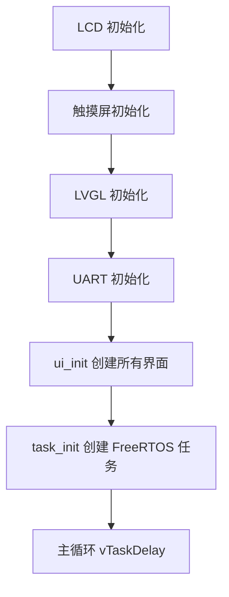

# ESP32-S3 智能终端开发教程（ESP-IDF）

## 目录

- [〇、前言](#〇前言)
- [一、开发环境搭建](#一开发环境搭建)
- [二、GPIO 输出 - 点亮 RGB](#二gpio-输出---点亮-rgb)
- [三、GPIO 输入 - 按键控制 RGB](#三gpio-输入---按键控制-rgb)
- [四、PWM 输出 - RGB 颜色深度控制](#四pwm-输出---rgb-颜色深度控制)
- [五、定时器 - RGB 呼吸灯](#五定时器---rgb-呼吸灯)
- [六、ADC 模数转换 - 电池电压检测](#六adc-模数转换---电池电压检测)
- [七、UART 串口收发 - 串口控制 RGB](#七uart-串口收发---串口控制-rgb)
- [八、SPI 通信 - LCD 驱动](#八spi-通信---lcd-驱动)
- [九、SPI 通信 - 电阻触摸读取](#九spi-通信---电阻触摸读取)
- [十、LVGL 图形界面 - 显示与触摸](#十lvgl-图形界面---显示与触摸)
- [十一、LVGL 机制 - UI 绘制和事件注册](#十一lvgl-机制---ui-绘制和事件注册)
- [十二、FreeRTOS 多任务管理 - 创建串口 APP](#十二freertos-多任务管理---创建串口-app)
- [十三、WiFi 获取天气和时间 - 创建设置/日历/天气APP](#十三wifi-获取天气和时间---创建设置日历天气app)
- [十四、I2S 音频输出 - 创建音乐 APP](#十四i2s-音频输出---创建音乐-app)
- [十五、I2S 音频输入 - 创建小智 APP](#十五i2s-音频输入---创建小智-app)
- [十六、LVGL Games 移植 - 创建游戏/关于 APP](#十六lvgl-games-移植---创建游戏关于-app)
- [附录](#附录)

---

## 〇、前言

### 1、ESP-IDF 开发

- **什么是 ESP-IDF**

  ESP-IDF（Espressif IoT Development Framework）是乐鑫官方推出的物联网开发框架，基于 C 语言，提供完整的驱动库、网络协议栈、RTOS 集成和丰富的组件。它是开发 ESP32 系列芯片最底层、最完整的官方框架。

- **为什么要使用 ESP-IDF 开发**

  基于 **Arduino + PlatformIO** 的开发教程，适合快速上手和原型验证。但在实际产品开发和企业级项目中，ESP-IDF 是更优的选择：

  - **行业标准**：物联网行业中使用 ESP32 系列芯片的公司，绝大多数采用 ESP-IDF 进行开发。掌握 ESP-IDF 是从事 ESP32 相关岗位的基本要求，Arduino 框架仅用于个人项目和快速原型。

  - **官方支持**：ESP-IDF 是乐鑫官方维护的一级框架，新功能、新芯片、Bug 修复都优先在 ESP-IDF 上发布。Arduino 的 ESP32 支持本质是对 ESP-IDF 的二次封装，版本更新滞后。

  - **性能与资源控制**：ESP-IDF 可以精细控制 FreeRTOS 任务、内存分配、功耗管理等底层资源，适合对性能和功耗有要求的产品。Arduino 框架为了易用性牺牲了大量性能和灵活性。

  - **组件化架构**：ESP-IDF 采用组件化设计，每个功能模块（GPIO、ADC、WiFi、BLE 等）都是独立组件，代码结构清晰，易于维护和复用。

  - **调试能力**：ESP-IDF 提供完善的日志系统（ESP_LOG）、GDB 调试、Core Dump 等工具，便于排查问题。Arduino 的调试手段相对有限。


### 2、开发板硬件实物

- **旧版 V1**

  

- **升级版 V2**

  - **烧录接口升级为 USB 接口，可自动进入烧录模式，不需要手动按键**
  - **解决 V1 部分开发板无法进入烧录模式的问题**
  - **屏幕升级为焊接粘贴式，不需要手动插接到 FPC**
  - **电池添加充电指示灯，红色（CHARGE）显示正在充电，绿色（STDBY）显示已充满**
  - **添加三个按键、一个 RGB 灯、一个串口接和一个ADC 引脚采集电池电压**
  - **去除读卡芯片，复刻焊接更加简单**
  - **整体颜值升级，相对于 V1 缩小二分之一，并添加背部透明外壳**


### 3、**开发板硬件原理图**


### 4、开源软硬件资料

- **硬件原理图**
- **硬件 PCB 制板文件**
- **硬件 BOM 表**
- **硬件焊接交互式 BOM 表**
- **程序源码**

## 一、开发环境搭建

### 1. 安装并配置 VSCode

- **下载**：访问 [VSCode 官网](https://code.visualstudio.com/)，点击 "Download for Windows" 下载安装包。
- **安装**：运行下载的安装程序，按照提示完成安装。建议勾选 "Add to PATH" 选项。
- **安装必要插件**：
  - **中文语言包 (Chinese Language Pack)**：
    - 点击左侧扩展图标，搜索 `Chinese`。
  
    - 选择 **Chinese (Simplified) (简体中文) Language Pack**，点击 **Install**。
  
    - 安装完成后重启 VSCode 即可生效。
  - **C/C++ 扩展**：
  
    - 点击左侧扩展图标，搜索 `C/C++`。
  
    - 选择由 **Microsoft** 发布的插件，点击 **Install**。
  
    - 该插件提供代码高亮、智能提示等功能，是开发 C/C++ 项目的基础。
  - **Serial Monitor 扩展**：
  
    - 点击左侧扩展图标，搜索 `Serial Monitor`。
    - 选择由 **Microsoft** 发布的插件，点击 **Install**。
    - 该插件提供串口监视器，可以实时查看开发板的输出信息。

### 2. 安装并配置 ESP-IDF

- **下载 ESP-IDF 安装包**：[esp-idf](https://dl.espressif.com/dl/esp-idf/)。

  

  > [!note]
  >
  > 这里的 `v5.5.3` 是最新稳定版本号，可以通过 [ESP-IDF 版本简介](https://docs.espressif.com/projects/esp-idf/zh_CN/stable/esp32/versions.html) 查看。

  

- **安装环境**：

  双击EXE文件开始安装：

  

  

  勾选我同意之后，一直点下一步：

  

  可以在此处设置一下自己的IDF需要安装到的文件夹，尽量别安装到C盘：

  

  一直点下一步直到安装完成，等待安装完成：

  

**测试安装**：

  双击桌面上的 **Powershell** 会自动导入 **IDF** 环境，`Win + R` 输入 `cmd` 打开终端，终端的 **+** 号可以直接运行 **IDF** 环境：

  

  

  

  当出现 `idf.py build` 字样就是安装成功了。

### 3. 新建并配置工程

- **常用idf.py命令**：

  | 功能             | 命令                                                    | 备注                                                |
  | :--------------- | :------------------------------------------------------ | :-------------------------------------------------- |
  | 创建新工程       | `idf.py create-project <project name>`                  | `<project name>` 为项目名称                         |
  | 创建新组件       | `idf.py -C components create-component {componentName}` | `{componentName}` 为组件名称                        |
  | 选择目标芯片     | `idf.py set-target <target>`                            | `<target>` 为芯片型号，不输入参数会列出所有可用型号 |
  | 启动图形配置工具 | `idf.py menuconfig`                                     | 配置项目的菜单选项                                  |
  | 构建工程         | `idf.py build`                                          | 编译生成固件                                        |
  | 清除构建输出     | `idf.py clean`                                          | 清除中间文件                                        |
  | 删除所有构建内容 | `idf.py fullclean`                                      | 清除所有生成的文件                                  |
  | 烧录工程         | `idf.py -p /dev/ttyUSB0 flash`                          | `/dev/ttyUSB0` 为目标串口，根据实际情况修改         |
  | 打开串口监视器   | `idf.py -p /dev/ttyUSB0 monitor`                        | `/dev/ttyUSB0` 为目标串口，根据实际情况修改         |
  | 构建、烧录并监视 | `idf.py -p /dev/ttyUSB0 flash monitor`                  | `/dev/ttyUSB0` 为目标串口，根据实际情况修改         |
  | 打开文档         | `idf.py docs`                                           |                                                     |

  > [!NOTE]
  >
  > 更多命令可以参考官方文档：[IDF 前端工具 - idf.py](https://docs.espressif.com/projects/esp-idf/zh_CN/stable/esp32/api-guides/tools/idf-py.html)。

- **新建工程**：

  打开 **IDF** 终端运行：

  ```bash
  # 创建工作空间
  mkdir workspace
  cd workspace
  
  # 创建新工程
  idf.py create-project '1.Hello World'
  ```

  

- **配置工程**：

  打开 **IDF** 终端运行：

  ```bash
  cd '.\workspace\1.Hello World\'
  
  # 选择目标芯片
  idf.py set-target esp32s3
  
  # 打开配置菜单
  idf.py menuconfig
  ```
  
  > [!note]
  >
  > 这里目标芯片只选择了安装 `esp32 esp32s3`，如果要安装所有目标芯片，可以运行 `./install.sh all`。

  配置 Flash 大小 （**16MB**）：
  
  - 进入菜单 **Serial flasher config**；
  
  - **Flash SPI mode**：选择 **QIO**；
  
  - **Flash Size**：选择 **16MB**。
  
    
  
  启用并配置 PSRAM （**8MB** Octal）：
  
  - 进入菜单 **Component config** -> **ESP PSRAM**；
  
  - 勾选 **Support for external, SPI-connected RAM**（启用 PSRAM 支持）；
  
  - 进入新出现的 **SPI RAM config** 子菜单；
  
  - **Mode (QUAD/OCT)**：选择 **Octal Mode PSRAM**；
  
  - **Set RAM clock speed**：选择 **80MHz**。
  
    
  
  保存并退出：
  
  - 按 **S** 保存配置；
  - 按 **Esc** 退出。

### 4. 编译并烧录

- **编写测试程序**：

  使用 **VSCode** 打开工程文件夹，打开 `\Espressif\frameworks\esp-idf-v5.5.3\workspace\1.Hello World\1.Hello World.c`，添加以下代码：

  ```c
  #include <stdio.h>
  #include "esp_log.h"

  void app_main(void)
  {
      ESP_LOGI("HelloWorld", "Hello, world!");
  }
  ```

- **编译工程**：

  打开 **IDF PowerShell** 终端运行：

  ```bash
  cd '.\workspace\1.Hello World\'

  # 编译工程
  idf.py build
  ```

  编译成功会输出类似以下信息：

  

- **烧录固件**：

  打开 **设备管理器** 查看串口号（如 `COM5`），然后在 **IDF PowerShell** 终端运行：

  ```bash
  # 烧录固件，按住 Boot 键不松开，按下 Reset 键后松开 Boot 键进入烧录模式
  idf.py -p COM5 flash
  
  # 打开串口监视器，查看串口输出
  idf.py -p COM5 monitor
  ```

  > [!NOTE]
  >
  > 根据实际情况修改 `COM5` 为目标串口；
  >
  > 按 `Ctrl+]` 退出串口监视器。

  按下复位，可以看到打印的 `Hello, world!` 信息：

  

### 5. 在 VSCode 中使用 ESP-IDF 终端

- **打开 CMD 终端**：

  新建终端：

  

  新建的是 PoweShell 终端，添加一个 CMD 终端：

  

- **设置 ESP-IDF 的环境变量**：

​	在 **ESP-IDF 的安装路径**下找到 **export.bat**，复制它的文件地址：

​	

​	粘贴到 VSCode 新建的 CMD 终端并回车：

​	

​	看到 `idf.py build`  则设置环境变量成功，可以在 VSCode 终端中使用 `idf.py` 命令：

·	

- **配置 VSCode 智能提示**：

  打开 VSCode 后，代码中的 `#include "esp_log.h"` 等头文件会出现红色波浪线报错：

  ```
  检测到 #include 错误。请更新 includePath。
  无法打开 源 文件 "esp_log.h"
  ```

  这是因为 VSCode 的 C/C++ 扩展不知道 ESP-IDF 的头文件路径。解决方法是在工程目录下创建 `.vscode/c_cpp_properties.json` 配置文件：

  ```bash
  # 在工程目录下创建 .vscode 文件夹
  mkdir .vscode
  ```

  创建 `.vscode/c_cpp_properties.json` 文件，添加以下内容：

  ```json
  {
      "configurations": [
          {
              "name": "ESP-IDF",
              "includePath": [
                  "${workspaceFolder}/**",
                  "D:/Espressif/frameworks/esp-idf-v5.5.3/components/**"
              ],
              "defines": [
                  "IDF_VER=\"v5.5.3\"",
                  "ESP_PLATFORM",
                  "CONFIG_IDF_TARGET_ESP32S3=1"
              ],
              "cStandard": "gnu17",
              "cppStandard": "gnu++20",
              "intelliSenseMode": "gcc-x64"
          }
      ],
      "version": 4
  }
  ```

  > [!NOTE]
  >
  > - `includePath` 中的路径使用正斜杠 `/`，不是反斜杠 `\`；
  > - `components/**` 使用通配符，自动包含 ESP-IDF 所有组件的头文件路径；
  > - 如果 ESP-IDF 安装在其他位置，需要修改为实际安装路径；
  > - 每个新建的工程都需要复制此配置文件。

  创建完成后，按 `Ctrl+Shift+P` 输入 `C/C++: Reset IntelliSense Database` 刷新，红色波浪线应该会消失。

  > [!NOTE]
  >
  > VSCode 的 IntelliSense 仅用于代码提示和错误检查，不影响实际编译。ESP-IDF 工程的实际编译是通过 `idf.py build` 完成的。

## 二、GPIO 输出 - 点亮 RGB

### 1. 创建 GPIO RGB 工程

在实际开发中，每个新工程通常需要相同的芯片配置（如 Flash 大小、PSRAM 等）。为了避免重复配置，我们可以复制上一节的工程，在其基础上进行开发。

- **复制工程目录**：

  打开 **CMD** 终端运行：

  ```bash
  # 进入工作空间
  cd D:\Espressif\frameworks\esp-idf-v5.5.3\workspace

  # 复制工程目录（PowerShell）
  Copy-Item -Path '.\1.Hello World' -Destination '.\2.GPIO RGB' -Recurse -Force
  ```

  > [!note]
  >
  > 复制工程会保留 `sdkconfig` 配置文件，因此不需要重新执行 `idf.py set-target` 和 `idf.py menuconfig`。

- **清理构建产物**：

  ```bash
  cd '.\2.GPIO RGB\'

  # 清除所有构建内容
  idf.py fullclean
  ```

- **重命名源文件和修改配置**：

  1. 将 `main\1.Hello World.c` 重命名为 `main\2.GPIO RGB.c`；
  2. 修改根目录 `CMakeLists.txt` 中的项目名：

     ```text
     project(2.GPIO RGB)
     ```

  3. 修改 `main\CMakeLists.txt` 中的源文件名：

     ```text
     idf_component_register(SRCS "2.GPIO RGB.c"
                         INCLUDE_DIRS "."
                         REQUIRES rgb_set)
     ```

- **编译验证**：

  ```bash
  idf.py build
  ```

  编译成功说明工程复制和改名操作正确。

### 2. ESP-IDF 组件机制

- **什么是组件（Component）**：

  ESP-IDF 采用组件化的架构，**组件是 ESP-IDF 工程的基本模块单元**。每个组件是一个独立的代码模块，包含源文件、头文件和构建配置。ESP-IDF 本身就由大量组件构成（如 `driver`、`wifi`、`freertos` 等），用户也可以创建自定义组件。

- **组件目录结构**：

  一个典型的 ESP-IDF 工程结构如下：

  ```text
  project/
  ├── CMakeLists.txt          # 工程顶层 CMake 配置
  ├── sdkconfig               # 项目配置文件
  ├── main/                   # 主组件（必需）
  │   ├── CMakeLists.txt
  │   ├── main.c
  │   └── include/
  └── components/             # 自定义组件目录
      ├── my_component/
      │   ├── CMakeLists.txt
      │   ├── my_component.c
      │   └── include/
      │       └── my_component.h
      └── another_component/
          └── ...
  ```

  - `main/`：主组件，包含 `app_main()` 入口函数，是每个工程必须的；
  - `components/`：自定义组件目录，放在此目录下的组件会被自动发现和编译。

- **idf_component_register 参数说明**：

  每个组件的 `CMakeLists.txt` 中通过 `idf_component_register()` 注册组件，常用参数如下：

  | 参数 | 说明 | 示例 |
  | :--- | :--- | :--- |
  | `SRCS` | 组件的源文件列表 | `"rgb_set.c"` |
  | `INCLUDE_DIRS` | 头文件搜索路径（相对于组件目录） | `"include"` |
  | `REQUIRES` | 公共依赖（其他组件可看到其头文件） | `"driver"` |
  | `PRIV_REQUIRES` | 私有依赖（仅本组件内部使用） | `"esp_timer"` |

- **自定义组件与 IDF 内置组件的区别**：

  | 特性 | IDF 内置组件 | 自定义组件 |
  | :--- | :--- | :--- |
  | 位置 | `ESP-IDF/components/` | `project/components/` |
  | 自动发现 | ✅ | ✅ |
  | 可修改 | ❌（不建议） | ✅ |
  | 示例 | `driver`、`esp_wifi` | `rgb_set` |

### 3. GPIO 输出模式

- **GPIO 简介**：

  GPIO（General Purpose Input/Output，通用输入输出）是单片机最基本的外设接口。ESP32-S3 有多达 45 个 GPIO 引脚，每个引脚可以独立配置为输入或输出模式。

- **gpio_config_t 结构体**：

  ESP-IDF 使用 `gpio_config_t` 结构体来配置 GPIO，各字段说明如下：

  | 字段 | 类型 | 说明 |
  | :--- | :--- | :--- |
  | `pin_bit_mask` | `uint64_t` | 引脚位掩码，指定要配置的引脚 |
  | `mode` | `gpio_mode_t` | 引脚模式（输入/输出） |
  | `pull_up_en` | `gpio_pullup_t` | 是否启用内部上拉电阻 |
  | `pull_down_en` | `gpio_pulldown_t` | 是否启用内部下拉电阻 |
  | `intr_type` | `gpio_int_type_t` | 中断触发类型 |

  > [!note]
  >
  > `pin_bit_mask` 使用位掩码表示多个引脚，例如 `(1ULL << GPIO_NUM_21) | (1ULL << GPIO_NUM_47)` 表示同时配置 GPIO21 和 GPIO47。

- **GPIO 输出模式**：

  将 `mode` 设置为 `GPIO_MODE_OUTPUT` 即可将引脚配置为输出模式，此时可以通过 `gpio_set_level()` 控制引脚的高低电平。

- **gpio_set_level() 函数**：

  ```c
  esp_err_t gpio_set_level(gpio_num_t gpio_num, uint32_t level);
  ```

  | 参数 | 说明 |
  | :--- | :--- |
  | `gpio_num` | 引脚编号，如 `GPIO_NUM_21` |
  | `level` | 电平值，`0` 为低电平，`1` 为高电平 |

### 4. 创建 rgb_set 组件

- **创建组件**：

  打开 **IDF** 终端运行：

  ```bash
  # 进入工程目录
  cd 'D:\Espressif\frameworks\esp-idf-v5.5.3\workspace\2.GPIO RGB'

  # 在 components 目录下创建 rgb_set 组件
  idf.py -C components create-component rgb_set
  ```

  创建后组件目录结构如下：

  ```text
  components/
  └── rgb_set/
      ├── CMakeLists.txt      # 组件构建配置
      ├── rgb_set.c           # 组件源文件
      └── include/
          └── rgb_set.h       # 组件头文件
  ```

- **修改组件 CMakeLists.txt**：

  自动生成的 `CMakeLists.txt` 需要添加 `REQUIRES esp_driver_gpio` 依赖，因为 `rgb_set.h` 中包含了 `driver/gpio.h`：

  ```cmake
  idf_component_register(SRCS "rgb_set.c"
                      INCLUDE_DIRS "include"
                      REQUIRES esp_driver_gpio)
  ```

  > [!note]
  >
  > - `INCLUDE_DIRS "include"` 表示将 `include/` 目录添加到头文件搜索路径，这样其他组件可以通过 `#include "rgb_set.h"` 引用头文件；
  > - `REQUIRES esp_driver_gpio` 声明对 `esp_driver_gpio` 组件的依赖，因为我们的头文件中 `#include "driver/gpio.h"` 来自该组件。如果不添加此依赖，编译时会报错找不到头文件。

### 5. 编写 rgb_set 驱动代码

本节使用的 RGB LED 硬件信息如下：

| 颜色 | 引脚 | 说明 |
| :--- | :--- | :--- |
| R（红） | GPIO21 | 低电平点亮 |
| G（绿） | GPIO47 | 低电平点亮 |
| B（蓝） | GPIO48 | 低电平点亮 |

> [!note]
  >
  > 本开发板的 RGB LED 为**低电平点亮**，即输出低电平（0）时 LED 亮，输出高电平（1）时 LED 灭。因此控制逻辑需要**取反**。

- **编写 rgb_set.h**：

  打开 `components\rgb_set\include\rgb_set.h`，添加以下代码：

  ```c
  #ifndef RGB_SET_H
  #define RGB_SET_H
  #include "driver/gpio.h"

  // RGB LED 引脚定义
  #define RGB_R_PIN  GPIO_NUM_21
  #define RGB_G_PIN  GPIO_NUM_47
  #define RGB_B_PIN  GPIO_NUM_48

  // 预定义颜色（低电平点亮，1 = 亮）
  #define RGB_COLOR_RED      0x04  // R=1, G=0, B=0
  #define RGB_COLOR_GREEN    0x02  // R=0, G=1, B=0
  #define RGB_COLOR_BLUE     0x01  // R=0, G=0, B=1
  #define RGB_COLOR_YELLOW   (RGB_COLOR_RED | RGB_COLOR_GREEN)
  #define RGB_COLOR_CYAN     (RGB_COLOR_GREEN | RGB_COLOR_BLUE)
  #define RGB_COLOR_MAGENTA  (RGB_COLOR_RED | RGB_COLOR_BLUE)
  #define RGB_COLOR_WHITE    (RGB_COLOR_RED | RGB_COLOR_GREEN | RGB_COLOR_BLUE)
  #define RGB_COLOR_OFF      0x00  // 全部关闭

  /**
   * @brief 初始化 RGB LED
   * 
   * 将 R、G、B 三个引脚配置为 GPIO 输出模式，并默认关闭 LED
   */
  void rgb_init(void);

  /**
   * @brief 设置 RGB LED 颜色
   * 
   * @param color 颜色值，使用 RGB_COLOR_xxx 宏定义，如 RGB_COLOR_RED
   */
  void rgb_set_color(uint8_t color);

  #endif /* RGB_SET_H */
  ```

  代码说明：

  - `#ifndef RGB_SET_H` / `#define RGB_SET_H` / `#endif`：防止头文件重复包含的标准写法；
  - 引脚定义使用宏，方便后续修改引脚时只需改一处；
  - 颜色使用位编码，`0x04`（bit2）表示红，`0x02`（bit1）表示绿，`0x01`（bit0）表示蓝，通过位或运算组合颜色。

- **编写 rgb_set.c**：

  打开 `components\rgb_set\rgb_set.c`，添加以下代码：

  ```c
  #include "rgb_set.h"
  
  void rgb_init(void)
  {
      // 配置 R、G、B 三个引脚为 GPIO 输出模式
      gpio_config_t io_conf = {
          .pin_bit_mask = (1ULL << RGB_R_PIN) | (1ULL << RGB_G_PIN) | (1ULL << RGB_B_PIN),
          .mode = GPIO_MODE_OUTPUT,
          .pull_up_en = GPIO_PULLUP_DISABLE,
          .pull_down_en = GPIO_PULLDOWN_DISABLE,
          .intr_type = GPIO_INTR_DISABLE,
      };
      gpio_config(&io_conf);
  
      // 默认关闭 LED
      rgb_set_color(RGB_COLOR_OFF);
  }
  
  void rgb_set_color(uint8_t color)
  {
      // 低电平点亮：color 位为 1 时输出低电平（点亮），为 0 时输出高电平（熄灭）
      gpio_set_level(RGB_R_PIN, (color & 0x04) ? 0 : 1);
      gpio_set_level(RGB_G_PIN, (color & 0x02) ? 0 : 1);
      gpio_set_level(RGB_B_PIN, (color & 0x01) ? 0 : 1);
  }
  ```

  代码说明：

  - `rgb_init()`：使用 `gpio_config()` 一次性配置三个引脚，比逐个配置更高效；
  - `rgb_set_color()`：由于低电平点亮，当 `color` 对应位为 `1` 时输出 `0`（点亮），为 `0` 时输出 `1`（熄灭），逻辑取反；
  - `1ULL << RGB_R_PIN`：将 `1` 左移指定位数，生成对应引脚的位掩码，`ULL` 表示无符号长长整型（64位）。

### 6. 编写主程序

打开 `main\2.GPIO RGB.c`，添加以下代码：

  ```c
  #include <stdio.h>
  #include "freertos/FreeRTOS.h"
  #include "freertos/task.h"
  #include "esp_log.h"
  #include "rgb_set.h"

  void app_main(void)
  {
      rgb_init();

      while (1) {
          rgb_set_color(RGB_COLOR_RED);
          ESP_LOGI("RGB", "RED");
          vTaskDelay(pdMS_TO_TICKS(1000));

          rgb_set_color(RGB_COLOR_GREEN);
          ESP_LOGI("RGB", "GREEN");
          vTaskDelay(pdMS_TO_TICKS(1000));

          rgb_set_color(RGB_COLOR_BLUE);
          ESP_LOGI("RGB", "BLUE");
          vTaskDelay(pdMS_TO_TICKS(1000));

          rgb_set_color(RGB_COLOR_YELLOW);
          ESP_LOGI("RGB", "YELLOW");
          vTaskDelay(pdMS_TO_TICKS(1000));

          rgb_set_color(RGB_COLOR_CYAN);
          ESP_LOGI("RGB", "CYAN");
          vTaskDelay(pdMS_TO_TICKS(1000));

          rgb_set_color(RGB_COLOR_MAGENTA);
          ESP_LOGI("RGB", "MAGENTA");
          vTaskDelay(pdMS_TO_TICKS(1000));

          rgb_set_color(RGB_COLOR_WHITE);
          ESP_LOGI("RGB", "WHITE");
          vTaskDelay(pdMS_TO_TICKS(1000));
      }
  }
  ```

  代码说明：

  - `freertos/FreeRTOS.h` 和 `freertos/task.h`：FreeRTOS 实时操作系统头文件，提供延时函数；
  - `vTaskDelay(pdMS_TO_TICKS(1000))`：延时 1000 毫秒（1秒），`pdMS_TO_TICKS()` 宏将毫秒转换为 FreeRTOS 的滴答数；
  - `while (1)`：无限循环，程序会持续运行，每隔 1 秒切换一种颜色。

  > [!note]
  >
  > 由于 `rgb_set` 组件的 `CMakeLists.txt` 中已设置 `INCLUDE_DIRS "include"`，`main` 组件可以直接通过 `#include "rgb_set.h"` 引用头文件，无需额外配置。

- **编译工程**：

  ```bash
  idf.py build
  ```

- **烧录并验证**：

  ```bash
  # 烧录固件
  idf.py -p COM5 flash
  
  # 打开串口监视器
  idf.py -p COM5 monitor
  ```

  > [!NOTE]
  >
  > 根据实际情况修改 `COM5` 为目标串口；
  >
  > 按 `Ctrl+]` 退出串口监视器。

  烧录后，RGB LED 将每隔 1 秒自动切换颜色，依次显示**红→绿→蓝→黄→青→品红→白**，循环往复。串口监视器输出如下：

  ```text
  RED
  GREEN
  BLUE
  YELLOW
  CYAN
  MAGENTA
  WHITE
   RED
   ...
  ```

## 三、GPIO 输入 - 按键控制 RGB

### 1. 创建 GPIO Key 工程

复制上一节的 `2.GPIO RGB` 工程，在其基础上添加按键功能。

- **复制工程目录**：

  打开 **CMD** 终端运行：

  ```bash
  # 进入工作空间
  cd D:\Espressif\frameworks\esp-idf-v5.5.3\workspace

  # 复制工程目录
  Copy-Item -Path '.\2.GPIO RGB' -Destination '.\3.GPIO Key' -Recurse -Force
  ```

- **清理构建产物**：

  ```bash
  cd '.\3.GPIO Key\'

  # 清除所有构建内容
  idf.py fullclean
  ```

- **重命名源文件和修改配置**：

  1. 将 `main\2.GPIO RGB.c` 重命名为 `main\3.GPIO Key.c`；
  2. 修改根目录 `CMakeLists.txt` 中的项目名：

     ```text
     project(3.GPIO Key)
     ```

  3. 修改 `main\CMakeLists.txt` 中的源文件名：

     ```text
     idf_component_register(SRCS "3.GPIO Key.c"
                         INCLUDE_DIRS "."
                         REQUIRES rgb_set key_set)
     ```

- **编译验证**：

  ```bash
  idf.py build
  ```

### 2. GPIO 输入模式

- **GPIO 输入简介**：

  上一节我们学习了 GPIO 输出模式，通过控制引脚的高低电平来点亮 RGB LED。本节将学习 GPIO 输入模式，通过读取引脚的电平状态来检测按键是否按下。

- **gpio_get_level() 函数**：

  ```c
  int gpio_get_level(gpio_num_t gpio_num);
  ```

  | 参数 | 说明 |
  | :--- | :--- |
  | `gpio_num` | 引脚编号，如 `GPIO_NUM_0` |
  | **返回值** | 引脚电平，`0` 为低电平，`1` 为高电平 |

- **上拉电阻**：

  按键的一端连接 GPIO 引脚，另一端接地（GND）。按键未按下时，引脚处于悬空状态，电平不确定。启用内部上拉电阻后，按键未按下时引脚为高电平，按下时引脚为低电平。

  ```text
  上拉电阻
      ┌──[10KΩ]──┬── VCC (3.3V)
      │           │
      │       GPIO_NUM_0
      │           │
      │       ┌───┘
      │       │ 按键
      │       └───┐
      │           │
      └───────────┴── GND
  ```

  > [!note]
  >
  > ESP32-S3 的 GPIO 内部自带上拉电阻（约 45KΩ），通过 `pull_up_en = GPIO_PULLUP_ENABLE` 即可启用，无需外接电阻。

- **按键消抖**：

  机械按键在按下和松开的瞬间，触点会产生弹跳，导致短时间内电平多次变化。这种机械抖动一般持续 5~20ms。

  本节采用**软件消抖**的方式：检测到按键按下后，等待按键松开再执行操作，避免一次按下触发多次。

### 3. 创建 key_set 组件

- **创建组件**：

  打开 **IDF** 终端运行：

  ```bash
  # 进入工程目录
  cd 'D:\Espressif\frameworks\esp-idf-v5.5.3\workspace\3.GPIO Key'

  # 在 components 目录下创建 key_set 组件
  idf.py -C components create-component key_set
  ```

  创建后组件目录结构如下：

  ```text
  components/
  ├── key_set/                 # 新增：按键组件
  │   ├── CMakeLists.txt
  │   ├── key_set.c
  │   └── include/
  │       └── key_set.h
  └── rgb_set/                 # 上一节已有：RGB 组件
      ├── CMakeLists.txt
      ├── rgb_set.c
      └── include/
          └── rgb_set.h
  ```

- **修改组件 CMakeLists.txt**：

  自动生成的 `CMakeLists.txt` 需要添加 `REQUIRES esp_driver_gpio` 依赖，因为 `key_set.h` 中包含了 `driver/gpio.h`：

  ```cmake
  idf_component_register(SRCS "key_set.c"
                      INCLUDE_DIRS "include"
                      REQUIRES esp_driver_gpio)
  ```

### 4. 编写 key_set 驱动代码

本节使用的按键硬件信息如下：

| 按键 | 引脚 | 说明 |
| :--- | :--- | :--- |
| 按键1 | GPIO2 | 低电平有效，按下为低电平 |
| 按键2 | GPIO45 | 低电平有效，按下为低电平 |
| 按键3 | GPIO46 | 低电平有效，按下为低电平 |

> [!note]
  >
  > 三个按键的一端分别连接 GPIO2、GPIO45、GPIO46，另一端接地。按下时对应引脚为低电平，松开时通过内部上拉电阻为高电平。

- **编写 key_set.h**：

  打开 `components\key_set\include\key_set.h`，添加以下代码：

  ```c
  #ifndef KEY_SET_H
  #define KEY_SET_H
  #include "driver/gpio.h"

  // 按键引脚定义
  #define KEY_1_PIN  GPIO_NUM_2   // 按键1
  #define KEY_2_PIN  GPIO_NUM_45  // 按键2
  #define KEY_3_PIN  GPIO_NUM_46  // 按键3

  /**
   * @brief 初始化按键
   * 
   * 将三个按键引脚配置为 GPIO 输入模式，启用内部上拉电阻
   */
  void key_init(void);

  /**
   * @brief 读取按键值
   * 
   * 检测按键按下并等待松开后返回按键编号
   * @return 0 表示无按键按下，1/2/3 表示按键1/2/3 被按下
   */
  uint8_t key_value_read(void);

  #endif /* KEY_SET_H */
  ```

  代码说明：

  - `KEY_1_PIN`、`KEY_2_PIN`、`KEY_3_PIN`：三个按键的引脚定义，方便后续修改；
  - `key_init()`：初始化三个按键引脚，配置为输入模式并启用上拉电阻；
  - `key_value_read()`：无参数，内部检测所有按键，按下并松开后返回按键编号（`1`/`2`/`3`），无按键返回 `0`。

- **编写 key_set.c**：

  打开 `components\key_set\key_set.c`，添加以下代码：

  ```c
  #include "key_set.h"
  #include "freertos/FreeRTOS.h"
  #include "freertos/task.h"
  
  void key_init(void)
  {
      // 配置三个按键引脚为 GPIO 输入模式，启用内部上拉电阻
      gpio_config_t io_conf = {
          .pin_bit_mask = (1ULL << KEY_1_PIN) | (1ULL << KEY_2_PIN) | (1ULL << KEY_3_PIN),
          .mode = GPIO_MODE_INPUT,
          .pull_up_en = GPIO_PULLUP_ENABLE,
          .pull_down_en = GPIO_PULLDOWN_DISABLE,
          .intr_type = GPIO_INTR_DISABLE,
      };
      gpio_config(&io_conf);
  }
  
  uint8_t key_value_read(void)
  {
      // 按键1按下
      if (gpio_get_level(KEY_1_PIN) == 0) {
          // 等待按键松开
          while (gpio_get_level(KEY_1_PIN) == 0) {
              vTaskDelay(pdMS_TO_TICKS(10));
          }
          return 1;
      }
      // 按键2按下
      if (gpio_get_level(KEY_2_PIN) == 0) {
          while (gpio_get_level(KEY_2_PIN) == 0) {
              vTaskDelay(pdMS_TO_TICKS(10));
          }
          return 2;
      }
      // 按键3按下
      if (gpio_get_level(KEY_3_PIN) == 0) {
          while (gpio_get_level(KEY_3_PIN) == 0) {
              vTaskDelay(pdMS_TO_TICKS(10));
          }
          return 3;
      }
      return 0;
  }
  ```

  代码说明：

  - `key_init()`：使用 `gpio_config()` 一次性配置三个按键引脚，与上一节输出模式不同的是 `mode` 设为 `GPIO_MODE_INPUT`，`pull_up_en` 设为 `GPIO_PULLUP_ENABLE`（启用内部上拉电阻），`pin_bit_mask` 同时包含三个引脚的位掩码；
  - `key_value_read()`：检测三个按键的状态，如果某个按键被按下（低电平），等待松开后返回对应编号（`1`/`2`/`3`），无按键按下返回 `0`。等待松开的过程即实现了软件消抖，`vTaskDelay(pdMS_TO_TICKS(10))` 每 10ms 检测一次。

### 5. 编写主程序

打开 `main\3.GPIO Key.c`，添加以下代码：

  ```c
  #include <stdio.h>
  #include "freertos/FreeRTOS.h"
  #include "freertos/task.h"
  #include "esp_log.h"
  #include "rgb_set.h"
  #include "key_set.h"

  void app_main(void)
  {
      rgb_init();
      key_init();

      uint8_t color = RGB_COLOR_OFF;
      rgb_set_color(color);

      ESP_LOGI("Key", "GPIO Key Example");

      while (1) {
          uint8_t key = key_value_read();

          switch (key) {
              case 1:
                  if (color & RGB_COLOR_RED) {
                      color = color & ~RGB_COLOR_RED;
                      ESP_LOGI("Key", "RED OFF");
                  } else {
                      color = color | RGB_COLOR_RED;
                      ESP_LOGI("Key", "RED ON");
                  }
                  rgb_set_color(color);
                  break;

              case 2:
                  if (color & RGB_COLOR_GREEN) {
                      color = color & ~RGB_COLOR_GREEN;
                      ESP_LOGI("Key", "GREEN OFF");
                  } else {
                      color = color | RGB_COLOR_GREEN;
                      ESP_LOGI("Key", "GREEN ON");
                  }
                  rgb_set_color(color);
                  break;

              case 3:
                  if (color & RGB_COLOR_BLUE) {
                      color = color & ~RGB_COLOR_BLUE;
                      ESP_LOGI("Key", "BLUE OFF");
                  } else {
                      color = color | RGB_COLOR_BLUE;
                      ESP_LOGI("Key", "BLUE ON");
                  }
                  rgb_set_color(color);
                  break;

              default:
                  break;
          }

          vTaskDelay(pdMS_TO_TICKS(10));
      }
  }
  ```

  代码说明：

  - `rgb_init()` 和 `key_init()`：分别初始化 RGB LED 和三个按键；
  - `color` 变量：记录当前颜色状态，初始为 `RGB_COLOR_OFF`（全灭）；
  - `key_value_read()`：返回按键编号（`1`/`2`/`3`），无按键返回 `0`，消抖已在函数内部完成；
  - `switch (key)`：根据返回的按键编号执行对应操作，比多个 `if` 更清晰；
  - 三个按键分别控制 R、G、B 的开关：
    - **按键1**：切换红色，`color | RGB_COLOR_RED` 打开红色，`color & ~RGB_COLOR_RED` 关闭红色；
    - **按键2**：切换绿色，`color | RGB_COLOR_GREEN` 打开绿色，`color & ~RGB_COLOR_GREEN` 关闭绿色；
    - **按键3**：切换蓝色，`color | RGB_COLOR_BLUE` 打开蓝色，`color & ~RGB_COLOR_BLUE` 关闭蓝色；
  - `color & RGB_COLOR_RED`：判断当前红色是否已打开（位与运算，结果非 0 表示已打开）；
  - `vTaskDelay(pdMS_TO_TICKS(10))`：主循环中每次延时 10ms，避免 CPU 空转占用资源。

  > [!note]
  >
  > 三个按键可以独立控制 R、G、B 的开关，组合出 7 种颜色。例如同时按下按键1和按键2，可以显示黄色（红+绿）。

- **编译工程**：

  ```bash
  idf.py build
  ```

- **烧录并验证**：

  ```bash
  # 烧录固件
  idf.py -p COM5 flash
  
  # 打开串口监视器
  idf.py -p COM5 monitor
  ```

  > [!NOTE]
  >
  > 根据实际情况修改 `COM5` 为目标串口；
  >
  > 按 `Ctrl+]` 退出串口监视器。

  烧录后，RGB LED 默认全灭。三个按键分别独立控制 R、G、B 的开关：
  - 按下**按键1**：切换红色（开/关）；
  - 按下**按键2**：切换绿色（开/关）；
  - 按下**按键3**：切换蓝色（开/关）。

  通过组合可以显示 7 种颜色。串口监视器输出如下：

  ```text
  GPIO Key Example
  RED ON
  GREEN ON
  BLUE OFF
  RED OFF
  ...
  ```

## 四、PWM 输出 - RGB 颜色深度控制

### 1. 创建 PWM RGB 工程

复制上一节的 `3.GPIO Key` 工程，在其基础上将 RGB 驱动从 GPIO 输出模式改为 PWM 模式。

- **复制工程目录**：

  打开 **CMD** 终端运行：

  ```bash
  # 进入工作空间
  cd D:\Espressif\frameworks\esp-idf-v5.5.3\workspace

  # 复制工程目录
  xcopy ".\3.GPIO Key" ".\4.PWM RGB\" /E /I /Q /Y
  ```

- **清理构建产物**：

  ```bash
  cd '.\4.PWM RGB\'

  # 删除 build 目录
  rd /s /q build

  # 清除所有构建内容
  idf.py fullclean
  ```

- **重命名源文件和修改配置**：

  1. 将 `main\3.GPIO Key.c` 重命名为 `main\4.PWM RGB.c`；
  2. 修改根目录 `CMakeLists.txt` 中的项目名：

     ```text
     project(4.PWM RGB)
     ```

  3. 修改 `main\CMakeLists.txt` 中的源文件名：

     ```text
     idf_component_register(SRCS "4.PWM RGB.c"
                         INCLUDE_DIRS "."
                         REQUIRES rgb_set key_set)
     ```

- **编译验证**：

  ```bash
  idf.py build
  ```

### 2. PWM 与 LEDC

- **PWM 简介**：

  PWM（Pulse Width Modulation，脉冲宽度调制）是一种通过改变信号高电平时间占比（占空比）来控制输出功率的技术。在 LED 控制中，PWM 可以实现亮度调节：占空比越大，LED 越亮；占空比越小，LED 越暗。

  ```text
  占空比 = 高电平时间 / 周期 × 100%

  100% 占空比：████████  全亮
   75% 占空比：██████░░  较亮
   50% 占空比：████░░░░  中等
   25% 占空比：██░░░░░░  较暗
    0% 占空比：░░░░░░░░  全灭
  ```

  > [!note]
  >
  > LEDC 的 duty 值控制的是**高电平时间**。由于本开发板 RGB LED 为低电平点亮，duty 越大高电平越长，LED 越暗；duty 越小高电平越短，LED 越亮。因此代码中需要**反转占空比**：将用户传入的亮度值用 `RGB_DUTY_MAX - duty` 转换后再设置给 LEDC，这样用户传入的值越大，LED 越亮。

- **LEDC 外设**：

  ESP-IDF 通过 LEDC（LED Control）外设来生成 PWM 信号。LEDC 的核心配置分为两层：

  1. **定时器配置**（`ledc_timer_config_t`）：设置 PWM 频率和分辨率；
  2. **通道配置**（`ledc_channel_config_t`）：将 PWM 信号绑定到指定 GPIO 引脚。

  ESP32-S3 的 LEDC 支持 1~20 位占空比分辨率，分辨率越高，可调节的亮度等级越多。本节使用 10 位分辨率，占空比范围为 0~1023（共 1024 级）。

  > [!note]
  >
  > 分辨率、频率和占空比范围的关系：分辨率越高，占空比调节越精细，但最大频率越低。10 位分辨率下，最大 PWM 频率约为 80MHz / 1024 ≈ 78kHz，本节使用 5kHz 已足够。

- **常用 LEDC 函数**：

  | 函数 | 说明 |
  | :--- | :--- |
  | `ledc_timer_config()` | 配置 LEDC 定时器（频率、分辨率） |
  | `ledc_channel_config()` | 配置 LEDC 通道（引脚、通道号、定时器） |
  | `ledc_set_duty()` | 设置占空比值 |
  | `ledc_update_duty()` | 更新占空比（使设置生效） |

### 3. 修改 rgb_set 组件

本节将 `rgb_set` 组件从 GPIO 输出模式改为 PWM 模式。旧的 GPIO 代码保留为注释，方便对比学习。

- **修改 rgb_set.h**：

  打开 `components\rgb_set\include\rgb_set.h`，替换为以下代码：

  ```c
  #ifndef RGB_SET_H
  #define RGB_SET_H
  #include "driver/gpio.h"

  // RGB LED 引脚定义
  #define RGB_R_PIN  GPIO_NUM_21
  #define RGB_G_PIN  GPIO_NUM_47
  #define RGB_B_PIN  GPIO_NUM_48

  // LEDC PWM 配置
  #define RGB_LEDC_TIMER       LEDC_TIMER_0      // 定时器
  #define RGB_LEDC_MODE        LEDC_LOW_SPEED_MODE // 低速模式
  #define RGB_LEDC_CHANNEL_R   LEDC_CHANNEL_0     // 红色通道
  #define RGB_LEDC_CHANNEL_G   LEDC_CHANNEL_1     // 绿色通道
  #define RGB_LEDC_CHANNEL_B   LEDC_CHANNEL_2     // 蓝色通道
  #define RGB_LEDC_DUTY_RES    LEDC_TIMER_10_BIT  // 10 位分辨率（0~1023）
  #define RGB_LEDC_FREQUENCY   5000               // PWM 频率 5kHz
  #define RGB_DUTY_MAX         1023               // 最大占空比值

  // ---- 以下为 GPIO 输出模式的颜色定义（已弃用，保留供参考）----
  // #define RGB_COLOR_RED      0x04
  // #define RGB_COLOR_GREEN    0x02
  // #define RGB_COLOR_BLUE     0x01
  // #define RGB_COLOR_YELLOW   (RGB_COLOR_RED | RGB_COLOR_GREEN)
  // #define RGB_COLOR_CYAN     (RGB_COLOR_GREEN | RGB_COLOR_BLUE)
  // #define RGB_COLOR_MAGENTA  (RGB_COLOR_RED | RGB_COLOR_BLUE)
  // #define RGB_COLOR_WHITE    (RGB_COLOR_RED | RGB_COLOR_GREEN | RGB_COLOR_BLUE)
  // #define RGB_COLOR_OFF      0x00

  /**
   * @brief 初始化 RGB LED（PWM 模式）
   *
   * 配置 LEDC 定时器和三个 PWM 通道，默认关闭 LED
   */
  void rgb_init(void);

  /**
   * @brief 设置 RGB LED 颜色深度
   *
   * @param r_duty 红色占空比（0~1023），0 为全灭，1023 为最亮
   * @param g_duty 绿色占空比（0~1023），0 为全灭，1023 为最亮
   * @param b_duty 蓝色占空比（0~1023），0 为全灭，1023 为最亮
   */
  void rgb_set_color(uint16_t r_duty, uint16_t g_duty, uint16_t b_duty);

  // ---- 以下为 GPIO 输出模式的函数（已弃用，保留供参考）----
  // void rgb_init(void);           // GPIO 输出模式初始化
  // void rgb_set_color(uint8_t color);  // GPIO 输出模式设置颜色

  #endif /* RGB_SET_H */
  ```

  代码说明：

  - `RGB_LEDC_TIMER`：选择 LEDC 定时器0，ESP32-S3 有多个定时器可供选择；
  - `RGB_LEDC_MODE`：选择低速模式，适合 LED 控制等低频率场景；
  - `RGB_LEDC_CHANNEL_R/G/B`：分别使用通道0、1、2，ESP32-S3 有 8 个低速通道；
  - `RGB_LEDC_DUTY_RES`：10 位分辨率，占空比范围为 0~1023；
  - `RGB_LEDC_FREQUENCY`：5kHz 频率，人眼无法察觉闪烁；
  - `RGB_DUTY_MAX`：最大占空比值 1023（即 2^10 - 1）；
  - `rgb_set_color()` 的参数从 `uint8_t color` 改为三个独立的 `uint16_t` 占空比值，分别控制 R、G、B 的亮度。

- **修改 rgb_set.c**：

  打开 `components\rgb_set\rgb_set.c`，替换为以下代码：

  ```c
  #include "rgb_set.h"
  #include "driver/ledc.h"

  // ---- 以下为 GPIO 输出模式的实现（已弃用，保留供参考）----
  // void rgb_init(void)
  // {
  //     gpio_config_t io_conf = {
  //         .pin_bit_mask = (1ULL << RGB_R_PIN) | (1ULL << RGB_G_PIN) | (1ULL << RGB_B_PIN),
  //         .mode = GPIO_MODE_OUTPUT,
  //         .pull_up_en = GPIO_PULLUP_DISABLE,
  //         .pull_down_en = GPIO_PULLDOWN_DISABLE,
  //         .intr_type = GPIO_INTR_DISABLE,
  //     };
  //     gpio_config(&io_conf);
  //     rgb_set_color(RGB_COLOR_OFF);
  // }
  //
  // void rgb_set_color(uint8_t color)
  // {
  //     gpio_set_level(RGB_R_PIN, (color & 0x04) ? 0 : 1);
  //     gpio_set_level(RGB_G_PIN, (color & 0x02) ? 0 : 1);
  //     gpio_set_level(RGB_B_PIN, (color & 0x01) ? 0 : 1);
  // }

  void rgb_init(void)
  {
      // 配置 LEDC 定时器
      ledc_timer_config_t timer_conf = {
          .speed_mode      = RGB_LEDC_MODE,
          .duty_resolution = RGB_LEDC_DUTY_RES,
          .timer_num       = RGB_LEDC_TIMER,
          .freq_hz         = RGB_LEDC_FREQUENCY,
          .clk_cfg         = LEDC_AUTO_CLK,
      };
      ledc_timer_config(&timer_conf);

      // 配置红色通道（初始 duty=RGB_DUTY_MAX 输出高电平，LED 灭）
      ledc_channel_config_t r_conf = {
          .gpio_num   = RGB_R_PIN,
          .speed_mode = RGB_LEDC_MODE,
          .channel    = RGB_LEDC_CHANNEL_R,
          .timer_sel  = RGB_LEDC_TIMER,
          .duty       = RGB_DUTY_MAX,
          .hpoint     = 0,
      };
      ledc_channel_config(&r_conf);

      // 配置绿色通道
      ledc_channel_config_t g_conf = {
          .gpio_num   = RGB_G_PIN,
          .speed_mode = RGB_LEDC_MODE,
          .channel    = RGB_LEDC_CHANNEL_G,
          .timer_sel  = RGB_LEDC_TIMER,
          .duty       = RGB_DUTY_MAX,
          .hpoint     = 0,
      };
      ledc_channel_config(&g_conf);

      // 配置蓝色通道
      ledc_channel_config_t b_conf = {
          .gpio_num   = RGB_B_PIN,
          .speed_mode = RGB_LEDC_MODE,
          .channel    = RGB_LEDC_CHANNEL_B,
          .timer_sel  = RGB_LEDC_TIMER,
          .duty       = RGB_DUTY_MAX,
          .hpoint     = 0,
      };
      ledc_channel_config(&b_conf);
  }

  void rgb_set_color(uint16_t r_duty, uint16_t g_duty, uint16_t b_duty)
  {
      // 限制占空比范围（0~1023）
      if (r_duty > RGB_DUTY_MAX) r_duty = RGB_DUTY_MAX;
      if (g_duty > RGB_DUTY_MAX) g_duty = RGB_DUTY_MAX;
      if (b_duty > RGB_DUTY_MAX) b_duty = RGB_DUTY_MAX;

      // 低电平点亮：LEDC duty 控制高电平时间，需反转
      // 用户传入的 duty 值越大 → LED 越亮 → 实际高电平时间越短
      ledc_set_duty(RGB_LEDC_MODE, RGB_LEDC_CHANNEL_R, RGB_DUTY_MAX - r_duty);
      ledc_update_duty(RGB_LEDC_MODE, RGB_LEDC_CHANNEL_R);

      ledc_set_duty(RGB_LEDC_MODE, RGB_LEDC_CHANNEL_G, RGB_DUTY_MAX - g_duty);
      ledc_update_duty(RGB_LEDC_MODE, RGB_LEDC_CHANNEL_G);

      ledc_set_duty(RGB_LEDC_MODE, RGB_LEDC_CHANNEL_B, RGB_DUTY_MAX - b_duty);
      ledc_update_duty(RGB_LEDC_MODE, RGB_LEDC_CHANNEL_B);
  }
  ```

  代码说明：

  - `rgb_init()`：
    - `ledc_timer_config()`：配置 LEDC 定时器，设置频率 5kHz、10 位分辨率，`LEDC_AUTO_CLK` 让系统自动选择时钟源；
    - `ledc_channel_config()`：分别为 R、G、B 配置 PWM 通道，绑定到对应 GPIO 引脚，初始 duty 设为 `RGB_DUTY_MAX`（输出高电平，LED 熄灭），`hpoint` 设为 0 表示从周期起点开始计数；
  - `rgb_set_color()`：
    - 先检查占空比是否超出范围，超过则限制为最大值；
    - `ledc_set_duty()` 设置占空比值，`ledc_update_duty()` 使设置生效，两者必须配合使用。

- **修改 rgb_set 组件 CMakeLists.txt**：

  由于新增了 `driver/ledc.h` 头文件，需要添加 `esp_driver_ledc` 依赖：

  ```cmake
  idf_component_register(SRCS "rgb_set.c"
                      INCLUDE_DIRS "include"
                      REQUIRES esp_driver_gpio esp_driver_ledc)
  ```

### 4. 编写主程序

打开 `main\4.PWM RGB.c`，替换为以下代码：

  ```c
  #include <stdio.h>
  #include "freertos/FreeRTOS.h"
  #include "freertos/task.h"
  #include "esp_log.h"
  #include "rgb_set.h"
  #include "key_set.h"

  #define DUTY_STEP 100

  void app_main(void)
  {
      rgb_init();
      key_init();

      uint16_t r_duty = 0;
      uint16_t g_duty = 0;
      uint16_t b_duty = 0;
      rgb_set_color(r_duty, g_duty, b_duty);

      ESP_LOGI("PWM", "PWM RGB Example");

      while (1) {
          uint8_t key = key_value_read();

          switch (key) {
              case 1:
                  if (r_duty + DUTY_STEP > RGB_DUTY_MAX) {
                      r_duty = 0;
                  } else {
                      r_duty = r_duty + DUTY_STEP;
                  }
                  rgb_set_color(r_duty, g_duty, b_duty);
                  ESP_LOGI("PWM", "R:%d G:%d B:%d", r_duty, g_duty, b_duty);
                  break;

              case 2:
                  if (g_duty + DUTY_STEP > RGB_DUTY_MAX) {
                      g_duty = 0;
                  } else {
                      g_duty = g_duty + DUTY_STEP;
                  }
                  rgb_set_color(r_duty, g_duty, b_duty);
                  ESP_LOGI("PWM", "R:%d G:%d B:%d", r_duty, g_duty, b_duty);
                  break;

              case 3:
                  if (b_duty + DUTY_STEP > RGB_DUTY_MAX) {
                      b_duty = 0;
                  } else {
                      b_duty = b_duty + DUTY_STEP;
                  }
                  rgb_set_color(r_duty, g_duty, b_duty);
                  ESP_LOGI("PWM", "R:%d G:%d B:%d", r_duty, g_duty, b_duty);
                  break;

              default:
                  break;
          }

          vTaskDelay(pdMS_TO_TICKS(10));
      }
  }
  ```

  代码说明：

  - `DUTY_STEP`：每次按键增加的占空比步进值，设为 100，则 1023 / 100 ≈ 10 次按键可以从 0 调到最大亮度；
  - `r_duty`、`g_duty`、`b_duty`：分别记录 R、G、B 的当前占空比，初始为 0（全灭）；
  - `rgb_set_color(r_duty, g_duty, b_duty)`：PWM 模式下分别设置三个通道的占空比；
  - 按键逻辑：每次按下对应按键，颜色深度增加 `DUTY_STEP`（100），当超过最大值 `RGB_DUTY_MAX`（1023）时回到 0，形成循环；
  - `printf("R:%d G:%d B:%d\n", ...)`：打印当前三个通道的占空比值，方便调试。

  > [!note]
  >
  > `DUTY_STEP` 为 100 时，约 10 次按键可以从全灭调到最亮。你可以根据需要修改步进值：步进越小，调节越精细，但需要按更多次；步进越大，调节越快，但亮度变化越粗糙。

- **编译工程**：

  ```bash
  idf.py build
  ```

- **烧录并验证**：

  ```bash
  # 烧录固件
  idf.py -p COM5 flash
  
  # 打开串口监视器
  idf.py -p COM5 monitor
  ```

  > [!NOTE]
  >
  > 根据实际情况修改 `COM5` 为目标串口；
  >
  > 按 `Ctrl+]` 退出串口监视器。

  烧录后，RGB LED 默认全灭。三个按键分别控制 R、G、B 的颜色深度：
  - 按下**按键1**：红色亮度增加，到最亮后回到 0；
  - 按下**按键2**：绿色亮度增加，到最亮后回到 0；
  - 按下**按键3**：蓝色亮度增加，到最亮后回到 0。

  通过组合三个通道的不同亮度，可以混合出丰富的颜色。串口监视器输出如下：

  ```text
  PWM RGB Example
  R:100 G:0 B:0
  R:200 G:0 B:0
  R:300 G:0 B:100
  R:300 G:100 B:200
  ...
  ```

## 五、定时器 - RGB 呼吸灯

### 1. 创建 Timer Breath 工程

复制上一节的 `4.PWM RGB` 工程，在其基础上增加定时器功能，实现三个按键分别控制 R、G、B 三色呼吸灯效果。

- **复制工程目录**：

  打开 **CMD** 终端运行：

  ```bash
  # 进入工作空间
  cd D:\Espressif\frameworks\esp-idf-v5.5.3\workspace

  # 复制工程目录
  xcopy ".\4.PWM RGB" ".\5.Timer Breath\" /E /I /Q /Y
  ```

- **清理构建产物**：

  ```bash
  cd '.\5.Timer Breath\'

  # 删除 build 目录
  rd /s /q build

  # 清除所有构建内容
  idf.py fullclean
  ```

- **重命名源文件和修改配置**：

  1. 将 `main\4.PWM RGB.c` 重命名为 `main\5.Timer Breath.c`；
  2. 修改根目录 `CMakeLists.txt` 中的项目名：

     ```text
     project(5.Timer Breath)
     ```

  3. 修改 `main\CMakeLists.txt` 中的源文件名：

     ```text
     idf_component_register(SRCS "5.Timer Breath.c"
                         INCLUDE_DIRS "."
                         REQUIRES rgb_set key_set timer_set)
     ```

- **编译验证**：

  ```bash
  idf.py build
  ```

### 2. 硬件定时器

- **定时器简介**：

  ESP32-S3 内置硬件定时器（GPTimer），可以精确地按照设定的时间间隔产生中断。与软件定时器（esp_timer）相比，硬件定时器精度更高，不占用 CPU 资源，适合周期性任务。

  ```text
  硬件定时器工作流程：

  启动定时器 → 计数器递增 → 达到阈值 → 触发回调 → 自动重载 → 重新计数 → ...
       ↑                                                                  |
       └──────────────────── 循环 ───────────────────────────────────────┘
  ```

- **GPTimer 简介**：

  ESP-IDF 通过 GPTimer（General Purpose Timer）驱动来使用硬件定时器。核心配置步骤：

  1. **创建定时器**（`gptimer_new_timer()`）：设置计数方向和分辨率；
  2. **设置报警参数**（`gptimer_set_alarm_action()`）：配置周期和自动重载；
  3. **注册回调**（`gptimer_register_event_callbacks()`）：指定定时器到期时执行的函数；
  4. **使能并启动**（`gptimer_enable()` + `gptimer_start()`）。

- **常用 GPTimer 函数**：

  | 函数 | 说明 |
  | :--- | :--- |
  | `gptimer_new_timer()` | 创建定时器实例，配置分辨率和计数方向 |
  | `gptimer_set_alarm_action()` | 设置报警参数（周期、自动重载） |
  | `gptimer_register_event_callbacks()` | 注册定时器到期回调函数 |
  | `gptimer_enable()` | 使能定时器 |
  | `gptimer_disable()` | 禁用定时器 |
  | `gptimer_start()` | 启动定时器 |
  | `gptimer_stop()` | 停止定时器 |

- **定时器配置参数**：

  `gptimer_config_t` 结构体的关键字段：

  | 字段 | 说明 | 本节设置 |
  | :--- | :--- | :--- |
  | `clk_src` | 时钟源 | `GPTIMER_CLK_SRC_DEFAULT`（默认 80MHz） |
  | `direction` | 计数方向 | `GPTIMER_COUNT_UP`（向上计数） |
  | `resolution_hz` | 分辨率（Hz） | `1000000`（1MHz，即 1μs 精度） |

  `gptimer_alarm_config_t` 结构体的关键字段：

  | 字段 | 说明 | 本节设置 |
  | :--- | :--- | :--- |
  | `alarm_count` | 周期（计数值） | `10000`（10ms = 10000μs） |
  | `reload_count` | 重载值 | `0`（从 0 重新开始） |
  | `flags.auto_reload_on_alarm` | 自动重载 | `true`（自动循环） |

### 3. 创建 timer_set 组件

- **创建组件**：

  打开 **IDF** 终端运行：

  ```bash
  # 进入工程目录
  cd 'D:\Espressif\frameworks\esp-idf-v5.5.3\workspace\5.Timer Breath'

  # 在 components 目录下创建 timer_set 组件
  idf.py -C components create-component timer_set
  ```

  创建后组件目录结构如下：

  ```text
  5.Timer Breath/
  ├── components/
  │   ├── rgb_set/          （已有）
  │   ├── key_set/          （已有）
  │   └── timer_set/        （新建）
  │       ├── CMakeLists.txt
  │       ├── include/
  │       │   └── timer_set.h
  │       └── timer_set.c
  ```

- **修改组件 CMakeLists.txt**：

  修改 `components/timer_set/CMakeLists.txt`，添加 GPTimer 驱动依赖：

  ```cmake
  idf_component_register(SRCS "timer_set.c"
                      INCLUDE_DIRS "include"
                      REQUIRES esp_driver_gptimer)
  ```

### 4. 编写 timer_set 驱动代码

- **编写 timer_set.h**：

  打开 `components/timer_set/include/timer_set.h`，添加以下代码：

  ```c
  #ifndef TIMER_SET_H
  #define TIMER_SET_H
  #include "driver/gptimer.h"

  /**
   * @brief 初始化 GPTimer 硬件定时器
   *
   * 创建定时器、设置周期、注册回调函数，自动使能并启动
   *
   * @param period_us  定时周期（微秒），如 10000 = 10ms
   * @param callback   定时器到期回调函数
   * @param user_data  传递给回调函数的用户数据
   * @return 定时器句柄，失败返回 NULL
   */
  gptimer_handle_t timer_init(uint32_t period_us,
                              gptimer_alarm_cb_t callback,
                              void *user_data);

  #endif /* TIMER_SET_H */
  ```

- **编写 timer_set.c**：

  打开 `components/timer_set/timer_set.c`，添加以下代码：

  ```c
  #include "timer_set.h"
  
  gptimer_handle_t timer_init(uint32_t period_us,
                              gptimer_alarm_cb_t callback,
                              void *user_data)
  {
      // 1. 创建定时器
      gptimer_config_t timer_config = {
          .clk_src = GPTIMER_CLK_SRC_DEFAULT,
          .direction = GPTIMER_COUNT_UP,
          .resolution_hz = 1000000,  // 1MHz，即 1μs 计数一次
      };
      gptimer_handle_t gptimer = NULL;
      gptimer_new_timer(&timer_config, &gptimer);
  
      // 2. 设置报警参数（自动重载）
      gptimer_alarm_config_t alarm_config = {
          .alarm_count = period_us,
          .reload_count = 0,
          .flags.auto_reload_on_alarm = true,
      };
      gptimer_set_alarm_action(gptimer, &alarm_config);
  
      // 3. 注册回调函数
      gptimer_event_callbacks_t cb_config = {
          .on_alarm = callback,
      };
      gptimer_register_event_callbacks(gptimer, &cb_config, user_data);
  
      // 4. 使能并启动定时器
      gptimer_enable(gptimer);
      gptimer_start(gptimer);
  
      return gptimer;
  }
  ```

  代码说明：

  - `gptimer_new_timer()`：创建定时器，设置 1MHz 分辨率（1μs 精度），向上计数；
  - `gptimer_set_alarm_action()`：设置报警周期和自动重载，`auto_reload_on_alarm = true` 使定时器周期性触发；
  - `gptimer_register_event_callbacks()`：注册回调函数，定时器到期时自动调用；
  - `gptimer_enable()` + `gptimer_start()`：使能并启动定时器。

### 5. 编写主程序

打开 `main\5.Timer Breath.c`，替换为以下代码：

```c
#include <stdio.h>
#include "freertos/FreeRTOS.h"
#include "freertos/task.h"
#include "esp_log.h"
#include "rgb_set.h"
#include "key_set.h"
#include "timer_set.h"

// 呼吸灯步进值（每次回调变化的占空比）
#define BREATH_STEP 5

// 红色呼吸灯状态
static uint16_t r_duty = 0;
static int8_t r_dir = 1;        // 1=渐亮，-1=渐暗
static uint8_t r_breathing = 0; // 0=停止，1=呼吸中

// 绿色呼吸灯状态
static uint16_t g_duty = 0;
static int8_t g_dir = 1;
static uint8_t g_breathing = 0;

// 蓝色呼吸灯状态
static uint16_t b_duty = 0;
static int8_t b_dir = 1;
static uint8_t b_breathing = 0;

// 定时器周期（微秒）
#define TIMER_PERIOD_US 10000  // 10ms

// 硬件定时器回调函数：每 10ms 更新一次所有正在呼吸的通道
static bool IRAM_ATTR breath_timer_cb(gptimer_handle_t timer,
                                      const gptimer_alarm_event_data_t *edata,
                                      void *user_data)
{
    // 更新红色呼吸
    if (r_breathing) {
        if (r_dir > 0) {
            r_duty += BREATH_STEP;
            if (r_duty >= RGB_DUTY_MAX) {
                r_duty = RGB_DUTY_MAX;
                r_dir = -1;
            }
        } else {
            if (r_duty <= BREATH_STEP) {
                r_duty = 0;
                r_dir = 1;
            } else {
                r_duty -= BREATH_STEP;
            }
        }
    }

    // 更新绿色呼吸
    if (g_breathing) {
        if (g_dir > 0) {
            g_duty += BREATH_STEP;
            if (g_duty >= RGB_DUTY_MAX) {
                g_duty = RGB_DUTY_MAX;
                g_dir = -1;
            }
        } else {
            if (g_duty <= BREATH_STEP) {
                g_duty = 0;
                g_dir = 1;
            } else {
                g_duty -= BREATH_STEP;
            }
        }
    }

    // 更新蓝色呼吸
    if (b_breathing) {
        if (b_dir > 0) {
            b_duty += BREATH_STEP;
            if (b_duty >= RGB_DUTY_MAX) {
                b_duty = RGB_DUTY_MAX;
                b_dir = -1;
            }
        } else {
            if (b_duty <= BREATH_STEP) {
                b_duty = 0;
                b_dir = 1;
            } else {
                b_duty -= BREATH_STEP;
            }
        }
    }

    // 更新 RGB 显示
    rgb_set_color(r_duty, g_duty, b_duty);

    return false;  // 返回 false 表示不需要唤醒高优先级任务
}

void app_main(void)
{
    // 1. 初始化 RGB LED（PWM 模式）和按键
    rgb_init();
    key_init();

    // 2. 创建硬件定时器，周期 10ms
    timer_init(TIMER_PERIOD_US, breath_timer_cb, NULL);

    // 3. 初始状态：全灭
    rgb_set_color(0, 0, 0);

    ESP_LOGI("Breath", "Timer Breath Example");
    ESP_LOGI("Breath", "KEY1: Red  KEY2: Green  KEY3: Blue");

    while (1) {
        uint8_t key = key_value_read();

        switch (key) {
            case 1:  // 按键1：切换红色呼吸
                r_breathing = !r_breathing;
                if (!r_breathing) {
                    r_duty = 0;
                }
                ESP_LOGI("Breath", "Red breathing: %s", r_breathing ? "ON" : "OFF");
                break;

            case 2:  // 按键2：切换绿色呼吸
                g_breathing = !g_breathing;
                if (!g_breathing) {
                    g_duty = 0;
                }
                ESP_LOGI("Breath", "Green breathing: %s", g_breathing ? "ON" : "OFF");
                break;

            case 3:  // 按键3：切换蓝色呼吸
                b_breathing = !b_breathing;
                if (!b_breathing) {
                    b_duty = 0;
                }
                ESP_LOGI("Breath", "Blue breathing: %s", b_breathing ? "ON" : "OFF");
                break;

            default:
                break;
        }

        vTaskDelay(pdMS_TO_TICKS(10));
    }
}
```

- **代码说明**：

  1. **三组呼吸灯状态**：分别为 R、G、B 各自维护 `duty`（当前亮度）、`dir`（呼吸方向）、`breathing`（是否呼吸中）三个变量，互不影响。

  2. **硬件定时器回调** `breath_timer_cb`：每 10ms 被硬件定时器自动触发。回调函数标记为 `IRAM_ATTR`，确保放在 IRAM 中以获得最快的中断响应。回调中依次检查三个通道的 `breathing` 标志，只更新正在呼吸的通道，最后统一调用 `rgb_set_color()` 刷新 LED。

  3. **呼吸灯算法**：亮度从 0 逐渐增加到最大值（`RGB_DUTY_MAX`，即 1023），再从最大值逐渐减小到 0，循环往复形成呼吸效果。由于 `duty` 为 `uint16_t`（无符号），渐暗时需要先判断 `duty <= BREATH_STEP` 再减法，避免无符号整数下溢。步进值 `BREATH_STEP` 为 5，每次回调变化 5，一轮呼吸约需 `1023 / 5 × 2 × 10ms ≈ 4 秒`。

  4. **按键控制**：三个按键分别切换 R、G、B 的呼吸状态。按下后开启呼吸，再次按下停止呼吸并将亮度清零。

  5. **GPTimer 回调返回值**：返回 `false` 表示不需要唤醒高优先级任务，返回 `true` 则会在退出 ISR 后唤醒对应任务。

- **编译烧录**：

  ```bash
  idf.py build
  ```

  烧录到开发板后，RGB LED 默认全灭。按下不同按键可分别控制三色呼吸：
  - **按键1**：切换红色呼吸（开/关）；
  - **按键2**：切换绿色呼吸（开/关）；
  - **按键3**：切换蓝色呼吸（开/关）。

  三个颜色可以同时呼吸，组合出丰富的视觉效果。串口监视器输出如下：

  ```text
  Timer Breath Example
  KEY1: Red breath  KEY2: Green breath  KEY3: Blue breath
  Red breathing: ON
  Green breathing: ON
  Blue breathing: ON
  Red breathing: OFF
  ...
  ```

## 六、ADC 模数转换 - 电池电压检测

### 1. 创建 ADC Battery 工程

复制上一节的 `5.Timer Breath` 工程，在其基础上增加 ADC 采集电池电量功能。

- **复制工程目录**：

  打开 **CMD** 终端运行：

  ```bash
  # 进入工作空间
  cd D:\Espressif\frameworks\esp-idf-v5.5.3\workspace
  
  # 复制工程目录
  xcopy ".\5.Timer Breath" ".\6.ADC Battery\" /E /I /Q /Y
  ```

- **清理构建产物**：

  ```bash
  cd '.\6.ADC Battery\'
  
  # 删除 build 目录
  rd /s /q build
  
  # 清除所有构建内容
  idf.py fullclean
  ```

- **重命名源文件和修改配置**：

  1. 将 `main\5.Timer Breath.c` 重命名为 `main\6.ADC Battery.c`；

  2. 修改根目录 `CMakeLists.txt` 中的项目名：

     ```text
     project(6.ADC Battery)
     ```

  3. 修改 `main\CMakeLists.txt` 中的源文件名：

     ```text
     idf_component_register(SRCS "6.ADC Battery.c"
                         INCLUDE_DIRS "."
                         REQUIRES rgb_set key_set timer_set adc_set)
     ```

- **编译验证**：

  ```bash
  idf.py build
  ```

### 2. ADC 模数转换

- **ADC 简介**：

  ESP32-S3 内置两个 ADC 模块（ADC1 和 ADC2），可以将模拟电压信号转换为数字值。本节使用 ADC1 的通道 0（对应 GPIO1）来采集电池电压。

- **ADC 基本参数**：

  | 参数 | 说明 |
  | :--- | :--- |
  | 分辨率 | 12 位（0~4095） |
  | 量程 | 0~3.3V（12dB 衰减时） |
  | 通道 | ADC1 有 10 个通道（CH0~CH9），对应不同 GPIO |

- **衰减与量程**：

  ADC 的输入电压范围通过衰减（attenuation）来调整，本节使用 12dB 衰减，量程覆盖 0~3.3V：

  | 衰减值 | 量程（约） |
  | :--- | :--- |
  | 0dB | 0~1.1V |
  | 2.5dB | 0~1.5V |
  | 6dB | 0~2.2V |
  | 12dB | 0~3.3V |

- **电池电压检测电路**：

  电池电压通常高于 3.3V（如满电 4.2V），不能直接接入 ADC 引脚。需要使用电阻分压电路将电压降到 ADC 量程内。

  > [!NOTE]
  >
  > 本开发板的电池通过两个背对背 AO3406 N-MOS 管接到分压电阻，MOS 的 G 极接 VCC（由开关控制）。这样设计的目的是在断电时 MOS 不导通，电池不会通过分压电阻接地导致耗电。但 N-MOS 的 Vgs 不足导致导通不完全，满电 4.2V 时 MOS 后分压前电压约 2.7V（压降约 1.5V），代码中需要通过补偿系数修正。

  ```
  电池正极 ── MOS(AO3406×2背对背) ──┬── R1(10KΩ) ──┬── GPIO1（ADC）
                                    │              │
                                    │         R2(5.1KΩ)
                                    │              │
                                    GND ────────────┘
  ```

- **分压公式为**：

  ```
  V_adc = V_battery × R2 / (R1 + R2)
  ```

- **反推电池电压**：

  ```
  V_battery = V_adc × (R1 + R2) / R2 = V_adc × 15.1 / 5.1 ≈ V_adc × 2.96
  ```

- **校准**：

  ESP-IDF 提供了 ADC 校准功能（`adc_cali`），可以将 ADC 原始值转换为实际电压（毫伏），消除芯片个体差异带来的误差。本节使用曲线拟合校准方案（`curve_fitting`）。

- **ADC 配置参数**：

  ADC 初始化分三步，每步对应一个结构体：

  1. **创建 ADC 单元**（`adc_oneshot_unit_init_cfg_t`）：

  | 字段 | 说明 | 本节设置 |
  | :--- | :--- | :--- |
  | `unit_id` | ADC 单元编号 | `ADC_UNIT_1`（使用 ADC1） |

  2. **配置 ADC 通道**（`adc_oneshot_chan_cfg_t`）：

  | 字段 | 说明 | 本节设置 |
  | :--- | :--- | :--- |
  | `atten` | 衰减值 | `ADC_ATTEN_DB_12`（12dB，量程 0~3.3V） |
  | `bitwidth` | 分辨率 | `ADC_BITWIDTH_12`（12 位，0~4095） |

  3. **创建校准句柄**（`adc_cali_curve_fitting_config_t`）：

  | 字段 | 说明 | 本节设置 |
  | :--- | :--- | :--- |
  | `unit_id` | ADC 单元编号 | `ADC_UNIT_1`（必须与创建单元时一致） |
  | `atten` | 衰减值 | `ADC_ATTEN_DB_12`（必须与通道配置一致） |
  | `bitwidth` | 分辨率 | `ADC_BITWIDTH_12`（必须与通道配置一致） |

- **常用 ADC 函数**：

  | 函数 | 说明 |
  | :--- | :--- |
  | `adc_oneshot_new_unit()` | 创建 ADC 单元实例 |
  | `adc_oneshot_config_channel()` | 配置 ADC 通道（衰减、分辨率） |
  | `adc_oneshot_read()` | 读取 ADC 原始值 |
  | `adc_cali_create_scheme_curve_fitting()` | 创建校准实例（曲线拟合） |
  | `adc_cali_raw_to_voltage()` | 将原始值转换为实际电压（毫伏） |

### 3. 创建 adc_set 组件

- **创建组件**：

  打开 **IDF** 终端运行：

  ```bash
  # 进入工程目录
  cd 'D:\Espressif\frameworks\esp-idf-v5.5.3\workspace\6.ADC Battery'

  # 在 components 目录下创建 adc_set 组件
  idf.py -C components create-component adc_set
  ```

  创建后组件目录结构如下：

  ```text
  components/
  └── adc_set/
      ├── CMakeLists.txt
      ├── adc_set.c
      └── include/
          └── adc_set.h
  ```

- **修改组件 CMakeLists.txt**：

  修改 `components/adc_set/CMakeLists.txt`，添加 ADC 驱动依赖：

  ```cmake
  idf_component_register(
      SRCS "adc_set.c"
      INCLUDE_DIRS "include"
      REQUIRES driver esp_adc
  )
  ```

### 4. 编写 adc_set 驱动代码

本节使用的 ADC 电池电压检测硬件信息如下：

| 项目 | 说明 |
| :--- | :--- |
| ADC 引脚 | GPIO1（ADC1_CH0） |
| 衰减 | 12dB（量程 0~3.3V） |
| 分辨率 | 12 位（0~4095） |
| 串联电阻 | 10KΩ（R1） |
| 并联电阻 | 5.1KΩ（R2） |
| MOS 管 | 背对背 AO3406 N-MOS ×2 |
| 满电电压 | 4.2V |

> [!NOTE]
>
> 电池通过两个背对背 AO3406 N-MOS 接到分压电阻，MOS 的 G 极接 VCC（由开关控制）。满电 4.2V 时，MOS 后分压前电压约 2.7V（压降约 1.5V），代码中通过补偿系数修正。

- **编写 adc_set.h**：

  打开 `components/adc_set/include/adc_set.h`，添加以下代码：

  ```c
  #ifndef ADC_SET_H
  #define ADC_SET_H
  #include <stdint.h>

  // ADC 采集引脚（GPIO1 对应 ADC1_CH0）
  #define ADC_BATTERY_CHANNEL  0

  // 分压电阻（单位：KΩ）
  #define BATTERY_R_SERIES   10.0f   // 串联电阻（上）
  #define BATTERY_R_PARALLEL 5.1f    // 并联电阻（下）

  // 电池满电电压
  #define BATTERY_FULL_VOLTAGE  4.2f

  // MOS管压降补偿系数（背对背AO3406 N-MOS导致的压降）
  // 电路结构：BAT -> [MOS] -> 分压电阻 -> ADC
  // 实测满电4.2V时，MOS后分压前电压约为2.7V（两个AO3406的Vds压降约1.5V）
  // 补偿系数 = 电池满电电压 / MOS后满电电压 = 4.2 / 2.7 ≈ 1.556
  #define BATTERY_MOS_V_AFTER        2.7f
  #define BATTERY_MOS_COMPENSATION   (BATTERY_FULL_VOLTAGE / BATTERY_MOS_V_AFTER)

  /**
   * @brief 初始化 ADC 电池电压采集
   */
  void adc_init(void);

  /**
   * @brief 读取电池电压
   *
   * 通过 ADC 采集分压后的电压，换算为实际电池电压
   * 电路有背对背AO3406 N-MOS开关，需补偿MOS压降
   *
   * @return 电池电压（单位：V）
   */
  float adc_get_battery_voltage(void);

  /**
   * @brief 计算电池电量百分比
   *
   * @param voltage 电池电压
   * @return 电量百分比（0~100）
   */
  uint8_t adc_get_battery_percent(float voltage);

  #endif /* ADC_SET_H */
  ```

- **编写 adc_set.c**：

  打开 `components/adc_set/adc_set.c`，添加以下代码：

  ```c
  #include "adc_set.h"
  #include "esp_adc/adc_oneshot.h"
  #include "esp_adc/adc_cali.h"
  #include "esp_adc/adc_cali_scheme.h"
  
  // 基准电压 3.3V 对应的 ADC 满量程值（12 位 = 4095）
  #define ADC_MAX_MV     3300
  #define ADC_RESOLUTION 4095.0f
  
  // ADC 单元句柄
  static adc_oneshot_unit_handle_t adc_handle = NULL;
  // ADC 校准句柄
  static adc_cali_handle_t cali_handle = NULL;
  
  void adc_init(void)
  {
      // 1. 创建 ADC 单元
      adc_oneshot_unit_init_cfg_t init_cfg = {
          .unit_id = ADC_UNIT_1,
      };
      adc_oneshot_new_unit(&init_cfg, &adc_handle);
  
      // 2. 配置 ADC 通道（GPIO1 = ADC1_CH0）
      adc_oneshot_chan_cfg_t chan_cfg = {
          .atten = ADC_ATTEN_DB_12,     // 衰减 12dB，量程约 0~3.3V
          .bitwidth = ADC_BITWIDTH_12,  // 12 位分辨率
      };
      adc_oneshot_config_channel(adc_handle, ADC_BATTERY_CHANNEL, &chan_cfg);
  
      // 3. 创建校准句柄
      adc_cali_curve_fitting_config_t cali_cfg = {
          .unit_id = ADC_UNIT_1,
          .atten = ADC_ATTEN_DB_12,
          .bitwidth = ADC_BITWIDTH_12,
      };
      adc_cali_create_scheme_curve_fitting(&cali_cfg, &cali_handle);
  }
  
  float adc_get_battery_voltage(void)
  {
      // 读取 ADC 原始值
      int raw = 0;
      adc_oneshot_read(adc_handle, ADC_BATTERY_CHANNEL, &raw);
  
      // 通过校准转换为毫伏
      int voltage_mv = 0;
      adc_cali_raw_to_voltage(cali_handle, raw, &voltage_mv);
  
      // 分压比：MOS后电压 = 采集电压 × (R串联 + R并联) / R并联
      float ratio = (BATTERY_R_SERIES + BATTERY_R_PARALLEL) / BATTERY_R_PARALLEL;
      float voltage_after_mos = (voltage_mv / 1000.0f) * ratio;
  
      // 补偿MOS管压降：电池实际电压 = MOS后电压 × 补偿系数
      float battery_v = voltage_after_mos * BATTERY_MOS_COMPENSATION;
  
      return battery_v;
  }
  
  uint8_t adc_get_battery_percent(float voltage)
  {
      if (voltage >= BATTERY_FULL_VOLTAGE) {
          return 100;
      }
      if (voltage <= 3.3f) {
          return 0;
      }
      // 3.3V~4.2V 线性映射到 0%~100%
      uint8_t percent = (uint8_t)((voltage - 3.3f) / (BATTERY_FULL_VOLTAGE - 3.3f) * 100.0f);
      return percent;
  }
  ```
  

代码说明：

- `adc_init()`：依次完成三个步骤——创建 ADC1 单元、配置通道 0（GPIO1，12dB 衰减，12 位分辨率）、创建校准句柄。校准使用曲线拟合方案，能有效补偿芯片个体差异。
  
- `adc_get_battery_voltage()`：先读取 ADC 原始值，再通过校准函数转换为毫伏，然后根据分压电阻比例换算为 MOS 后的电压，最后乘以 MOS 补偿系数得到实际电池电压。由于电池通过两个背对背 AO3406 N-MOS 接入，MOS 导通不完全导致约 1.5V 压降，补偿系数约为 4.2/2.7 ≈ 1.556。
  
- `adc_get_battery_percent()`：将电池电压从 3.3V~4.2V 线性映射到 0%~100%。电压高于 4.2V 返回 100%，低于 3.3V 返回 0%。
  
- `adc_cali_raw_to_voltage`：ESP-IDF 提供的校准函数，将 ADC 原始值转换为实际电压（毫伏），内部已考虑芯片非线性特性。

### 5. 编写主程序

**文件** `main/6.ADC Battery.c`：

```c
#include <stdio.h>
#include "freertos/FreeRTOS.h"
#include "freertos/task.h"
#include "esp_log.h"
#include "adc_set.h"

void app_main(void)
{
    adc_init();
    ESP_LOGI("Battery", "ADC Battery Example");

    while (1) {
        float voltage = adc_get_battery_voltage();
        uint8_t percent = adc_get_battery_percent(voltage);
        ESP_LOGI("Battery", "Voltage: %.3fV, Percent: %d%%", voltage, percent);
        vTaskDelay(pdMS_TO_TICKS(1000));
    }
}
```

- **代码说明**：

  1. 主程序非常简洁，初始化 ADC 后进入循环，每秒读取一次电池电压并打印。

  2. `adc_get_battery_voltage()` 返回实际电池电压（单位：V），`adc_get_battery_percent()` 根据电压计算电量百分比。

  3. 输出格式如 `Battery: 3.85V  61%`，方便直观了解电池状态。

### 6. 编译烧录

编译工程：

```bash
idf.py build
```

烧录到开发板后，串口监视器每秒输出一次电池电压和电量：

```text
ADC Battery Example
Voltage: 3.850V, Percent: 61%
Voltage: 3.840V, Percent: 60%
Voltage: 3.850V, Percent: 61%
...
```

> [!NOTE]
>
> - 未接电池时，ADC 引脚悬空会读到随机值，这是正常现象。
> - 实际电量与电池放电曲线有关，线性映射仅为近似值。锂电池的实际放电曲线在 3.6V~3.8V 区间变化较慢，在 3.3V 以下会快速下降。
> - 如果需要更换分压电阻，只需修改 `adc_set.h` 中的 `BATTERY_R_SERIES` 和 `BATTERY_R_PARALLEL` 即可。

## 七、UART 串口收发 - 串口控制 RGB

### 1. 创建 UART RGB 工程

复制上一节的 `6.ADC Battery` 工程，在其基础上增加 UART 串口收发功能。

- **复制工程目录**：

  打开 **CMD** 终端运行：

  ```bash
  # 进入工作空间
  cd D:\Espressif\frameworks\esp-idf-v5.5.3\workspace

  # 复制工程目录
  xcopy ".\6.ADC Battery" ".\7.UART RGB\" /E /I /Q /Y
  ```

- **清理构建产物**：

  ```bash
  cd '.\7.UART RGB\'

  # 删除 build 目录
  rd /s /q build

  # 清除所有构建内容
  idf.py fullclean
  ```

- **重命名源文件和修改配置**：

  1. 将 `main\6.ADC Battery.c` 重命名为 `main\7.UART RGB.c`；

  2. 修改根目录 `CMakeLists.txt` 中的项目名：

     ```text
     project(7.UART RGB)
     ```

  3. 修改 `main\CMakeLists.txt` 中的源文件名：

     ```text
     idf_component_register(SRCS "7.UART RGB.c"
                         INCLUDE_DIRS "."
                         REQUIRES uart_set rgb_set)
     ```

- **编译验证**：

  ```bash
  idf.py build
  ```

### 2. UART 串口

- **UART 简介**：

  UART（Universal Asynchronous Receiver/Transmitter，通用异步收发器）是一种常用的串行通信协议。它只需要两根线就能实现双向通信：TX（发送）和 RX（接收）。ESP32-S3 有三个 UART 端口（UART0、UART1、UART2），本节使用 UART0。

- **UART 通信参数**：

  | 参数 | 说明 | 本节设置 |
  | :--- | :--- | :--- |
  | 波特率 | 每秒传输的比特数 | 115200 |
  | 数据位 | 每个数据帧的数据位数 | 8 位 |
  | 停止位 | 数据帧末尾的停止位数 | 1 位 |
  | 校验位 | 数据校验方式 | 无校验 |

- **UART 配置参数**：

  初始化 UART 分三步：

  1. **配置 UART 参数**（`uart_config_t`）：

  | 字段 | 说明 | 本节设置 |
  | :--- | :--- | :--- |
  | `baud_rate` | 波特率 | `115200` |
  | `data_bits` | 数据位 | `UART_DATA_8_BITS` |
  | `parity` | 校验位 | `UART_PARITY_DISABLE` |
  | `stop_bits` | 停止位 | `UART_STOP_BITS_1` |
  | `flow_ctrl` | 流控 | `UART_HW_FLOWCTRL_DISABLE` |
  | `source_clk` | 时钟源 | `UART_SCLK_DEFAULT` |

  2. **设置引脚**（`uart_set_pin()`）：将 TX、RX 绑定到指定 GPIO

  3. **安装驱动**（`uart_driver_install()`）：安装 UART 驱动并分配收发缓冲区

- **常用 UART 函数**：

  | 函数 | 说明 |
  | :--- | :--- |
  | `uart_param_config()` | 配置 UART 参数（波特率、数据位等） |
  | `uart_set_pin()` | 设置 TX/RX 引脚 |
  | `uart_driver_install()` | 安装 UART 驱动 |
  | `uart_read_bytes()` | 读取指定字节数 |
  | `uart_write_bytes()` | 发送指定字节数 |

### 3. 创建 uart_set 组件

- **创建组件**：

  打开 **IDF** 终端运行：

  ```bash
  # 进入工程目录
  cd 'D:\Espressif\frameworks\esp-idf-v5.5.3\workspace\7.UART RGB'

  # 在 components 目录下创建 uart_set 组件
  idf.py -C components create-component uart_set
  ```

  创建后组件目录结构如下：

  ```text
  7.UART RGB/
  ├── components/
  │   ├── adc_set/          
  │   ├── key_set/         
  │   ├── rgb_set/          
  │   ├── timer_set/        
  │   └── uart_set/         
  │       ├── CMakeLists.txt
  │       ├── include/
  │       │   └── uart_set.h
  │       └── uart_set.c
  └── main/
  ```

- **修改组件 CMakeLists.txt**：

  修改 `components/uart_set/CMakeLists.txt`，添加 UART 驱动依赖：

  ```cmake
  idf_component_register(SRCS "uart_set.c"
                      INCLUDE_DIRS "include"
                      REQUIRES esp_driver_uart esp_driver_gpio)
  ```

### 4. 编写 uart_set 驱动代码

本节使用的 UART 串口硬件信息如下：

| 项目 | 说明 |
| :--- | :--- |
| UART 端口 | UART0 |
| TX 引脚 | GPIO43 |
| RX 引脚 | GPIO44 |
| 波特率 | 115200 |
| 数据格式 | 8N1（8数据位，无校验，1停止位） |

- **编写 uart_set.h**：

  打开 `components\uart_set\include\uart_set.h`，添加以下代码：

  ```c
  #ifndef UART_SET_H
  #define UART_SET_H
  #include "driver/uart.h"
  #include "driver/gpio.h"
  #include <stdint.h>

  // UART0 配置（TX0 = GPIO43, RX0 = GPIO44）
  #define UART_PORT_NUM    UART_NUM_0
  #define UART_BAUD_RATE   115200
  #define UART_TX_PIN      GPIO_NUM_43
  #define UART_RX_PIN      GPIO_NUM_44
  #define UART_BUF_SIZE    1024

  /**
   * @brief 初始化 UART 串口（UART0，115200，8N1）
   */
  void uart_init(void);

  #endif /* UART_SET_H */
  ```

- **编写 uart_set.c**：

  打开 `components\uart_set\uart_set.c`，添加以下代码：

  ```c
  #include "uart_set.h"
  #include "string.h"
  
  void uart_init(void)
  {
      uart_config_t uart_config = {
          .baud_rate = UART_BAUD_RATE,
          .data_bits = UART_DATA_8_BITS,
          .parity    = UART_PARITY_DISABLE,
          .stop_bits = UART_STOP_BITS_1,
          .flow_ctrl = UART_HW_FLOWCTRL_DISABLE,
          .source_clk = UART_SCLK_DEFAULT,
      };
      uart_param_config(UART_PORT_NUM, &uart_config);
      uart_set_pin(UART_PORT_NUM, UART_TX_PIN, UART_RX_PIN, UART_PIN_NO_CHANGE, UART_PIN_NO_CHANGE);
      uart_driver_install(UART_PORT_NUM, UART_BUF_SIZE, 0, 0, NULL, 0);
  }
  ```

  代码说明：

  - `uart_init()`：三步初始化——配置参数（波特率 115200、8N1）、设置引脚（TX=GPIO43、RX=GPIO44）、安装驱动。发送缓冲区设为 0（本节只接收不发送），事件队列大小设为 0（不使用事件队列），回调函数为 NULL。

  - `uart_driver_install()` 的最后四个参数说明：发送缓冲区大小为 0（本节不发送数据）、接收缓冲区大小为 1024（UART 内部自动缓存收到的数据）、事件队列大小为 0（不使用事件队列）、回调函数为 NULL（不使用中断回调）。

### 5. 编写主程序

打开 `main\7.UART RGB.c`，替换为以下代码：

```c
#include <stdio.h>
#include <string.h>
#include "freertos/FreeRTOS.h"
#include "freertos/task.h"
#include "esp_log.h"
#include "uart_set.h"
#include "rgb_set.h"

static uint16_t r_state = 0;
static uint16_t g_state = 0;
static uint16_t b_state = 0;

static void print_status(void)
{
    char status[64];
    snprintf(status, sizeof(status), "Red:%s Green:%s Blue:%s\r\n",
             r_state ? "ON" : "OFF",
             g_state ? "ON" : "OFF",
             b_state ? "ON" : "OFF");
    uart_write_bytes(UART_PORT_NUM, status, strlen(status));
}

void app_main(void)
{
    rgb_init();
    uart_init();
    rgb_set_color(r_state, g_state, b_state);

    char buf[64] = {0};

    while (1) {
        if (uart_read_bytes(UART_PORT_NUM, buf, sizeof(buf), 20 / portTICK_PERIOD_MS)) {
            if (strcmp(buf, "R ON") == 0) {
                r_state = RGB_DUTY_MAX;
            } else if (strcmp(buf, "R OFF") == 0) {
                r_state = 0;
            } else if (strcmp(buf, "G ON") == 0) {
                g_state = RGB_DUTY_MAX;
            } else if (strcmp(buf, "G OFF") == 0) {
                g_state = 0;
            } else if (strcmp(buf, "B ON") == 0) {
                b_state = RGB_DUTY_MAX;
            } else if (strcmp(buf, "B OFF") == 0) {
                b_state = 0;
            } else if (strcmp(buf, "A ON") == 0) {
                r_state = RGB_DUTY_MAX;
                g_state = RGB_DUTY_MAX;
                b_state = RGB_DUTY_MAX;
            } else if (strcmp(buf, "A OFF") == 0) {
                r_state = 0;
                g_state = 0;
                b_state = 0;
            } else {
                continue;
            }

            memset(buf, 0, sizeof(buf));
            rgb_set_color(r_state, g_state, b_state);
            print_status();
        }
    }
}
```

  代码说明：

  - `r_state`、`g_state`、`b_state`：记录当前 RGB 三个通道的占空比状态。`RGB_DUTY_MAX`（1023）表示全亮，`0` 表示关闭。

  - `print_status()`：用 `snprintf()` 格式化状态字符串，然后通过 `uart_write_bytes()` 发送到串口。使用 `uart_write_bytes()` 而不是 `ESP_LOGI()`，因为串口输出应该用 UART 自己的函数。

  - `uart_read_bytes()` 函数详解：

    | 参数 | 说明 |
    | :--- | :--- |
    | `UART_PORT_NUM` | 串口号，`UART_NUM_0` |
    | `buf` | 存储接收数据的缓冲区 |
    | `sizeof(buf)` | 要读取的最大字节数（64） |
    | `20 / portTICK_PERIOD_MS` | 超时时间，20ms |

    - 第一个参数 `UART_PORT_NUM`：指定从哪个串口读取，我们配置的是 UART0。
    - 第二个参数 `buf`：接收缓冲区指针，读到的数据存到这里。
    - 第三个参数 `sizeof(buf)`：最多读取 64 字节。如果收到的数据不足 64 字节，会在 20ms 超时后返回实际收到的字节数。
    - 第四个参数 `20 / portTICK_PERIOD_MS`：超时时间。`portTICK_PERIOD_MS` 是 FreeRTOS 的宏，表示每个 tick 多少毫秒（通常为 1ms），所以 `20 / portTICK_PERIOD_MS` 等于 20 个 tick，即 20ms。**这个参数不能设为 0**，因为超时为 0 时 `uart_read_bytes()` 可能立即返回空数据导致后续处理异常。

  - `memset(buf, 0, sizeof(buf))`：每次处理完命令后清空缓冲区，避免残留数据影响下一次读取。

  - 主循环中，`uart_read_bytes()` 返回实际读取的字节数，大于 0 表示收到数据，进入命令匹配。

  - 未匹配的命令直接跳过，不做任何处理。

### 6. 编译烧录

编译工程：

```bash
idf.py build
```

烧录到开发板后，打开串口监视器，发送以下命令测试：

| 发送内容 | 预期输出 | LED 效果 |
| :--- | :--- | :--- |
| `R ON` | `Red:ON Green:OFF Blue:OFF` | 红色亮 |
| `G ON` | `Red:ON Green:ON Blue:OFF` | 红+绿=黄 |
| `A OFF` | `Red:OFF Green:OFF Blue:OFF` | 全灭 |
| `A ON` | `Red:ON Green:ON Blue:ON` | 全亮（白） |

```text
I (xxx) UART: UART RGB Example
I (xxx) UART: Received: R ON
I (xxx) UART: Red:ON Green:OFF Blue:OFF
I (xxx) UART: Received: G ON
I (xxx) UART: Red:ON Green:ON Blue:OFF
I (xxx) UART: Received: A OFF
I (xxx) UART: Red:OFF Green:OFF Blue:OFF
```

> [!NOTE]
>
> - 串口监视器中输入命令后需要按回车发送。
> - `RGB_DUTY_MAX` 是 1023（10 位 PWM 最大占空比），对应 LED 最亮。
> - `main/CMakeLists.txt` 中的 `REQUIRES` 保留了原有依赖（`adc_set`、`key_set` 等），只新增了 `uart_set`。这些未使用的组件不会影响编译。

## 八、SPI 通信 - LCD 驱动

### 1. 创建 SPI LCD 工程

复制上一节的 `7.UART RGB` 工程，在其基础上增加 SPI LCD 驱动功能。

- **复制工程目录**：

  打开 **CMD** 终端运行：

  ```bash
  # 进入工作空间
  cd D:\Espressif\frameworks\esp-idf-v5.5.3\workspace

  # 复制工程目录
  xcopy ".\7.UART RGB" ".\8.SPI LCD\" /E /I /Q /Y
  ```

- **清理构建产物**：

  ```bash
  cd '.\8.SPI LCD\'

  # 删除 build 目录
  rd /s /q build

  # 清除所有构建内容
  idf.py fullclean
  ```

- **重命名源文件和修改配置**：

  1. 将 `main\7.UART RGB.c` 重命名为 `main\8.SPI LCD.c`；

  2. 修改根目录 `CMakeLists.txt` 中的项目名：

     ```text
     project(8.SPI LCD)
     ```

  3. 修改 `main\CMakeLists.txt` 中的源文件名：

     ```text
     idf_component_register(SRCS "8.SPI LCD.c"
                         INCLUDE_DIRS "."
                         REQUIRES lcd_set)
     ```

- **编译验证**：

  ```bash
  idf.py build
  ```

### 2. SPI 通信与 LCD 显示

- **SPI 简介**：

  SPI（Serial Peripheral Interface，串行外设接口）是一种高速、全双工、同步的通信协议，广泛用于连接外部设备。它需要四根线：SCK（时钟）、MOSI（主出从入）、MISO（主入从出）、CS（片选）。ESP32-S3 有两个 SPI 端口（SPI2、SPI3），本节使用 SPI2。

- **SPI 通信参数**：

  | 参数 | 说明 | 本节设置 |
  | :--- | :--- | :--- |
  | 时钟频率 | SCK 时钟速度 | 40 MHz |
  | 时钟极性 | 空闲时 SCK 电平 | 0（低电平） |
  | 时钟相位 | 数据采样时刻 | 0（第一个边沿） |
  | 数据位序 | MSB/LSB 优先 | MSB 优先 |

- **LCD 显示原理**：

  LCD（Liquid Crystal Display，液晶显示屏）通过控制每个像素的电压来显示图像。本节使用的 ST7789 控制器支持 320×240 分辨率，16 位色深（RGB565 格式）。SPI 接口的 LCD 通过发送命令和数据来控制显示内容。

- **ST7789 配置参数**：

  初始化 ST7789 分三步：

  1. **配置 SPI 总线**（`spi_bus_config_t`）：

  | 字段 | 说明 | 本节设置 |
  | :--- | :--- | :--- |
  | `sclk_io_num` | SCK 引脚 | `GPIO_NUM_12` |
  | `mosi_io_num` | MOSI 引脚 | `GPIO_NUM_11` |
  | `miso_io_num` | MISO 引脚 | `GPIO_NUM_13` |
  | `max_transfer_sz` | 最大传输大小 | `320*240*2` |

  2. **创建 LCD 面板 IO**（`esp_lcd_panel_io_spi_config_t`）：

  | 字段 | 说明 | 本节设置 |
  | :--- | :--- | :--- |
  | `dc_gpio_num` | 数据/命令引脚 | `GPIO_NUM_9` |
  | `cs_gpio_num` | 片选引脚 | `GPIO_NUM_10` |
  | `pclk_hz` | SPI 时钟频率 | `40000000` |
  | `lcd_cmd_bits` | 命令位数 | `8` |
  | `lcd_param_bits` | 参数位数 | `8` |

  3. **创建 LCD 面板**（`esp_lcd_panel_dev_config_t`）：

  | 字段 | 说明 | 本节设置 |
  | :--- | :--- | :--- |
  | `reset_gpio_num` | 复位引脚 | `GPIO_NUM_NC`（不使用） |
  | `rgb_endian` | RGB 顺序 | `LCD_RGB_ENDIAN_RGB` |
  | `bits_per_pixel` | 色深 | `16` |

- **常用 SPI LCD 函数**：

  | 函数 | 说明 |
  | :--- | :--- |
  | `spi_bus_initialize()` | 初始化 SPI 总线 |
  | `esp_lcd_new_panel_io_spi()` | 创建 SPI LCD 面板 IO |
  | `esp_lcd_new_panel_st7789()` | 创建 ST7789 面板 |
  | `esp_lcd_panel_reset()` | 复位 LCD 面板 |
  | `esp_lcd_panel_init()` | 初始化 LCD 面板 |
  | `esp_lcd_panel_draw_bitmap()` | 绘制位图 |
  | `esp_lcd_panel_swap_xy()` | 交换 XY 轴（横屏） |
  | `esp_lcd_panel_mirror()` | 镜像显示 |
  | `esp_lcd_panel_disp_on_off()` | 开关显示 |

### 3. 创建 lcd_set 组件

- **创建组件**：

  打开 **IDF** 终端运行：

  ```bash
  # 进入工程目录
  cd 'D:\Espressif\frameworks\esp-idf-v5.5.3\workspace\8.SPI LCD'

  # 在 components 目录下创建 lcd_set 组件
  idf.py -C components create-component lcd_set
  ```

  创建后组件目录结构如下：

  ```text
  8.SPI LCD/
  ├── components/
  │   ├── adc_set/          
  │   ├── key_set/         
  │   ├── lcd_set/          
  │   ├── rgb_set/          
  │   ├── timer_set/        
  │   └── uart_set/         
  │       ├── CMakeLists.txt
  │       ├── include/
  │       │   └── lcd_set.h
  │       └── lcd_set.c
  └── main/
  ```

- **修改组件 CMakeLists.txt**：

  修改 `components/lcd_set/CMakeLists.txt`，添加 LCD 驱动依赖：

  ```cmake
  idf_component_register(SRCS "lcd_set.c"
                      INCLUDE_DIRS "include"
                      REQUIRES esp_lcd esp_driver_spi esp_driver_gpio)
  ```

### 4. 编写 lcd_set 驱动代码

本节使用的 SPI LCD 硬件信息如下：

| 项目 | 说明 |
| :--- | :--- |
| LCD 控制器 | ST7789 |
| 分辨率 | 320×240 |
| 色深 | 16 位（RGB565） |
| SCK 引脚 | GPIO12 |
| MOSI 引脚 | GPIO11 |
| MISO 引脚 | GPIO13 |
| CS 引脚 | GPIO10 |
| DC 引脚 | GPIO9 |
| LED 引脚 | GPIO14（背光） |
| RST 引脚 | 复位引脚（不使用） |

- **编写 lcd_set.h**：

  打开 `components\lcd_set\include\lcd_set.h`，添加以下代码：

  ```c
  #ifndef LCD_SET_H
  #define LCD_SET_H

  #include "esp_err.h"
  #include "esp_lcd_types.h"
  #include "driver/gpio.h"

  // LCD 引脚定义
  #define LCD_SCK_PIN     GPIO_NUM_12
  #define LCD_MOSI_PIN    GPIO_NUM_11
  #define LCD_MISO_PIN    GPIO_NUM_13
  #define LCD_CS_PIN      GPIO_NUM_10
  #define LCD_DC_PIN      GPIO_NUM_9
  #define LCD_LED_PIN     GPIO_NUM_14
  #define LCD_RST_PIN     GPIO_NUM_NC

  // LCD 分辨率
  #define LCD_WIDTH       320
  #define LCD_HEIGHT      240

  // LCD 句柄类型
  typedef struct {
      esp_lcd_panel_handle_t panel;
  } lcd_dev_t;

  /**
   * @brief 初始化 LCD（ST7789，SPI2，横屏 320x240）
   *
   * @param lcd_dev LCD 设备结构体指针
   */
  void lcd_init(lcd_dev_t *lcd_dev);

  /**
   * @brief 刷新 LCD 显示区域（供 LVGL 调用）
   *
   * @param lcd_dev LCD 设备结构体指针
   * @param x_start 起始 X 坐标
   * @param y_start 起始 Y 坐标
   * @param x_end 结束 X 坐标
   * @param y_end 结束 Y 坐标
   * @param color_data 颜色数据缓冲区（RGB565 格式）
   */
  void lcd_flush(lcd_dev_t *lcd_dev, int x_start, int y_start, int x_end, int y_end, const uint16_t *color_data);

  /**
   * @brief 填充整个屏幕为单一颜色
   *
   * @param lcd_dev LCD 设备结构体指针
   * @param color 颜色值（RGB565 格式）
   */
  void lcd_fill_color(lcd_dev_t *lcd_dev, uint16_t color);

  #endif /* LCD_SET_H */
  ```

- **编写 lcd_set.c**：

  打开 `components\lcd_set\lcd_set.c`，添加以下代码：

  ```c
  #include "lcd_set.h"
  #include "esp_lcd_panel_io.h"
  #include "esp_lcd_panel_ops.h"
  #include "esp_lcd_panel_vendor.h"
  #include "driver/spi_master.h"
  #include "driver/gpio.h"
  
  void lcd_init(lcd_dev_t *lcd_dev)
  {
      // 初始化 SPI 总线
      spi_bus_config_t bus_cfg = {
          .sclk_io_num = LCD_SCK_PIN,
          .mosi_io_num = LCD_MOSI_PIN,
          .miso_io_num = LCD_MISO_PIN,
          .quadwp_io_num = -1,
          .quadhd_io_num = -1,
          .max_transfer_sz = LCD_WIDTH * LCD_HEIGHT * sizeof(uint16_t),
      };
      spi_bus_initialize(SPI2_HOST, &bus_cfg, SPI_DMA_CH_AUTO);
  
      // 创建 SPI LCD 面板 IO
      esp_lcd_panel_io_handle_t io_handle = NULL;
      esp_lcd_panel_io_spi_config_t io_config = {
          .dc_gpio_num = LCD_DC_PIN,
          .cs_gpio_num = LCD_CS_PIN,
          .pclk_hz = 40 * 1000 * 1000,
          .lcd_cmd_bits = 8,
          .lcd_param_bits = 8,
          .spi_mode = 0,
          .trans_queue_depth = 10,
      };
      esp_lcd_new_panel_io_spi((esp_lcd_spi_bus_handle_t)SPI2_HOST, &io_config, &io_handle);
  
      // 创建 LCD 面板（ST7789）
      esp_lcd_panel_handle_t panel_handle = NULL;
      esp_lcd_panel_dev_config_t panel_config = {
          .reset_gpio_num = LCD_RST_PIN,
          .rgb_endian = LCD_RGB_ENDIAN_RGB,
          .bits_per_pixel = 16,
      };
      esp_lcd_new_panel_st7789(io_handle, &panel_config, &panel_handle);
  
      // 初始化面板
      esp_lcd_panel_reset(panel_handle);
      esp_lcd_panel_init(panel_handle);
  
      // 设置横屏
      esp_lcd_panel_swap_xy(panel_handle, true);
      esp_lcd_panel_mirror(panel_handle, false, false);
  
      // 开启显示
      esp_lcd_panel_disp_on_off(panel_handle, true);
  
      // 配置背光引脚
      gpio_config_t io_conf = {
          .pin_bit_mask = (1ULL << LCD_LED_PIN),
          .mode = GPIO_MODE_OUTPUT,
          .pull_up_en = GPIO_PULLUP_DISABLE,
          .pull_down_en = GPIO_PULLDOWN_DISABLE,
          .intr_type = GPIO_INTR_DISABLE,
      };
      gpio_config(&io_conf);
      gpio_set_level(LCD_LED_PIN, 1);
  
      lcd_dev->panel = panel_handle;
  }
  
  void lcd_flush(lcd_dev_t *lcd_dev, int x_start, int y_start, int x_end, int y_end, const uint16_t *color_data)
  {
      esp_lcd_panel_draw_bitmap(lcd_dev->panel, x_start, y_start, x_end, y_end, color_data);
  }
  
  void lcd_fill_color(lcd_dev_t *lcd_dev, uint16_t color)
  {
      uint16_t *buffer = heap_caps_malloc(LCD_WIDTH * sizeof(uint16_t), MALLOC_CAP_DMA);
      for (int i = 0; i < LCD_WIDTH; i++) {
          buffer[i] = color;
      }
      for (int y = 0; y < LCD_HEIGHT; y++) {
          esp_lcd_panel_draw_bitmap(lcd_dev->panel, 0, y, LCD_WIDTH, y + 1, buffer);
      }
  }
  
  ```

  代码说明：

  - `lcd_flush()`：供 LVGL 调用的刷新函数。接收区域坐标和颜色数据缓冲区，调用 `esp_lcd_panel_draw_bitmap()` 将数据写入 LCD。该函数设计为异步，LVGL 可以在调用后立即释放缓冲区。
  
  - `lcd_fill_color()`：填充整个屏幕为单一颜色。分配一个行缓冲区，填充颜色后逐行刷新。该函数用于测试，实际 LVGL 使用 `lcd_flush()` 刷新。

### 5. 编写主程序

打开 `main\8.SPI LCD.c`，替换为以下代码：

```c
#include <stdio.h>
#include "freertos/FreeRTOS.h"
#include "freertos/task.h"
#include "esp_log.h"
#include "lcd_set.h"

// RGB565 颜色定义
#define COLOR_RED     0xF800
#define COLOR_GREEN   0x07E0
#define COLOR_BLUE    0x001F
#define COLOR_WHITE   0xFFFF
#define COLOR_BLACK   0x0000

void app_main(void)
{
    lcd_dev_t lcd_dev;
    lcd_init(&lcd_dev);

    ESP_LOGI("LCD", "LCD init done, starting color sweep");

    while (1) {
        // 红色
        lcd_fill_color(&lcd_dev, COLOR_RED);
        ESP_LOGI("LCD", "RED");
        // 绿色
        lcd_fill_color(&lcd_dev, COLOR_GREEN);
        ESP_LOGI("LCD", "GREEN");
        // 蓝色
        lcd_fill_color(&lcd_dev, COLOR_BLUE);
        ESP_LOGI("LCD", "BLUE");
    }
}
```

  代码说明：

  - `lcd_dev_t lcd_dev`：定义 LCD 设备结构体，用于存储 LCD 面板句柄。

  - `lcd_init(&lcd_dev)`：初始化 LCD，如果失败则打印错误并返回。

  - 主循环中，依次填充红色、绿色、蓝色，无延时快速刷屏。`lcd_fill_color()` 会逐行刷新整个屏幕，实现颜色切换。

  - 使用 `ESP_LOGI("LCD", "RED")` 打印当前颜色，便于调试。

### 6. 编译烧录

- **编译工程**：

  打开 **CMD** 终端运行：

  ```bash
  # 进入工程目录
  cd /d "D:\Espressif\frameworks\esp-idf-v5.5.3\workspace\8.SPI LCD"

  # 设置 ESP-IDF 环境
  "D:\Espressif\frameworks\esp-idf-v5.5.3\export.bat"

  # 编译工程
  idf.py build
  ```

- **烧录到开发板**：

  ```bash
  # 烧录固件（替换 COM9 为实际串口号）
  idf.py -p COM9 flash
  ```

- **查看串口输出**：

  ```bash
  # 打开串口监视器
  idf.py -p COM9 monitor
  ```

烧录成功后，LCD 屏幕将快速循环显示红色、绿色、蓝色，无延时切换。串口监视器输出：

```text
I (xxx) LCD: LCD initialized successfully
I (xxx) LCD: LCD init success, starting color sweep
I (xxx) LCD: RED
I (xxx) LCD: GREEN
I (xxx) LCD: BLUE
I (xxx) LCD: RED
...
```

> [!NOTE]
>
> - 如果屏幕没有显示，请检查背光引脚（GPIO14）是否正确连接，以及 SPI 引脚是否接错。
> - 如果颜色显示异常，可能是 RGB 顺序不匹配，可以修改 `lcd_set.c` 中的 `rgb_endian` 参数。
> - `lcd_flush()` 函数设计为供 LVGL 调用，接收区域坐标和颜色数据缓冲区。后续移植 LVGL 时，需要实现 LVGL 的 `display_flush` 回调函数，调用 `lcd_flush()` 将数据写入 LCD。

## 九、SPI 通信 - 电阻触摸读取

### 1. 创建 SPI-EXTI TouchPad 工程

复制上一节的 `8.SPI LCD` 工程，在其基础上增加触摸屏驱动功能。

- **复制工程目录**：

  打开 **CMD** 终端运行：

  ```bash
  # 进入工作空间
  cd D:\Espressif\frameworks\esp-idf-v5.5.3\workspace

  # 复制工程目录
  xcopy ".\8.SPI LCD" ".\9.SPI Touch\" /E /I /Q /Y
  ```

- **清理构建产物**：

  ```bash
  cd '.\9.SPI Touch\'

  # 删除 build 目录
  rd /s /q build

  # 清除所有构建内容
  idf.py fullclean
  ```

- **重命名源文件和修改配置**：

  1. 将 `main\8.SPI LCD.c` 重命名为 `main\9.SPI Touch.c`；

  2. 修改根目录 `CMakeLists.txt` 中的项目名：

     ```text
     project(9.SPI Touch)
     ```

  3. 修改 `main\CMakeLists.txt` 中的源文件名：

     ```text
     idf_component_register(SRCS "9.SPI Touch.c"
                         INCLUDE_DIRS "."
                         REQUIRES lcd_set touch_set)
     ```

- **添加 XPT2046 官方组件**：

  XPT2046 触摸屏驱动不在 ESP-IDF 内置组件中，需要从 ESP-IDF 组件管理器下载。在工程目录下执行：

  ```bash
  # 添加 XPT2046 触摸驱动组件（会自动添加 esp_lcd_touch 依赖）
  idf.py add-dependency "atanisoft/esp_lcd_touch_xpt2046^1.0.6"
  ```

  执行后会在 `main/` 目录下生成 `idf_component.yml` 文件，内容如下：

  ```yaml
  ## IDF Component Manager Manifest File
  dependencies:
    idf:
      version: '>=4.1.0'
    atanisoft/esp_lcd_touch_xpt2046: "^1.0.6"
  ```

  > [!NOTE]
  >
  > - `idf.py add-dependency` 只会修改 `idf_component.yml` 文件，组件实际下载发生在编译时。
  > - 编译后，组件会自动下载到 `managed_components/` 目录下，无需手动管理。
  > - 如果需要删除依赖，直接编辑 `idf_component.yml` 删除对应行，然后执行 `idf.py fullclean && idf.py build`。
  > - ESP-IDF 组件管理器地址：[https://components.espressif.com/](https://components.espressif.com/)

- **编译验证**：

  ```bash
  # fullclean 后编译，会自动下载组件到 managed_components/
  idf.py fullclean && idf.py build
  ```

### 2. SPI 通信与外部中断

- **XPT2046 触摸控制器简介**：

  XPT2046 是一款电阻式触摸屏控制器，内置 12 位 ADC，通过 SPI 接口与主控通信。当屏幕被按下时，XPT2046 会将触摸点的 X、Y 坐标转换为 ADC 值，主控通过 SPI 读取这些值并映射为屏幕坐标。

- **SPI 总线分配**：

  本节 LCD 使用 SPI2 总线，触摸屏使用 SPI3 总线，避免总线冲突。ESP32-S3 的 SPI0/SPI1 被 Flash/PSRAM 占用，只能使用 SPI2 和 SPI3 两个通用 SPI 端口。

- **外部中断（EXTI）简介**：

  ESP32-S3 支持 GPIO 外部中断，可以配置为上升沿、下降沿、双边沿或电平触发。本节使用**下降沿触发**：当触摸屏被按下时，IRQ 引脚从高电平变为低电平，触发中断。

  外部中断的工作流程：

  ```text
  触摸按下 → IRQ 引脚下降沿 → 中断服务函数设置标志 → 主循环检测标志 → 读取坐标
  ```

- **GPIO 中断配置参数**：

  `gpio_config_t` 结构体中与中断相关的字段：

  | 字段 | 说明 | 本节设置 |
  | :--- | :--- | :--- |
  | `intr_type` | 中断触发类型 | `GPIO_INTR_NEGEDGE`（下降沿触发） |
  | `pull_up_en` | 上拉电阻 | `GPIO_PULLUP_ENABLE`（启用，保证空闲为高电平） |

- **常用 GPIO 中断函数**：

  | 函数 | 说明 |
  | :--- | :--- |
  | `gpio_install_isr_service()` | 安装 GPIO 中断服务 |
  | `gpio_isr_handler_add()` | 为指定引脚注册中断回调函数 |

- **esp_lcd_touch 常用函数**：

  | 函数 | 说明 |
  | :--- | :--- |
  | `esp_lcd_touch_new_spi_xpt2046()` | 创建 XPT2046 触摸驱动实例 |
  | `esp_lcd_touch_read_data()` | 从触摸控制器读取数据 |
  | `esp_lcd_touch_get_coordinates()` | 获取触摸坐标 |

### 3. 创建 touch_set 组件

- **创建组件**：

  打开 **IDF** 终端运行：

  ```bash
  # 进入工程目录
  cd 'D:\Espressif\frameworks\esp-idf-v5.5.3\workspace\9.SPI Touch'

  # 在 components 目录下创建 touch_set 组件
  idf.py -C components create-component touch_set
  ```

- **修改组件 CMakeLists.txt**：

  修改 `components/touch_set/CMakeLists.txt`，添加依赖：

  ```cmake
  idf_component_register(SRCS "touch_set.c"
                      INCLUDE_DIRS "include"
                      REQUIRES esp_driver_gpio esp_driver_spi
                      PRIV_REQUIRES atanisoft__esp_lcd_touch_xpt2046)
  ```

  > [!NOTE]
  >
  > - `PRIV_REQUIRES atanisoft__esp_lcd_touch_xpt2046`：声明对 XPT2046 组件的私有依赖。`PRIV_REQUIRES` 表示只有本组件内部使用，外部组件看不到这个依赖。
  > - 组件名称 `atanisoft__esp_lcd_touch_xpt2046` 是 `idf_component.yml` 中 `atanisoft/esp_lcd_touch_xpt2046` 的下划线格式。

### 4. 编写 touch_set 驱动代码

本节使用的触摸屏硬件信息如下：

| 项目 | 说明 |
| :--- | :--- |
| 触摸控制器 | XPT2046 |
| SPI 总线 | SPI3（避免与 LCD 的 SPI2 冲突） |
| CLK 引脚 | GPIO15 |
| CS 引脚 | GPIO7 |
| DIN 引脚 | GPIO6（MOSI） |
| DO 引脚 | GPIO5（MISO） |
| IRQ 引脚 | GPIO4（中断，下降沿触发） |

- **编写 touch_set.h**：

  打开 `components\touch_set\include\touch_set.h`，添加以下代码：

  ```c
  #ifndef TOUCH_SET_H
  #define TOUCH_SET_H
  
  #include "driver/gpio.h"
  #include <stdint.h>
  #include <stdbool.h>
  
  // XPT2046 引脚定义
  #define TOUCH_CLK_PIN   GPIO_NUM_15
  #define TOUCH_CS_PIN    GPIO_NUM_7
  #define TOUCH_DIN_PIN   GPIO_NUM_6   // MOSI
  #define TOUCH_DO_PIN    GPIO_NUM_5   // MISO
  #define TOUCH_IRQ_PIN   GPIO_NUM_4   // 中断引脚
  
  // 屏幕分辨率
  #define TOUCH_WIDTH     320
  #define TOUCH_HEIGHT    240
  
  // 触摸设备结构体
  typedef struct {
      uint16_t x;
      uint16_t y;
      bool pressed;
  } touch_dev_t;
  
  /**
   * @brief 初始化触摸设备
   *
   * @param void
   */
  void touch_init(void);
  
  /**
  * @brief 读取触摸数据
  *
  * @param data 读取到的触摸数据
  * @return true 读取成功
  * @return false 读取失败
  */
  bool touch_read(touch_dev_t *data);
  
  #endif /* TOUCH_SET_H */
  ```

- **编写 touch_set.c**：

  打开 `components\touch_set\touch_set.c`，添加以下代码：

  ```c
  #include "touch_set.h"
  #include "esp_lcd_touch_xpt2046.h"
  #include "esp_lcd_panel_io.h"
  #include "driver/spi_master.h"
  
  static esp_lcd_touch_handle_t touch_handle = NULL;
  
  void touch_init(void)
  {
      // 初始化 SPI 总线（使用 SPI3，LCD 用 SPI2，避免冲突）
      // 注意：ESP32-S3 的 SPI0/SPI1 被 Flash/PSRAM 占用，只能用 SPI2/SPI3
      spi_bus_config_t bus_cfg = {
          .sclk_io_num = TOUCH_CLK_PIN,
          .mosi_io_num = TOUCH_DIN_PIN,
          .miso_io_num = TOUCH_DO_PIN,
          .quadwp_io_num = -1,
          .quadhd_io_num = -1,
          .max_transfer_sz = 64,
      };
      spi_bus_initialize(SPI3_HOST, &bus_cfg, SPI_DMA_CH_AUTO);
  
      // 创建 SPI 面板 IO
      esp_lcd_panel_io_handle_t io_handle = NULL;
      esp_lcd_panel_io_spi_config_t io_config = ESP_LCD_TOUCH_IO_SPI_XPT2046_CONFIG(TOUCH_CS_PIN);
      esp_lcd_new_panel_io_spi((esp_lcd_spi_bus_handle_t)SPI3_HOST, &io_config, &io_handle);
  
      // XPT2046 触摸配置
      esp_lcd_touch_config_t touch_cfg = {
          .x_max = TOUCH_WIDTH,
          .y_max = TOUCH_HEIGHT,
          .rst_gpio_num = GPIO_NUM_NC,
          .int_gpio_num = TOUCH_IRQ_PIN,
          .levels = {
              .reset = 0,
              .interrupt = 0,
          },
          .flags = {
              .swap_xy = 0,
              .mirror_x = 0,
              .mirror_y = 0,
          },
      };
  
      esp_lcd_touch_new_spi_xpt2046(io_handle, &touch_cfg, &touch_handle);
  }
  
  bool touch_read(touch_dev_t *data)
  {
      data->pressed = false;
      if (touch_handle == NULL) return false;
  
      esp_lcd_touch_read_data(touch_handle);
  
      uint16_t x[1], y[1], strength[1];
      uint8_t point_num = 0;
      bool touched = esp_lcd_touch_get_coordinates(touch_handle, x, y, strength, &point_num, 1);
  
      if (touched && point_num > 0) {
          data->x = x[0];
          data->y = y[0];
          data->pressed = true;
          return true;
      }
      return false;
  }
  ```

  代码说明：

  - `touch_init()`：初始化 SPI3 总线、创建 SPI 面板 IO、配置 XPT2046 并创建驱动实例。使用 `ESP_LCD_TOUCH_IO_SPI_XPT2046_CONFIG` 宏自动生成 SPI 配置。

  - `touch_read()`：调用 `esp_lcd_touch_read_data()` 读取触摸数据，再调用 `esp_lcd_touch_get_coordinates()` 获取坐标。

### 5. 编写主程序

打开 `main\9.SPI Touch.c`，替换为以下代码：

```c
#include <stdio.h>
#include "freertos/FreeRTOS.h"
#include "freertos/task.h"
#include "esp_log.h"
#include "lcd_set.h"
#include "touch_set.h"

#define COLOR_WHITE 0xFFFF

void app_main(void)
{
    // 初始化 LCD
    lcd_dev_t lcd_dev;
    lcd_init(&lcd_dev);

    // 白色背景
    lcd_fill_color(&lcd_dev, COLOR_WHITE);

    // 初始化触摸屏
    touch_init();

    ESP_LOGI("Touch", "Touch test started, touch the screen");

    while (1) {
        touch_dev_t touch;
        if (touch_read(&touch)) {
            ESP_LOGI("Touch", "X:%d Y:%d", touch.x, touch.y);
        }
        vTaskDelay(pdMS_TO_TICKS(50));
    }
}
```

### 6. 编译烧录

- **编译工程**：

  ```bash
  # fullclean 后编译，自动下载 XPT2046 组件
  idf.py fullclean && idf.py build
  ```

- **烧录到开发板**：

  ```bash
  idf.py -p COM9 flash
  ```

- **查看串口输出**：

  ```bash
  idf.py -p COM9 monitor
  ```

烧录后，LCD 屏幕显示白色背景。触摸屏幕时，串口监视器输出触摸坐标：

```text
I (xxx) Touch: XPT2046 init done (SPI1, official driver)
I (xxx) TouchPad: Touch test started, touch the screen
I (xxx) TouchPad: X:156 Y:89
I (xxx) TouchPad: X:200 Y:120
```

> [!NOTE]
>
> - 如果触摸无响应，请检查 XPT2046 的 SPI 引脚是否接错，特别是 IRQ 引脚（GPIO4）。
> - 触摸坐标可能需要校准，可以通过修改 `esp_lcd_touch_config_t` 中的 `flags.mirror_x` 和 `flags.mirror_y` 来调整方向。
> - `managed_components/` 目录会被 `idf.py fullclean` 删除，重新编译时会自动下载。不要手动修改 `managed_components/` 中的文件。

## 十、LVGL 图形界面 - 显示与触摸

### 1. 创建 LVGL Display 工程

复制上一节的 `9.SPI Touch` 工程，在其基础上集成 LVGL 图形库。

- **复制工程目录**：

  打开 **CMD** 终端运行：

  ```bash
  # 进入工作空间
  cd D:\Espressif\frameworks\esp-idf-v5.5.3\workspace

  # 复制工程目录
  xcopy ".\9.SPI Touch" ".\10.LVGL Display\" /E /I /Q /Y
  ```

- **清理构建产物**：

  ```bash
  cd '.\10.LVGL Display\'

  rm /s /q build
  
  idf.py fullclean
  ```

- **重命名源文件和修改配置**：

  1. 将 `main\9.SPI Touch.c` 重命名为 `main\10.LVGL Display.c`；

  2. 修改根目录 `CMakeLists.txt` 中的项目名：

     ```text
     project(10.LVGL Display)
     ```

  3. 修改 `main\CMakeLists.txt` 中的源文件名：

     ```text
     idf_component_register(SRCS "10.LVGL Display.c"
                         INCLUDE_DIRS "."
                         REQUIRES lcd_set touch_set lvgl_set)
     ```

- **添加 LVGL 适配器组件**：

  ```bash
  # 添加 esp_lvgl_adapter（自动依赖 LVGL）
  idf.py add-dependency "espressif/esp_lvgl_adapter"
  ```

  执行后 `main/idf_component.yml` 内容如下：

  ```yaml
  dependencies:
    idf:
      version: '>=4.1.0'
    atanisoft/esp_lcd_touch_xpt2046: "^1.0.6"
    espressif/esp_lvgl_adapter: "*"
  ```

### 2. LVGL 简介

- **什么是 LVGL**：

  LVGL（Light and Versatile Graphics Library）是一个开源的嵌入式图形库，提供丰富的 UI 控件（按钮、标签、滑块、图表等），支持触摸操作，广泛用于工业控制面板、智能家居屏幕、可穿戴设备等场景。

- **LVGL 版本选择**：

  | 版本 | 特点 | 适用场景 |
  | :--- | :--- | :--- |
  | LVGL v8 | 成熟稳定，文档丰富，社区资源多 | 推荐用于生产项目 |
  | LVGL v9 | 新版本，支持矢量图形等新特性 | 适合尝鲜，部分 API 变化较大 |

  本教程使用 **LVGL v8.4**，通过 `sdkconfig.defaults` 指定版本。

- **esp_lvgl_adapter 组件**：

  直接移植 LVGL 需要手动实现显示驱动、触摸驱动、线程管理等底层适配。乐鑫官方提供了 `esp_lvgl_adapter` 组件，封装了这些底层工作：

  | 功能 | 说明 |
  | :--- | :--- |
  | 显示注册 | 自动对接 `esp_lcd_panel` 驱动 |
  | 触摸注册 | 自动对接 `esp_lcd_touch` 驱动 |
  | 线程管理 | 自动创建 LVGL 任务，处理刷新和输入 |
  | 线程安全 | 提供 `esp_lv_adapter_lock()` / `unlock()` 互斥锁 |
  | 版本兼容 | 自动适配 LVGL v8 和 v9 的 API 差异 |

  > [!NOTE]
  >
  > `esp_lvgl_adapter` 的官方文档：[ESP-IoT-Solution LVGL Adapter](https://github.com/espressif/esp-iot-solution/tree/master/components/display/lvgl/esp_lvgl_adapter)

### 3. 创建 lvgl_set 组件

- **创建组件**：

  打开 **IDF** 终端运行：

  ```bash
  # 进入工程目录
  cd 'D:\Espressif\frameworks\esp-idf-v5.5.3\workspace\10.LVGL Display'

  # 在 components 目录下创建 lvgl_set 组件
  idf.py -C components create-component lvgl_set
  ```

- **修改组件 CMakeLists.txt**：

  修改 `components/lvgl_set/CMakeLists.txt`：

  ```cmake
  idf_component_register(SRCS "lvgl_set.c"
                      INCLUDE_DIRS "include"
                      PRIV_REQUIRES espressif__esp_lvgl_adapter lcd_set touch_set)
  ```

  > [!NOTE]
  >
  > `PRIV_REQUIRES` 表示私有依赖，`lvgl_set` 内部使用了 `esp_lvgl_adapter`、`lcd_set`、`touch_set`，但外部组件不需要直接依赖它们。

- **修改 lcd_set 组件**：

  `lvgl_set` 需要访问 LCD 的面板 IO 句柄（`panel_io`），但第九节的 `lcd_dev_t` 结构体只包含 `panel` 句柄。需要修改 `lcd_set` 组件，将 `panel_io` 也存储到结构体中。

  修改 `components/lcd_set/include/lcd_set.h`，在 `lcd_dev_t` 结构体中添加 `panel_io` 字段：

  ```c
  // LCD 句柄类型
  typedef struct {
      esp_lcd_panel_handle_t panel;
      esp_lcd_panel_io_handle_t panel_io;
  } lcd_dev_t;
  ```

  修改 `components/lcd_set/lcd_set.c`，在 `lcd_init()` 函数末尾添加存储 `panel_io`：

  ```c
  lcd_dev->panel = panel_handle;
  lcd_dev->panel_io = io_handle;  // 新增：存储面板 IO 句柄
  ```

- **修改 touch_set 组件**：

  `touch_set` 的初始化代码需要将触摸句柄存储到 `touch_dev_t` 结构体中。修改 `components/touch_set/touch_set.c`，在 `touch_init()` 函数末尾添加：

  ```c
  esp_lcd_touch_new_spi_xpt2046(io_handle, &touch_cfg, &touch_handle);
  dev->handle = touch_handle;  // 新增：存储触摸句柄
  ```

### 4. 编写 lvgl_set 驱动代码

- **编写 lvgl_set.h**：

  打开 `components\lvgl_set\include\lvgl_set.h`，添加以下代码：

  ```c
  #ifndef LVGL_SET_H
  #define LVGL_SET_H

  #include "lcd_set.h"
  #include "touch_set.h"

  /**
   * @brief 初始化 LVGL（适配器 + 显示 + 触摸）
   *
   * @param lcd_dev LCD 设备指针
   * @param touch_dev 触摸设备指针
   */
  void lvgl_init(lcd_dev_t *lcd_dev, touch_dev_t *touch_dev);

  #endif /* LVGL_SET_H */
  ```

- **编写 lvgl_set.c**：

  打开 `components\lvgl_set\lvgl_set.c`，添加以下代码：

  ```c
  #include "lvgl_set.h"
  #include "esp_lv_adapter.h"
  #include "lvgl.h"

  void lvgl_init(lcd_dev_t *lcd_dev, touch_dev_t *touch_dev)
  {
      // 1. 初始化 LVGL 适配器
      esp_lv_adapter_config_t cfg = ESP_LV_ADAPTER_DEFAULT_CONFIG();
      esp_lv_adapter_init(&cfg);

      // 2. 注册显示设备（SPI 接口 + PSRAM）
      esp_lv_adapter_display_config_t disp_cfg =
          ESP_LV_ADAPTER_DISPLAY_SPI_WITH_PSRAM_DEFAULT_CONFIG(
              lcd_dev->panel, lcd_dev->panel_io,
              LCD_WIDTH, LCD_HEIGHT, ESP_LV_ADAPTER_ROTATE_0);
      lv_display_t *disp = esp_lv_adapter_register_display(&disp_cfg);

      // 3. 注册触摸输入设备
      esp_lv_adapter_touch_config_t touch_cfg =
          ESP_LV_ADAPTER_TOUCH_DEFAULT_CONFIG(disp, touch_dev->handle);
      esp_lv_adapter_register_touch(&touch_cfg);

      // 4. 启动适配器任务
      esp_lv_adapter_start();
  }
  ```

  代码说明：

  - `esp_lv_adapter_init()`：初始化适配器，使用默认配置。

  - `ESP_LV_ADAPTER_DISPLAY_SPI_WITH_PSRAM_DEFAULT_CONFIG()`：创建 SPI 显示配置宏，参数依次为 LCD 面板句柄、面板 IO 句柄、宽度、高度、旋转方向。该宏自动使用 PSRAM 作为帧缓冲区。

  - `esp_lv_adapter_register_display()`：注册显示设备，返回 `lv_display_t *` 句柄，后续注册触摸时需要使用。

  - `ESP_LV_ADAPTER_TOUCH_DEFAULT_CONFIG()`：创建触摸配置宏，第一个参数传显示设备句柄（将触摸关联到指定屏幕），第二个参数传触摸设备句柄。

  - `esp_lv_adapter_start()`：启动适配器内部任务，开始处理 LVGL 刷新和触摸输入。

- **函数签名设计**：

  `lvgl_init()` 接收 `lcd_dev_t *` 和 `touch_dev_t *` 两个设备结构体指针，而不是裸句柄。这种设计的好处是：

  - 与 `lcd_init()`、`touch_init()` 保持一致的接口风格；
  - 内部通过 `lcd_dev->panel`、`lcd_dev->panel_io`、`touch_dev->handle` 访问句柄，结构清晰；
  - 如果后续需要扩展（如添加 LCD 分辨率参数），只需修改结构体，不改函数签名。

### 5. sdkconfig.defaults 配置

- **为什么需要 sdkconfig.defaults**：

  ESP-IDF 使用 `sdkconfig` 文件存储项目配置（芯片型号、功能开关、组件参数等）。`idf.py menuconfig` 修改的就是这个文件。但 `sdkconfig` 不适合提交到版本控制，因为不同开发者、不同环境的配置可能不同。

  `sdkconfig.defaults` 是默认配置文件，在首次编译（没有 `sdkconfig` 时）自动生成 `sdkconfig`。它适合提交到版本控制，确保所有开发者使用相同的默认配置。

  本节的 `sdkconfig.defaults` 只包含 LVGL 相关配置和分区表配置。Flash、PSRAM 等硬件配置通过 `idf.py menuconfig` 设置，不放在 `sdkconfig.defaults` 中。

- **创建 sdkconfig.defaults**：

  在工程根目录创建 `sdkconfig.defaults`，内容如下：

  ```text
  # Partition Table
  CONFIG_PARTITION_TABLE_CUSTOM=y
  CONFIG_PARTITION_TABLE_CUSTOM_FILENAME="partitions.csv"

  # LVGL 配置
  CONFIG_LVGL_VERSION_MAJOR=8
  CONFIG_LVGL_VERSION_MINOR=4
  CONFIG_LV_COLOR_DEPTH_16=y
  CONFIG_LV_USE_SYSMON=y
  CONFIG_LV_USE_PERF_MONITOR=y
  CONFIG_LV_USE_LOG=n
  CONFIG_LV_FONT_MONTSERRAT_14=y
  CONFIG_LV_FONT_MONTSERRAT_16=y
  CONFIG_LV_FONT_DEFAULT_MONTSERRAT_14=y
  CONFIG_LV_USE_DEMO_MUSIC=y
  CONFIG_LV_DEMO_MUSIC_LANDSCAPE=y

  # FreeRTOS 优化
  CONFIG_FREERTOS_HZ=1000
  ```

  配置项说明：

  **分区表配置：**

  | 配置项 | 说明 |
  | :--- | :--- |
  | `CONFIG_PARTITION_TABLE_CUSTOM=y` | 使用自定义分区表 |
  | `CONFIG_PARTITION_TABLE_CUSTOM_FILENAME` | 指定分区表文件名 |

  **LVGL 配置：**

  | 配置项 | 说明 |
  | :--- | :--- |
  | `CONFIG_LVGL_VERSION_MAJOR=8` | 指定 LVGL 主版本号为 8 |
  | `CONFIG_LVGL_VERSION_MINOR=4` | 指定 LVGL 次版本号为 8.4 |
  | `CONFIG_LV_COLOR_DEPTH_16` | 16 位色深（RGB565，匹配 ST7789） |
  | `CONFIG_LV_USE_SYSMON=y` | 启用系统监控组件（性能监控的前置依赖） |
  | `CONFIG_LV_USE_PERF_MONITOR=y` | 启用 CPU 占用和 FPS 显示 |
  | `CONFIG_LV_USE_LOG=n` | 关闭 LVGL 日志输出 |
  | `CONFIG_LV_FONT_MONTSERRAT_14` | 启用 Montserrat 14 号字体 |
  | `CONFIG_LV_FONT_MONTSERRAT_16` | 启用 Montserrat 16 号字体 |
  | `CONFIG_LV_FONT_DEFAULT_MONTSERRAT_14` | 默认字体设为 Montserrat 14 |
  | `CONFIG_LV_USE_DEMO_MUSIC=y` | 启用 LVGL 内置音乐播放器 Demo |
  | `CONFIG_LV_DEMO_MUSIC_LANDSCAPE=y` | 音乐 Demo 横屏模式（适配 320×240） |

  **FreeRTOS 配置：**

  | 配置项 | 说明 |
  | :--- | :--- |
  | `CONFIG_FREERTOS_HZ=1000` | FreeRTOS 节拍频率 1000Hz（LVGL 需要） |

  > [!NOTE]
  >
  > - `CONFIG_LV_USE_PERF_MONITOR` 依赖 `CONFIG_LV_USE_SYSMON`，两者必须同时启用，否则性能监控不会显示。
  > - `CONFIG_LV_DEMO_MUSIC_LANDSCAPE` 启用横屏模式，适配本开发板的 320×240 分辨率。
  > - `sdkconfig.defaults` 只在首次编译时生效。如果已存在 `sdkconfig`，修改 `sdkconfig.defaults` 后需要运行 `idf.py reconfigure` 才能生效，但 `idf.py reconfigure` 不会覆盖已有的 `sdkconfig` 值。如果某个配置项没有生效，需要手动在 `sdkconfig` 中添加。

- **创建分区表文件**：

  LVGL 的音乐 Demo 固件较大（约 1.2MB），超过了默认分区表的 app 分区大小（1MB）。因此需要创建自定义分区表，将 app 分区扩大到 2MB。

  在工程根目录创建 `partitions.csv`，内容如下：

  ```text
  # Name,   Type, SubType, Offset,   Size,     Flags
  nvs,      data, nvs,     0x9000,   0x6000,
  phy_init, data, phy,     0xf000,   0x1000,
  factory,  app,  factory, 0x10000,  0x200000,
  ```

  各字段说明：

  | 字段 | 说明 | 本节设置 |
  | :--- | :--- | :--- |
  | Name | 分区名称 | `nvs`（存储）、`phy_init`（PHY 初始化）、`factory`（应用程序） |
  | Type | 分区类型 | `data`（数据分区）、`app`（应用程序分区） |
  | SubType | 子类型 | `nvs`（NVS 存储）、`phy`（PHY 数据）、`factory`（出厂固件） |
  | Offset | 起始地址 | `0x9000`（NVS）、`0xf000`（PHY）、`0x10000`（app） |
  | Size | 分区大小 | NVS 24KB、PHY 4KB、app 2MB（`0x200000`） |

  分区布局示意：

  ```text
  Flash 地址空间（16MB）
  ┌─────────────────┐ 0x000000
  │   bootloader    │ 24KB
  ├─────────────────┤ 0x009000
  │   nvs (24KB)    │
  ├─────────────────┤ 0x00F000
  │  phy_init (4KB) │
  ├─────────────────┤ 0x010000
  │                 │
  │  factory (2MB)  │ ← 应用程序固件
  │                 │
  ├─────────────────┤ 0x210000
  │   空闲空间      │ ← 剩余约 13.9MB
  │                 │
  └─────────────────┘ 0xFFFFFF
  ```

  > [!NOTE]
  >
  > - 默认分区表（`partitions_singleapp.csv`）的 app 分区只有 1MB，无法容纳 LVGL 音乐 Demo 的固件。
  > - 自定义分区表需要在 `sdkconfig.defaults` 中设置 `CONFIG_PARTITION_TABLE_CUSTOM=y`，并在 `idf.py set-target esp32s3` 首次生成 `sdkconfig` 时生效。
  > - NVS（Non-Volatile Storage）用于存储 WiFi 配对信息、校准数据等。
  > - `phy_init` 用于存储 PHY 初始化数据（WiFi/BLE 射频校准）。
  > - `factory` 是出厂固件分区，上电后默认运行此分区中的程序。

- **menuconfig 使用方法**：

  `idf.py menuconfig` 是 ESP-IDF 的图形化配置工具，通过菜单界面修改 `sdkconfig`。使用方法：

  ```bash
  # 打开配置菜单
  idf.py menuconfig
  ```

  打开后可以看到树形菜单，常用操作：

  | 按键 | 功能 |
  | :--- | :--- |
  | `↑` `↓` | 移动光标 |
  | `Enter` | 进入子菜单 |
  | `Esc` | 返回上级菜单 |
  | `Space` | 切换选项开关（`[*]` 表示启用） |
  | `?` | 查看当前选项的帮助信息 |
  | `Q` | 退出并保存 |
  | `/` | 搜索配置项 |

  LVGL 相关配置路径：`Component config → LVGL`，可以在这里修改字体、颜色深度、显示驱动等选项。

  分区表配置路径：`Partition Table`，可以在这里选择默认分区表或自定义分区表。

  > [!NOTE]
  >
  > - `menuconfig` 修改的是 `sdkconfig` 文件，不会修改 `sdkconfig.defaults`。
  > - 如果需要修改配置，推荐直接编辑 `sdkconfig.defaults`，然后运行 `idf.py reconfigure` 让配置生效。
  > - `idf.py reconfigure` 不会覆盖已有的 `sdkconfig` 值。如果某个配置项没有生效，需要手动在 `sdkconfig` 中添加。

### 6. 编写主程序

打开 `main\10.LVGL Display.c`，替换为以下代码：

```c
#include <stdio.h>
#include "freertos/FreeRTOS.h"
#include "freertos/task.h"
#include "esp_log.h"
#include "lcd_set.h"
#include "touch_set.h"
#include "lvgl_set.h"
#include "lvgl.h"
#include "esp_lv_adapter.h"
#include "music/lv_demo_music.h"

void app_main(void)
{
    // 初始化 LCD
    lcd_dev_t lcd_dev;
    lcd_init(&lcd_dev);

    // 初始化触摸屏
    touch_dev_t touch_dev;
    touch_init(&touch_dev);

    // 初始化 LVGL
    lvgl_init(&lcd_dev, &touch_dev);

    // 运行音乐播放器 Demo（需要加锁）
    if (esp_lv_adapter_lock(-1) == ESP_OK) {
        lv_demo_music();
        esp_lv_adapter_unlock();
    }

    ESP_LOGI("LVGL", "Music demo started");

    while (1) {
        vTaskDelay(pdMS_TO_TICKS(100));
    }
}
```

  代码说明：

  - **初始化顺序**：LCD → 触摸 → LVGL，LVGL 需要 LCD 和触摸的句柄，所以必须在它们之后初始化。

  - `lvgl_init(&lcd_dev, &touch_dev)`：传入设备结构体指针，内部自动获取 LCD 面板句柄和触摸句柄。

  - `#include "music/lv_demo_music.h"`：包含 LVGL 音乐播放器 Demo 的头文件。注意路径是 `music/lv_demo_music.h` 而不是 `lv_demo_music.h`，因为 LVGL 组件的 include 目录是 `demos/` 而不是 `demos/music/`。

  - `esp_lv_adapter_lock(-1)`：获取 LVGL 互斥锁，参数 `-1` 表示无限等待。**所有 LVGL API 调用都必须在锁内进行**，因为 LVGL 不是线程安全的。

  - `lv_demo_music()`：启动 LVGL 内置的音乐播放器 Demo。该 Demo 包含专辑封面动画、歌曲列表、播放进度条等完整 UI，支持触摸交互。横屏模式（`CONFIG_LV_DEMO_MUSIC_LANDSCAPE=y`）适配 320×240 分辨率。

  - `esp_lv_adapter_unlock()`：释放互斥锁，Demo 启动后必须释放。

  - 主循环每 100ms 延时一次，让出 CPU 给 LVGL 任务。

- **为什么使用 LVGL Demo 而不是手动创建 UI**：

  手动创建 UI 需要逐个创建控件、设置样式、注册事件，代码量大且容易出错。LVGL 内置的 Demo 提供了完整的 UI 示例，可以直接运行，便于验证硬件驱动是否正常工作。后续章节会讲解如何手动创建自定义 UI。

- **LVGL Demo 头文件路径**：

  LVGL 的 Demo 源码位于 `managed_components/lvgl__lvgl/demos/` 目录下。各 Demo 的头文件位于对应的子目录中：

  | Demo | 头文件路径 |
  | :--- | :--- |
  | 音乐播放器 | `"music/lv_demo_music.h"` |
  | 控件展示 | `"widgets/lv_demo_widgets.h"` |
  | 基准测试 | `"benchmark/lv_demo_benchmark.h"` |
  | 压力测试 | `"stress/lv_demo_stress.h"` |

  LVGL 组件的 `CMakeLists.txt` 将 `demos/` 目录添加到 include 路径，因此需要使用 `music/lv_demo_music.h` 这样的相对路径。

### 7. 编译烧录

- **首次编译**：

  打开 **CMD** 终端运行：

  ```bash
  # 进入工程目录
  cd /d "D:\Espressif\frameworks\esp-idf-v5.5.3\workspace\10.LVGL Display"

  # 设置 ESP-IDF 环境
  "D:\Espressif\frameworks\esp-idf-v5.5.3\export.bat"

  # 设置目标芯片（首次需要，会根据 sdkconfig.defaults 生成 sdkconfig）
  idf.py set-target esp32s3

  # 编译烧录
  idf.py -p COM9 flash
  ```

  > [!NOTE]
  >
  > - 首次编译时，`idf.py set-target esp32s3` 会根据 `sdkconfig.defaults` 生成 `sdkconfig`，并下载 `esp_lvgl_adapter` 和 LVGL 组件到 `managed_components/` 目录。编译时间较长（约 2-3 分钟），请耐心等待。
  > - `idf.py flash` 会自动编译并烧录，不需要先运行 `idf.py build`。
  > - 如果固件超过分区大小（报错 `app partition is too small`），检查是否创建了 `partitions.csv` 并在 `sdkconfig.defaults` 中启用了 `CONFIG_PARTITION_TABLE_CUSTOM=y`。

- **后续编译**：

  修改代码后，直接运行：

  ```bash
  idf.py -p COM9 flash
  ```

- **查看串口输出**：

  ```bash
  idf.py -p COM9 monitor
  ```

烧录成功后，LCD 屏幕显示 LVGL 音乐播放器界面，包含专辑封面、歌曲列表和播放进度条。屏幕右下角显示 CPU 占用率和 FPS 帧率。可以通过触摸操作切换歌曲和控制播放。

串口监视器输出：

```text
I (xxx) LVGL: Music demo started
```

> [!NOTE]
>
> - 如果屏幕没有显示，请检查背光引脚（GPIO14）是否正确连接。
> - 如果触摸无响应，请检查 XPT2046 的 SPI 引脚和 IRQ 引脚（GPIO4）。
> - 如果触摸位置偏移，可以修改 `touch_set.c` 中的 `mirror_x`、`mirror_y` 参数进行校准。
> - `managed_components/` 目录会被 `idf.py fullclean` 删除，重新编译时会自动下载。

## 十一、LVGL 机制 - UI 绘制和事件注册

### 1. 创建 LVGL UI 工程

复制上一节的 `10.LVGL Display` 工程，在其基础上学习 LVGL 的 UI 控件和事件机制。

- **复制工程目录**：

  打开 **CMD** 终端运行：

  ```bash
  # 进入工作空间
  cd D:\Espressif\frameworks\esp-idf-v5.5.3\workspace

  # 复制工程目录
  xcopy ".\10.LVGL Display" ".\11.LVGL UI\" /E /I /Q /Y
  ```

- **清理构建产物**：

  ```bash
  cd '.\11.LVGL UI\'
  rd /s /q build
  ```

- **重命名源文件和修改配置**：

  1. 将 `main\10.LVGL Display.c` 重命名为 `main\11.LVGL UI.c`；
  2. 修改根目录 `CMakeLists.txt`：`project(11.LVGL UI)`；
  3. 修改 `main\CMakeLists.txt`：

     ```text
     idf_component_register(SRCS "11.LVGL UI.c"
                         INCLUDE_DIRS "."
                         REQUIRES lcd_set touch_set lvgl_set ui_set)
     ```

- **锁定 LVGL 版本**：

  `esp_lvgl_adapter` 默认拉取 LVGL v9，但 SquareLine Studio v1.5 生成 v8 代码，v9 API 不兼容。必须锁定版本：

  ```bash
  idf.py add-dependency "lvgl/lvgl^8.3.11"
  ```

  > [!NOTE]
  >
  > `^8.3.11` 表示兼容 8.3.11 及以上、但低于 9.0.0 的版本。不锁定时编译 SquareLine 代码会报 `lv_image_header_t has no member named always_zero` 等错误。

- **配置 sdkconfig.defaults**：

  修改 `sdkconfig.defaults`，在 LVGL 配置中添加颜色字节交换和字体：

  ```text
  # Partition Table
  CONFIG_PARTITION_TABLE_CUSTOM=y
  CONFIG_PARTITION_TABLE_CUSTOM_FILENAME="partitions.csv"
  
  # LVGL 配置
  CONFIG_LVGL_VERSION_MAJOR=8
  CONFIG_LVGL_VERSION_MINOR=4
  CONFIG_LV_COLOR_DEPTH_16=y
  CONFIG_LV_COLOR_16_SWAP=y
  CONFIG_LV_USE_LOG=n
  CONFIG_LV_FONT_MONTSERRAT_14=y
  CONFIG_LV_FONT_MONTSERRAT_16=y
  CONFIG_LV_FONT_MONTSERRAT_48=y
  CONFIG_LV_FONT_DEFAULT_MONTSERRAT_14=y
  
  # FreeRTOS 优化
  CONFIG_FREERTOS_HZ=1000
  ```

  | 配置项 | 说明 |
  | :--- | :--- |
  | `CONFIG_LV_COLOR_16_SWAP=y` | 启用 RGB565 字节交换（ST7789 SPI 接口必需） |
  | `CONFIG_LV_FONT_MONTSERRAT_48=y` | 启用 Montserrat 48 号字体（按需启用） |

  > [!NOTE]
  >
  > `CONFIG_LV_COLOR_16_SWAP` 解决颜色显示异常。ST7789 用 SPI 传输 RGB565 采用大端字节序，LVGL 默认小端。不开启字节交换，紫色显示为青绿色、红色显示为蓝色。

### 2. LVGL UI 控件

- **Button 控件**：

  Button 是 LVGL 最常用的交互控件，是一个可点击的容器，内部可放置标签等子控件。

  | 函数 | 说明 |
  | :--- | :--- |
  | `lv_btn_create(parent)` | 创建按钮控件 |
  | `lv_obj_set_size(obj, w, h)` | 设置控件大小（像素） |
  | `lv_obj_align(obj, align, x, y)` | 设置对齐方式和偏移量 |
  | `lv_obj_set_style_bg_color(obj, color, selector)` | 设置背景颜色 |
  | `lv_obj_set_style_radius(obj, radius, selector)` | 设置圆角半径 |
  | `lv_obj_set_style_text_color(obj, color, selector)` | 设置文本颜色 |
  | `lv_obj_set_style_border_width(obj, width, selector)` | 设置边框宽度 |
  | `lv_obj_set_style_shadow_width(obj, width, selector)` | 设置阴影宽度 |

  对齐方式：

  | 常量 | 说明 |
  | :--- | :--- |
  | `LV_ALIGN_CENTER` | 居中 |
  | `LV_ALIGN_TOP_LEFT` | 左上角 |
  | `LV_ALIGN_BOTTOM_RIGHT` | 右下角 |

  样式选择器通过 `|` 组合，如 `LV_PART_MAIN | LV_STATE_DEFAULT` 表示主体默认状态，`LV_PART_MAIN | LV_STATE_PRESSED` 表示主体按下状态。

- **Label 控件**：

  | 函数 | 说明 |
  | :--- | :--- |
  | `lv_label_create(parent)` | 创建标签 |
  | `lv_label_set_text(obj, text)` | 设置文本 |
  | `lv_obj_set_style_text_font(obj, font, selector)` | 设置字体 |
  | `lv_obj_center(obj)` | 在父对象中居中 |

- **其他常用控件**：

  | 控件 | 创建函数 | 说明 |
  | :--- | :--- | :--- |
  | Slider | `lv_slider_create(parent)` | 滑动条 |
  | Switch | `lv_switch_create(parent)` | 开/关切换 |
  | Roller | `lv_roller_create(parent)` | 滚动选择器 |
  | Dropdown | `lv_dropdown_create(parent)` | 下拉列表 |
  | Textarea | `lv_textarea_create(parent)` | 文本输入 |
  | Chart | `lv_chart_create(parent)` | 图表 |
  | Checkbox | `lv_checkbox_create(parent)` | 复选框 |
  | Arc | `lv_arc_create(parent)` | 弧形控件 |

### 3. 创建 ui_set 组件

- **创建组件**：

  ```bash
  cd 'D:\Espressif\frameworks\esp-idf-v5.5.3\workspace\11.LVGL UI'
  idf.py -C components create-component ui_set
  ```

- **编写 ui_set.h**：

  ```c
  #ifndef UI_SET_H
  #define UI_SET_H

  #include "lvgl.h"

  void ui_init(void);

  #endif /* UI_SET_H */
  ```

- **编写 ui_set.c**：

  ```c
  #include "ui_set.h"
  #include "esp_log.h"

  static void btn_event_cb(lv_event_t *e)
  {
      lv_event_code_t code = lv_event_get_code(e);
      if (code == LV_EVENT_CLICKED) {
          ESP_LOGI("UI", "Button clicked!");
      }
  }

  void ui_init(void)
  {
      lv_obj_set_style_bg_color(lv_scr_act(), lv_color_hex(0xFFFFFF), 0);

      lv_obj_t *btn = lv_btn_create(lv_scr_act());
      lv_obj_set_size(btn, 150, 50);
      lv_obj_align(btn, LV_ALIGN_CENTER, 0, 0);

      lv_obj_set_style_bg_color(btn, lv_color_hex(0xFF0000), LV_PART_MAIN | LV_STATE_DEFAULT);
      lv_obj_set_style_bg_color(btn, lv_color_hex(0xCC0000), LV_PART_MAIN | LV_STATE_PRESSED);
      lv_obj_set_style_radius(btn, 10, LV_PART_MAIN);
      lv_obj_set_style_border_width(btn, 0, LV_PART_MAIN);
      lv_obj_set_style_shadow_width(btn, 0, LV_PART_MAIN);

      lv_obj_t *label = lv_label_create(btn);
      lv_label_set_text(label, "Hello LVGL");
      lv_obj_set_style_text_color(label, lv_color_hex(0xFFFFFF), LV_PART_MAIN);
      lv_obj_center(label);

      lv_obj_add_event_cb(btn, btn_event_cb, LV_EVENT_CLICKED, NULL);
  }
  ```

- **修改组件 CMakeLists.txt**：

  ```cmake
  idf_component_register(SRCS "ui_set.c"
                      INCLUDE_DIRS "include"
                      REQUIRES lvgl__lvgl)
  ```

### 4. LVGL 事件机制

- **注册事件回调**：

  ```c
  lv_obj_add_event_cb(obj, callback, event_filter, user_data);
  ```

  | 参数 | 说明 |
  | :--- | :--- |
  | `obj` | 控件对象指针 |
  | `callback` | 回调函数，签名为 `void (*cb)(lv_event_t *e)` |
  | `event_filter` | 事件过滤器，只响应指定类型的事件 |
  | `user_data` | 用户数据指针 |

- **常用事件类型**：

  | 事件 | 说明 | 触发时机 |
  | :--- | :--- | :--- |
  | `LV_EVENT_CLICKED` | 点击 | 按下后释放 |
  | `LV_EVENT_PRESSED` | 按下 | 手指按下瞬间 |
  | `LV_EVENT_RELEASED` | 释放 | 手指松开瞬间 |
  | `LV_EVENT_LONG_PRESSED` | 长按 | 按下超过 500ms |
  | `LV_EVENT_VALUE_CHANGED` | 值改变 | 滑块、开关等值变化 |

- **回调函数参数**：

  | 函数 | 说明 |
  | :--- | :--- |
  | `lv_event_get_code(e)` | 获取事件类型 |
  | `lv_event_get_user_data(e)` | 获取注册时传入的用户数据 |
  | `lv_event_get_target(e)` | 获取触发事件的控件 |

### 5. 编写主程序

```c
#include <stdio.h>
#include "freertos/FreeRTOS.h"
#include "freertos/task.h"
#include "esp_log.h"
#include "lcd_set.h"
#include "touch_set.h"
#include "lvgl_set.h"
#include "lvgl.h"
#include "esp_lv_adapter.h"
#include "ui_set.h"

void app_main(void)
{
    lcd_dev_t lcd_dev;
    lcd_init(&lcd_dev);

    touch_dev_t touch_dev;
    touch_init(&touch_dev);

    lvgl_init(&lcd_dev, &touch_dev);

    if (esp_lv_adapter_lock(-1) == ESP_OK) {
        ui_init();
        esp_lv_adapter_unlock();
    }

    ESP_LOGI("LVGL", "UI initialized");

    while (1) {
        vTaskDelay(pdMS_TO_TICKS(100));
    }
}
```

### 6. SquareLine Studio

- **什么是 SquareLine Studio**：LVGL 官方可视化 UI 设计工具，拖拽式界面设计，支持设置控件属性、样式、动画和事件，导出 C 代码直接集成。

- **下载和安装**：

  下载 [SquareLine Studio V1.5.0](https://static.squareline.io/downloads/SquareLine_Studio_Windows_v1_5_0.zip) 安装包。运行下载的安装程序，按照提示完成安装。

- **创建工程**：

  1. 打开 SquareLine Studio，点击 `File` → `New` 创建新项目；
  2. 选择 `Create` → `Arduino` → `Arduino with TFT_eSPI`，版本选择 `v1.1.1`；
  3. 配置右侧参数：
     - `Project Name`：自定义项目名称；
     - `Resolution`：设置为 `320x240`（匹配本开发板 LCD 分辨率）；
     - `Rotation`：设置为 `0 degree`；
     - `Color Depth`：设置为 `16 bit`；
     - `LVGL Version`：**必须选择 `v8.3.6`**（与工程中的 LVGL v8 对应）；
  4. 点击 `Create` 创建项目。

- **导入素材**：

  点击右下角 `ADD FILE INTO ASSETS` 按钮，可导入 `.png` 图片文件和 `.ttf` 字体文件。素材可以在 [iconfont 阿里巴巴矢量图标库](https://www.iconfont.cn/) 等网站下载。

- **导出代码**：

  设计完成后，点击 `File` → `Export` → `Create Template Project`，选择保存地址。导出的工程中，`libraries/ui` 目录包含所有 UI 代码。

- **移植到 ESP-IDF 工程**：

  | 步骤 | 操作 | 原因 |
  | :--- | :--- | :--- |
  | 1 | `idf.py add-dependency "lvgl/lvgl^8.3.11"` | 锁定 LVGL v8，SquareLine 生成 v8 代码 |
  | 2 | 复制 `ui/` 到 `components/ui_set/ui/` | 集成 SquareLine 导出的 UI 代码 |
  | 3 | CMakeLists.txt 添加 `file(GLOB_RECURSE UI_SOURCES "ui/*.c")` | 自动收集 `ui/` 下所有 `.c` 文件 |
  | 4 | CMakeLists.txt 添加 `target_compile_options(${COMPONENT_LIB} PRIVATE -Wno-unused-value)` | SquareLine 的 `(e);` 占位符触发编译警告 |
  | 5 | `ui_set.h` 使用 `#include "ui.h"` | `ui/` 已在 INCLUDE_DIRS，不需要相对路径 |
  | 6 | sdkconfig 启用所需字体 | SquareLine 可能使用非常用字体 |
  | 7 | sdkconfig 启用 `CONFIG_LV_COLOR_16_SWAP=y` | ST7789 SPI 接口需要字节交换 |

  移植后的 `components/ui_set/CMakeLists.txt`：

  ```cmake
  file(GLOB_RECURSE UI_SOURCES "ui/*.c")
  
  idf_component_register(SRCS ${UI_SOURCES}
                      INCLUDE_DIRS "include" "ui"
                      REQUIRES lvgl__lvgl)
  
  target_compile_options(${COMPONENT_LIB} PRIVATE -Wno-unused-value)
  ```

  移植后的 `components/ui_set/include/ui_set.h`：

  ```c
  #ifndef UI_SET_H
  #define UI_SET_H
  
  #include "ui.h"
  
  #endif /* UI_SET_H */
  ```

### 7. 编译烧录

```bash
cd /d "D:\Espressif\frameworks\esp-idf-v5.5.3\workspace\11.LVGL UI"
"D:\Espressif\frameworks\esp-idf-v5.5.3\export.bat"
idf.py -p COM9 flash
```

烧录成功后，LCD 屏幕显示白色背景和红色圆角按钮，按钮上显示 "Hello LVGL"。点击按钮时串口输出 `Button clicked!`。

> [!NOTE]
>
> - 如果颜色显示异常（如紫色显示为青绿色），检查 `sdkconfig` 中 `CONFIG_LV_COLOR_16_SWAP` 是否已启用。
> - 如果编译报 `lv_image_header_t has no member named always_zero`，需要 `idf.py add-dependency "lvgl/lvgl^8.3.11"` 锁定版本。
> - 如果编译报 `lv_font_montserrat_XX undeclared`，需要在 `sdkconfig` 中启用对应的字体配置。

## 十二、FreeRTOS 多任务管理 - 创建串口 APP

### 1. 创建 FreeRTOS UART 工程

复制上一节的 `11.LVGL UI` 工程，在其基础上添加 FreeRTOS 多任务管理和串口 APP 功能。

- **复制工程目录**：

  打开 **CMD** 终端运行：

  ```bash
  # 进入工作空间
  cd D:\Espressif\frameworks\esp-idf-v5.5.3\workspace

  # 复制工程目录
  xcopy ".\11.LVGL UI" ".\12.FreeRTOS UART\" /E /I /Q /Y
  ```

- **清理构建产物**：

  ```bash
  cd '.\12.FreeRTOS UART\'
  rd /s /q build
  ```

- **重命名源文件和修改配置**：

  1. 将 `main\11.LVGL UI.c` 重命名为 `main\12.FreeRTOS UART.c`；
  2. 修改根目录 `CMakeLists.txt`：`project(12.FreeRTOS UART)`；
  3. 修改 `main\CMakeLists.txt`：

     ```cmake
     idf_component_register(SRCS "12.FreeRTOS UART.c"
                         INCLUDE_DIRS "."
                         REQUIRES lcd_set touch_set lvgl_set ui_set task_set uart_set)
     ```

- **编译验证**：

  ```bash
  cd 'D:\Espressif\frameworks\esp-idf-v5.5.3\workspace\12.FreeRTOS UART'
  idf.py build
  ```

  编译成功说明工程复制和改名操作正确。

### 2. FreeRTOS 多任务管理

- **为什么需要 FreeRTOS**

  在前面的章节中，我们的程序是单线程运行：`app_main()` 初始化硬件后进入 `while(1)` 循环，调用 `vTaskDelay()` 延时。这种方式在简单场景下足够，但存在局限性：

  - **阻塞问题**：如果在主循环中执行耗时操作（如等待串口数据、网络请求），整个程序会被阻塞，LVGL 界面刷新也会卡顿。
  - **无法并行**：不能同时处理多个独立任务（如串口收发 + 音乐播放 + 触摸响应）。

  **FreeRTOS 解决了这些问题**：

  - **并行处理**：将不同功能拆分为独立任务（Task），每个任务在自己的 `while(1)` 循环中运行，互不阻塞。
  - **优先级调度**：FreeRTOS 调度器根据优先级决定哪个任务先运行，确保高优先级任务（如 GUI 刷新）始终流畅。
  - **双核利用**：ESP32-S3 有两个 CPU 核心（Core 0 和 Core 1），可将不同任务绑定到不同核心，充分利用硬件资源。

- **xTaskCreatePinnedToCore 函数**

  创建任务并指定运行在哪个 CPU 核心：

  ```c
  BaseType_t xTaskCreatePinnedToCore(
      TaskFunction_t pvTaskCode,    // 任务函数指针
      const char *pcName,           // 任务名称（调试用）
      uint32_t usStackDepth,        // 栈大小（字节）
      void *pvParameters,           // 传递给任务的参数
      UBaseType_t uxPriority,       // 优先级（数字越大越高）
      TaskHandle_t *pxCreatedTask,  // 任务句柄（不需要时传 NULL）
      BaseType_t xCoreID            // 绑定到的 CPU 核心（0 或 1）
  );
  ```

  | 参数 | 说明 | 本节取值 |
  | :--- | :--- | :--- |
  | `pvTaskCode` | 任务函数，必须是一个永不返回的 `while(1)` 循环 | `serial_task` |
  | `pcName` | 任务名称字符串，用于调试和任务列表显示 | `"serial_task"` |
  | `usStackDepth` | 任务栈大小（**单位是字 word，不是字节**），ESP32-S3 上 1 word = 4 bytes | `1024 * 5`（5KB） |
  | `pvParameters` | 传递给任务函数的参数指针，不需要时传 `NULL` | `NULL` |
  | `uxPriority` | 任务优先级，数值越大优先级越高。LVGL 刷新任务优先级最高（2），其他任务优先级为 1 | `1` |
  | `pxCreatedTask` | 任务句柄，用于后续管理任务（删除、挂起等），不需要时传 `NULL` | `NULL` |
  | `xCoreID` | 绑定到的 CPU 核心。`0` = Core 0，`1` = Core 1。LVGL 刷新任务固定 Core 1，其他任务放在 Core 0 | `0` |

  > [!NOTE]
  >
  > `usStackDepth` 的单位是**字（word）**，不是字节。ESP32-S3 上一个字是 4 字节，所以 `1024 * 5` 表示 5KB 栈空间。如果任务中使用了 `printf`、大数组或深度递归，需要增大栈大小。

- **任务函数的标准写法**

  每个 FreeRTOS 任务函数必须是 `void` 返回类型、接受一个 `void *` 参数，并且内部是永不退出的 `while(1)` 循环：

  ```c
  void serial_task(void *pvParameters)
  {
      while (1) {
          // 任务逻辑
          vTaskDelay(pdMS_TO_TICKS(50));  // 延时并让出 CPU
      }
  }
  ```

- **`vTaskDelay` 与 `pdMS_TO_TICKS`**

  `vTaskDelay()` 让任务进入阻塞状态指定时间，期间 CPU 可以运行其他任务。参数单位是 FreeRTOS 的**系统节拍（tick）**，不是毫秒。

  `pdMS_TO_TICKS(ms)` 将毫秒转换为 tick 数。**永远不要直接写 tick 数值**，使用 `pdMS_TO_TICKS()` 宏可以自动适配不同的 `CONFIG_FREERTOS_HZ` 配置。

  | 对比 | 普通延时 | FreeRTOS 延时 |
  | :--- | :--- | :--- |
  | 函数 | `delay(ms)`（Arduino） | `vTaskDelay(pdMS_TO_TICKS(ms))` |
  | 行为 | CPU 空转等待 | 任务阻塞，CPU 运行其他任务 |

- **多任务架构设计**

  从本节开始，项目采用**多任务架构**：

  ```
  Core 0（APP 任务）：
  ├── serial_task（串口接收，优先级 1，每 50ms 循环一次）
  └── （后续章节添加更多 APP 任务）
  
  Core 1（LVGL 任务）：
  └── lvgl 刷新任务（优先级 2，每 5ms 循环一次，由 esp_lv_adapter 自动创建）
  ```

### 3. 创建 task_set 组件

`task_set` 组件是**任务管理中心**，负责两件事：

1. 定义全局应用状态（`app_set_t`），所有 APP 通过它共享数据
2. 创建所有 FreeRTOS 任务（`task_init()`）

- **创建组件**：

  ```bash
  cd 'D:\Espressif\frameworks\esp-idf-v5.5.3\workspace\12.FreeRTOS UART'
  idf.py -C components create-component task_set
  ```

- **修改组件 CMakeLists.txt**：

  ```cmake
  idf_component_register(SRCS "task_set.c"
                      INCLUDE_DIRS "include"
                      REQUIRES uart_set)
  ```

  > `REQUIRES uart_set`：`task_init()` 中需要调用 `serial_task` 函数，所以需要依赖 `uart_set` 组件。后续每添加一个 APP，就要在这里添加对应的依赖。

- **编写 task_set.h**：

  ```c
  #ifndef TASK_SET_H
  #define TASK_SET_H
  
  #include <stdint.h>
  #include "freertos/FreeRTOS.h"
  #include "freertos/task.h"
  #include "uart_set.h"
  
  // UART application state
  typedef struct {
      const char *tx_data;
      char rx_data[256];
      TaskHandle_t handle;        // 串口任务句柄 (NULL=未创建)
  } uart_set_t;
  
  // Global application state (will be extended in future chapters)
  typedef struct {
      uart_set_t uart;
  } app_set_t;
  
  extern app_set_t app;
  
  /**
   * @brief 初始化任务管理系统
   *
   * 初始化全局应用状态 {@link app}，为后续任务创建做好准备。
   * 应在 app_main() 中优先调用。
   */
  void task_init(void);
  
  /**
   * @brief 创建一个 FreeRTOS 任务
   *
   * 封装 xTaskCreate()，简化任务创建流程。
   * 任务创建成功后，其句柄会写入 @p handle 指向的变量。
   *
   * @param[out] handle 任务句柄指针，创建成功后保存任务句柄
   * @param[in]  func   任务入口函数
   * @param[in]  name   任务名称（用于调试，最大长度由 FreeRTOS configMAX_TASK_NAME_LEN 决定）
   * @param[in]  stack  任务栈大小（单位：字，即 uint32_t）
   *
   * @note 若任务创建失败，会通过 ESP_LOGE 输出错误日志
   */
  void task_create(TaskHandle_t *handle, TaskFunction_t func, const char *name, uint32_t stack);
  
  /**
   * @brief 删除一个 FreeRTOS 任务
   *
   * 安全删除指定任务。若任务句柄有效，则调用 vTaskDelete() 删除任务
   * 并将句柄置为 NULL。
   *
   * @param[in,out] handle 任务句柄指针，删除后会被置为 NULL
   *
   * @note 传入 NULL 指针或 *handle 为 NULL 时，函数不做任何操作
   */
  void task_delete(TaskHandle_t *handle);
  
  #endif /* TASK_SET_H */
  ```

  - `uart_set_t`：串口 APP 的状态结构体。`tx_data` 指向待发送的文本，`rx_data` 存储接收缓冲区，`handle` 是串口任务的 FreeRTOS 句柄（用于动态创建/删除任务）。
  - `app_set_t`：全局应用状态。目前只有 `uart` 一个字段，后续每添加一个 APP（WiFi、天气、音乐等），就在这个结构体中新增对应字段。
  - `extern app_set_t app`：声明全局变量 `app`，其他组件（如 `ui.c`）通过 `extern` 引用它来读写 APP 状态。
  - `#include "uart_set.h"`：作为**伞形头文件**，`task_set.h` 包含了所有 APP 组件的头文件。这样 `ui.c` 只需要包含 `task_set.h` 就能访问所有 APP 的功能。
  - `task_create` 和 `task_delete`：参考 Arduino 的 `serialTask_create()` / `serialTask_delete()` 模式。进入某个 APP 界面时创建任务，返回主界面时删除任务，这样不使用的 APP 不占用 RAM。

- **编写 task_set.c**：

  ```c
  #include "task_set.h"
  #include "uart_set.h"
  #include "freertos/FreeRTOS.h"
  #include "freertos/task.h"
  
  app_set_t app = {
      .uart = {
          .tx_data = "",
          .rx_data = {0},
          .handle = NULL
      }
  };
  
  void task_init(void)
  {
  }
  
  void task_create(TaskHandle_t *handle, TaskFunction_t func, const char *name, uint32_t stack)
  {
      if (*handle == NULL) {
          xTaskCreatePinnedToCore(func, name, stack, NULL, 1, handle, 0);
      }
  }
  
  void task_delete(TaskHandle_t *handle)
  {
      if (*handle != NULL) {
          vTaskDelete(*handle);
          *handle = NULL;
      }
  }
  ```

  - `app` 是全局应用状态实例，使用 C99 的**指定初始化器**（designated initializer）语法初始化每个字段。`.uart.handle = NULL` 表示任务尚未创建。
  - `task_init()` 当前为空——后续章节中需要**常驻后台**的任务（如 WiFi、数据更新）会放在这里创建。
  - `task_create()` 检查句柄是否为 NULL 再创建任务，保证**幂等性**（重复调用不会创建多个任务）。`stack` 参数让每个任务可以指定不同的栈大小。
  - `task_delete()` 删除任务后将句柄置 NULL，防止悬空指针。这种"进入创建、返回销毁"的模式**节省 RAM**——未使用的 APP 不占用任务栈空间。

### 4. 修改 uart_set 组件

`uart_set` 组件在第七章已经创建，本节需要在其基础上增加串口 APP 相关的功能：添加 `serial_task` 任务函数、修改 CMakeLists.txt 依赖、使用 LVGL 锁保护 UI 更新。

本节使用的串口硬件信息如下：

| 引脚 | 功能 | 说明 |
| :--- | :--- | :--- |
| GPIO43 | UART0 TX | 串口发送 |
| GPIO44 | UART0 RX | 串口接收 |

- **修改组件 CMakeLists.txt**：

  ```cmake
  idf_component_register(SRCS "uart_set.c"
                      INCLUDE_DIRS "include"
                      REQUIRES esp_driver_uart esp_driver_gpio task_set ui_set
                      PRIV_REQUIRES espressif__esp_lvgl_adapter)
  ```

  > - `REQUIRES esp_driver_uart esp_driver_gpio`：头文件中使用了 `UART_NUM_0` 和 `GPIO_NUM_43` 等宏，来自这两个驱动组件。
  > - `REQUIRES task_set`：需要访问 `app_set_t` 状态结构体。
  > - `REQUIRES ui_set`：`serial_task` 中需要访问 LVGL 控件（`ui_TextAreaRX`）。
  > - `PRIV_REQUIRES espressif__esp_lvgl_adapter`：需要 `esp_lv_adapter_lock/unlock` 保证线程安全。

- **修改 uart_set.h**：

  ```c
  #ifndef UART_SET_H
  #define UART_SET_H
  #include "driver/uart.h"
  #include "driver/gpio.h"
  #include <stdint.h>
  
  // UART0 配置（TX0 = GPIO43, RX0 = GPIO44）
  #define UART_PORT_NUM    UART_NUM_0
  #define UART_BAUD_RATE   115200
  #define UART_TX_PIN      GPIO_NUM_43
  #define UART_RX_PIN      GPIO_NUM_44
  #define UART_BUF_SIZE    1024
  
  /**
   * @brief 初始化 UART 串口（UART0，115200，8N1）
   */
  void uart_init(void);
  
  /**
  * @brief UART 任务函数
  * @param pvParameters 任务参数
  */
  void uart_task(void *pvParameters);
  
  #endif /* UART_SET_H */
  ```

  - `UART_PORT` 使用 `UART_NUM_0`（UART0），对应 GPIO43（TX）和 GPIO44（RX）。
  - `uart_init()`：初始化串口硬件（第七章已实现，本节保留）。
  - `serial_task()`：**新增**，FreeRTOS 任务函数，循环接收串口数据并更新 LVGL 界面。

- **修改 uart_set.c**：

  ```c
  #include "uart_set.h"
  #include "task_set.h"
  #include "driver/uart.h"
  #include "esp_lv_adapter.h"
  #include "ui.h"
  #include <string.h>
  
  void uart_init(void)
  {
      uart_config_t uart_config = {
          .baud_rate = UART_BAUD_RATE,
          .data_bits = UART_DATA_8_BITS,
          .parity = UART_PARITY_DISABLE,
          .stop_bits = UART_STOP_BITS_1,
          .flow_ctrl = UART_HW_FLOWCTRL_DISABLE,
          .source_clk = UART_SCLK_DEFAULT,
      };
      uart_param_config(UART_PORT_NUM, &uart_config);
  
      uart_set_pin(UART_PORT_NUM, UART_TX_PIN, UART_RX_PIN,
                   UART_PIN_NO_CHANGE, UART_PIN_NO_CHANGE);
  
      uart_driver_install(UART_PORT_NUM, UART_BUF_SIZE, 0, 0, NULL, 0);
  }
  
  void uart_task(void *pvParameters)
  {
      while (1) {
          int len = uart_read_bytes(UART_PORT_NUM, app.uart.rx_data, sizeof(app.uart.rx_data) - 1, 20 / portTICK_PERIOD_MS);
          if (len > 0) {
              app.uart.rx_data[len] = '\0';
  
              if (esp_lv_adapter_lock(-1) == ESP_OK) {
                  lv_textarea_add_text(ui_TextAreaRX, (const char *)app.uart.rx_data);
                  esp_lv_adapter_unlock();
              }
          }
          vTaskDelay(pdMS_TO_TICKS(50));
      }
  }
  ```
  
  **uart_init 函数**保持不变，分三步：配置串口参数 → 绑定引脚 → 安装驱动。
  
  **uart_task 函数**是新增的 FreeRTOS 任务：
  
  - `while (1)` 无限循环，任务永不退出。
  - `uart_read_bytes()` 尝试读取串口数据。第四个参数 `20 / portTICK_PERIOD_MS` 表示等待 20ms 超时，如果没有数据就返回 0。**注意不能设为 0**，否则会立即返回导致读不到数据。
  - 读到数据后，先追加 `'\0'` 字符串结束符，然后在 **LVGL 锁**保护下调用 `lv_textarea_add_text()` 将数据追加到 UI 的接收文本框中。
  - `esp_lv_adapter_lock(-1)` 获取 LVGL 互斥锁（参数 `-1` 表示无限等待）。**任何非 LVGL 任务中访问 LVGL 控件都必须加锁**，否则会导致崩溃或显示异常。
  - `vTaskDelay(pdMS_TO_TICKS(50))` 延时 50ms 并让出 CPU。
  
  > [!NOTE]
  >
  > 如果串口同时用于 ESP_LOGI 日志输出和 APP 数据收发，日志信息也会显示在接收区。这是正常的，后续可通过 menuconfig 关闭日志输出或改用其他 UART 端口。

### 5. 修改 ui.c 事件回调

SquareLine Studio 生成的 `ui.c` 中，串口相关的事件回调是**占位符**（只有 `(e);` 空语句）。我们需要替换为实际功能。

- **修改 ui_set/CMakeLists.txt**，添加 `task_set` 依赖：

  ```cmake
  file(GLOB_RECURSE UI_SOURCES "ui/*.c")

  idf_component_register(SRCS ${UI_SOURCES}
                      INCLUDE_DIRS "include" "ui"
                      REQUIRES lvgl__lvgl task_set)

  target_compile_options(${COMPONENT_LIB} PRIVATE -Wno-unused-value)
  ```

- **修改 ui.c**，在文件顶部添加头文件包含：

  ```c
  #include "ui.h"
  #include "ui_helpers.h"
  #include "task_set.h"
  ```

  `task_set.h` 是伞形头文件，已包含 `uart_set.h`，所以 `ui.c` 可以直接使用 `UART_PORT` 和 `uart_write_bytes`。

- **实现 `ui_event_TextAreaTX`**（发送文本框事件）：

  ```c
  void ui_event_TextAreaTX(lv_event_t * e)
  {
      lv_event_code_t event_code = lv_event_get_code(e);
      lv_obj_t * target = lv_event_get_target(e);

      if(event_code == LV_EVENT_CLICKED) {
          _ui_flag_modify(ui_KeyboardSerial, LV_OBJ_FLAG_HIDDEN, _UI_MODIFY_FLAG_TOGGLE);
      }
      else if(event_code == LV_EVENT_VALUE_CHANGED) {
          app.uart.tx_data = lv_textarea_get_text(target);
      }
  }
  ```

  这个函数处理**两种**事件类型：
  - `LV_EVENT_CLICKED`：点击文本框时，切换键盘的显隐状态（SquareLine 原有逻辑）。
  - `LV_EVENT_VALUE_CHANGED`：文本内容变化时，将当前文本存入 `app.uart.tx_data`，供发送按钮使用。

- **实现 `ui_event_SerialTX`**（发送按钮事件）：

  ```c
  void ui_event_SerialTX(lv_event_t * e)
  {
      lv_event_code_t event_code = lv_event_get_code(e);
  
      if(event_code == LV_EVENT_CLICKED) {
          uart_write_bytes(UART_PORT_NUM, app.uart.tx_data, strlen(app.uart.tx_data));
          uart_write_bytes(UART_PORT_NUM, "\r\n", 2);
      }
  }
  ```

  点击发送按钮时，从 `app.uart.tx_data` 取出待发送文本，通过 UART 发送。发送完文本后追加 `\r\n`（回车换行），这样接收方的串口工具能正确换行显示。

- **实现 `ui_event_SerialDelete`**（清空按钮事件）：

  ```c
  void ui_event_SerialDelete(lv_event_t * e)
  {
      lv_event_code_t event_code = lv_event_get_code(e);

      if(event_code == LV_EVENT_CLICKED) {
          lv_textarea_set_text(ui_TextAreaRX, "");
      }
  }
  ```

  点击清空按钮时，将接收文本框的内容清空。

  > [!NOTE]
  >
  > SquareLine Studio 已经在 `ui_Serial_screen_init()` 中注册了这些事件回调，所以**不需要在 `main.c` 中重复注册**。我们只需要将 `ui.c` 中的占位符 `(e);` 替换为实际逻辑即可。

- **实现界面切换时的任务管理**（`ui_event_ToSerial` 和 `ui_event_SerialBackToMain`）：

  ```c
  void ui_event_ToSerial(lv_event_t * e)
  {
      lv_event_code_t event_code = lv_event_get_code(e);
  
      if(event_code == LV_EVENT_CLICKED) {
          _ui_screen_change(&ui_Serial, LV_SCR_LOAD_ANIM_FADE_ON, 200, 0, &ui_Serial_screen_init);
          _ui_screen_delete(&ui_Main);
  
          // 进入串口界面时创建任务
          task_create(&app.uart.handle, uart_task, "uart_task", 1024 * 5);
      }
  }
  ```

  ```c
  void ui_event_SerialBackToMain(lv_event_t * e)
  {
      lv_event_code_t event_code = lv_event_get_code(e);
  
      if(event_code == LV_EVENT_CLICKED) {
          _ui_screen_change(&ui_Main, LV_SCR_LOAD_ANIM_FADE_ON, 200, 0, &ui_Main_screen_init);
          _ui_screen_delete(&ui_Serial);
  
          // 返回主界面时删除任务
          task_delete(&app.uart.handle);
      }
  }
  ```

  这两个函数实现了 **"进入创建、退出销毁"** 的任务管理模式——参考 Arduino 的 `serialTask_create()` 和 `serialTask_delete()`：
  - 点击主界面的"串口"图标时，在切换到串口界面的**同时**调用 `task_create` 创建串口接收任务。
  - 点击串口界面的"返回"按钮时，在切换回主界面的**同时**调用 `task_delete` 删除串口任务，释放该任务占用的 5KB 栈空间。
  - 这种模式的优势是**节省 RAM**——用户没有打开的 APP 不占用任何任务栈。后续章节中的 WiFi、小智等 APP 都采用同样的模式。

### 6. 编写主程序

```c
#include <stdio.h>
#include "freertos/FreeRTOS.h"
#include "freertos/task.h"
#include "esp_log.h"
#include "lvgl.h"
#include "esp_lv_adapter.h"
#include "lcd_set.h"
#include "touch_set.h"
#include "lvgl_set.h"
#include "ui_set.h"
#include "uart_set.h"
#include "task_set.h"

void app_main(void)
{
    // 初始化 LCD
    lcd_dev_t lcd_dev;
    lcd_init(&lcd_dev);

    // 初始化触摸屏
    touch_dev_t touch_dev;
    touch_init(&touch_dev);

    // 初始化 LVGL
    lvgl_init(&lcd_dev, &touch_dev);

    // 初始化 UART
    uart_init();

    // 创建 UI（需要加锁）
    if (esp_lv_adapter_lock(-1) == ESP_OK) {
        ui_init();
        esp_lv_adapter_unlock();
    }

    ESP_LOGI("LVGL", "UI initialized");

    // 创建 FreeRTOS 任务
    task_init();

    while (1) {
        vTaskDelay(pdMS_TO_TICKS(100));
    }
}
```

**头文件包含顺序**：

| 顺序 | 头文件 | 层级 |
| :--- | :--- | :--- |
| 1 | `<stdio.h>` | 标准库 |
| 2 | `freertos/FreeRTOS.h`、`freertos/task.h` | 系统层 |
| 3 | `esp_log.h` | ESP-IDF 日志 |
| 4 | `lvgl.h`、`esp_lv_adapter.h` | LVGL 框架 |
| 5 | `lcd_set.h` → `touch_set.h` → `lvgl_set.h` | 驱动层（自底向上） |
| 6 | `ui_set.h` | UI 层 |
| 7 | `uart_set.h` | APP 组件 |
| 8 | `task_set.h` | 任务管理（始终最后，伞形头文件） |

**程序执行流程**：



关键点：

- `uart_init()` 在 `ui_init()` **之前**调用，因为 UI 事件回调中需要使用 UART 发送数据。
- `task_init()` 在 `ui_init()` **之后**调用，因为串口任务中需要更新 LVGL 控件。
- 主循环中只需要 `vTaskDelay()` 让出 CPU——所有实际工作都由 FreeRTOS 任务完成。

### 7. 编译烧录

```bash
cd /d "D:\Espressif\frameworks\esp-idf-v5.5.3\workspace\12.FreeRTOS UART"
"D:\Espressif\frameworks\esp-idf-v5.5.3\export.bat"
idf.py -p COM9 flash
```

烧录成功后，进入串口 APP 界面：

1. 电脑通过 **USB 串口**（如 COM9）连接开发板的 UART0，打开串口助手。
2. 在开发板屏幕上的 TX 文本框中输入文字，点击发送按钮。
3. 串口助手会收到开发板发送的文字。
4. 在串口助手中发送文字，开发板屏幕的 RX 文本框中会显示收到的内容。

> [!NOTE]
>
> - 如果串口收发无反应，检查 TX 引脚（GPIO43）和 RX 引脚（GPIO44）是否正确连接。
> - 使用 `idf.py -p COM9 monitor` 查看日志输出时，日志和 APP 数据共用 UART0，日志信息会显示在 RX 文本框中。
> - 本节 UART 配置已在第七章详细讲解，如有疑问可回顾第七章相关内容。

## 十三、WiFi 获取天气和时间 -  创建设置/日历/天气APP

### 1. 创建 WiFi Online 工程

复制上一节的 `12.FreeRTOS UART` 工程，在其基础上逐步添加 WiFi、设置和天气功能。

- **复制工程目录**：

  打开 **CMD** 终端运行：

  ```bash
  # 进入工作空间
  cd D:\Espressif\frameworks\esp-idf-v5.5.3\workspace

  # 复制工程目录
  xcopy ".\12.FreeRTOS UART" ".\13.WiFi Online\" /E /I /Q /Y
  ```

- **清理构建产物**：

  ```bash
  cd '.\13.WiFi Online\'
  rd /s /q build
  ```

- **重命名源文件和修改配置**：

  1. 将 `main\12.FreeRTOS UART.c` 重命名为 `main\13.WiFi Online.c`；
  2. 修改根目录 `CMakeLists.txt`：`project(13.WiFi Online)`；
  3. 修改 `main\CMakeLists.txt`：

     ```cmake
     idf_component_register(SRCS "13.WiFi Online.c"
                         INCLUDE_DIRS "."
                         REQUIRES lcd_set touch_set lvgl_set ui_set task_set uart_set)
     ```

- **编译验证**：

  ```bash
  idf.py build
  ```

### 2. 修改 lcd_set 组件

第八章的 `lcd_set` 组件使用 GPIO 输出模式控制背光（`gpio_set_level(LCD_LED_PIN, 1)`），只能开关不能调亮度。本节将背光改为 **LEDC PWM 模式**，实现 0~100% 无级亮度调节。

- **LEDC 背光配置参数**：

  | 参数 | 说明 | 本节设置 |
  | :--- | :--- | :--- |
  | LEDC 模式 | 高速/低速 | `LEDC_LOW_SPEED_MODE`（低速，适合背光） |
  | 定时器 | LEDC 定时器编号 | `LEDC_TIMER_0` |
  | 通道 | LEDC 通道编号 | `LEDC_CHANNEL_0` |
  | 频率 | PWM 频率 | `5000` Hz |
  | 分辨率 | 占空比分辨率 | `LEDC_TIMER_13_BIT`（0~8191） |

  > [!NOTE]
  >
  > 13 位分辨率提供 8192 级亮度（0~8191），足以实现平滑的亮度过渡。`LEDC_LOW_SPEED_MODE` 适合背光等低频场景，高速模式用于需要精确相位的场景（如多路同步）。

- **修改 lcd_set.h**：

  在原有头文件中添加 LEDC 相关宏和 `lcd_set_brightness` 函数声明：

  ```c
  #ifndef LCD_SET_H
  #define LCD_SET_H

  #include "esp_lcd_types.h"
  #include "esp_lcd_panel_io.h"
  #include "driver/gpio.h"
  #include "driver/ledc.h"

  // LCD 引脚定义
  #define LCD_SCK_PIN     GPIO_NUM_12
  #define LCD_MOSI_PIN    GPIO_NUM_11
  #define LCD_MISO_PIN    GPIO_NUM_13
  #define LCD_CS_PIN      GPIO_NUM_10
  #define LCD_DC_PIN      GPIO_NUM_9
  #define LCD_LED_PIN     GPIO_NUM_14
  #define LCD_RST_PIN     GPIO_NUM_NC

  // LCD 分辨率
  #define LCD_WIDTH       320
  #define LCD_HEIGHT      240

  // 背光 PWM 参数
  #define LCD_BL_LEDC_MODE       LEDC_LOW_SPEED_MODE
  #define LCD_BL_LEDC_TIMER      LEDC_TIMER_0
  #define LCD_BL_LEDC_CHANNEL    LEDC_CHANNEL_0
  #define LCD_BL_LEDC_DUTY_RES   LEDC_TIMER_13_BIT
  #define LCD_BL_LEDC_FREQ       5000
  #define LCD_BL_DUTY_MAX        ((1 << 13) - 1)   // 13位分辨率: 0~8191

  // LCD 句柄类型
  typedef struct {
      esp_lcd_panel_handle_t panel;
      esp_lcd_panel_io_handle_t panel_io;
  } lcd_dev_t;

  void lcd_init(lcd_dev_t *lcd_dev);

  /**
   * @brief 设置 LCD 背光亮度
   *
   * @param percent 亮度百分比 (0~100)，0=灭，100=最亮
   */
  void lcd_set_brightness(uint8_t percent);

  void lcd_flush(lcd_dev_t *lcd_dev, int x_start, int y_start,
                 int x_end, int y_end, const uint16_t *color_data);
  void lcd_fill_color(lcd_dev_t *lcd_dev, uint16_t color);

  #endif /* LCD_SET_H */
  ```

  新增内容说明：
  - `#include "driver/ledc.h"`：LEDC 外设驱动头文件；
  - `LCD_BL_LEDC_MODE/TIMER/CHANNEL`：定义背光使用的 LEDC 资源。注意本开发板的 RGB LED 使用了 `LEDC_TIMER_0` 和 `LEDC_CHANNEL_0/1/2`，背光使用同样的定时器和通道。两个 LEDC 通道可以共享同一个定时器，它们的 PWM 频率相同但占空比独立；
  - `LCD_BL_DUTY_MAX`：13 位分辨率的最大占空比值 8191（即 2^13 - 1）；
  - `lcd_set_brightness(uint8_t percent)`：设置亮度百分比（0~100），内部换算为 LEDC 占空比。

- **修改 lcd_set.c**：

  将背光引脚配置从 GPIO 输出模式改为 LEDC PWM 模式：

  ```c
  #include "lcd_set.h"
  #include "esp_lcd_panel_io.h"
  #include "esp_lcd_panel_ops.h"
  #include "esp_lcd_panel_vendor.h"
  #include "driver/spi_master.h"

  void lcd_init(lcd_dev_t *lcd_dev)
  {
      // 初始化 SPI 总线
      spi_bus_config_t bus_cfg = {
          .sclk_io_num = LCD_SCK_PIN,
          .mosi_io_num = LCD_MOSI_PIN,
          .miso_io_num = LCD_MISO_PIN,
          .quadwp_io_num = -1,
          .quadhd_io_num = -1,
          .max_transfer_sz = LCD_WIDTH * sizeof(uint16_t),
      };
      spi_bus_initialize(SPI2_HOST, &bus_cfg, SPI_DMA_CH_AUTO);

      // 创建 SPI LCD 面板 IO
      esp_lcd_panel_io_handle_t io_handle = NULL;
      esp_lcd_panel_io_spi_config_t io_config = {
          .dc_gpio_num = LCD_DC_PIN,
          .cs_gpio_num = LCD_CS_PIN,
          .pclk_hz = 40 * 1000 * 1000,
          .lcd_cmd_bits = 8,
          .lcd_param_bits = 8,
          .spi_mode = 0,
          .trans_queue_depth = 10,
      };
      esp_lcd_new_panel_io_spi((esp_lcd_spi_bus_handle_t)SPI2_HOST,
                               &io_config, &io_handle);

      // 创建 LCD 面板（ST7789）
      esp_lcd_panel_handle_t panel_handle = NULL;
      esp_lcd_panel_dev_config_t panel_config = {
          .reset_gpio_num = LCD_RST_PIN,
          .rgb_endian = LCD_RGB_ENDIAN_RGB,
          .bits_per_pixel = 16,
      };
      esp_lcd_new_panel_st7789(io_handle, &panel_config, &panel_handle);

      esp_lcd_panel_reset(panel_handle);
      esp_lcd_panel_init(panel_handle);

      // 设置横屏
      esp_lcd_panel_swap_xy(panel_handle, true);
      esp_lcd_panel_mirror(panel_handle, false, true);

      // 开启显示
      esp_lcd_panel_disp_on_off(panel_handle, true);

      // 配置背光 PWM（LEDC）
      ledc_timer_config_t ledc_timer = {
          .speed_mode      = LCD_BL_LEDC_MODE,
          .duty_resolution = LCD_BL_LEDC_DUTY_RES,
          .timer_num       = LCD_BL_LEDC_TIMER,
          .freq_hz         = LCD_BL_LEDC_FREQ,
          .clk_cfg         = LEDC_AUTO_CLK,
      };
      ledc_timer_config(&ledc_timer);

      ledc_channel_config_t ledc_channel = {
          .gpio_num   = LCD_LED_PIN,
          .speed_mode = LCD_BL_LEDC_MODE,
          .channel    = LCD_BL_LEDC_CHANNEL,
          .timer_sel  = LCD_BL_LEDC_TIMER,
          .duty       = LCD_BL_DUTY_MAX,   // 初始最亮
          .hpoint     = 0,
      };
      ledc_channel_config(&ledc_channel);

      lcd_dev->panel = panel_handle;
      lcd_dev->panel_io = io_handle;
  }

  void lcd_set_brightness(uint8_t percent)
  {
      if (percent > 100) percent = 100;
      uint32_t duty = (uint32_t)percent * LCD_BL_DUTY_MAX / 100;
      ledc_set_duty(LCD_BL_LEDC_MODE, LCD_BL_LEDC_CHANNEL, duty);
      ledc_update_duty(LCD_BL_LEDC_MODE, LCD_BL_LEDC_CHANNEL);
  }
  ```

  代码说明：

  - 背光初始化分两步：`ledc_timer_config()` 配置定时器参数（频率 5kHz、13 位分辨率），`ledc_channel_config()` 将 PWM 信号绑定到 `LCD_LED_PIN`（GPIO14）。初始 duty 设为 `LCD_BL_DUTY_MAX`（最亮）；
  - `lcd_set_brightness()` 将 0~100 的百分比线性映射到 0~8191 的占空比：`duty = percent × 8191 / 100`。`ledc_set_duty()` 设置占空比值，`ledc_update_duty()` 使新占空比立即生效；
  - 旧的 GPIO 背光代码（`gpio_config_t io_conf` 和 `gpio_set_level`）已完全移除，GPIO14 现在完全由 LEDC 管理。

- **修改 lcd_set 组件 CMakeLists.txt**：

  移除 `esp_driver_gpio` 依赖（背光不再使用 GPIO），添加 `esp_driver_ledc`：

  ```cmake
  idf_component_register(SRCS "lcd_set.c"
                      INCLUDE_DIRS "include"
                      REQUIRES esp_lcd esp_driver_spi esp_driver_ledc)
  ```

### 3. 修改 task_set 组件

本节将 `task_set` 组件扩展为**任务管理中心**，新增 WiFi 和数据相关的全局状态字段，并在 `task_init()` 中创建 `wifi_task` 和 `data_task` 两个后台任务。

- **修改 task_set.h**：

  ```c
  #ifndef TASK_SET_H
  #define TASK_SET_H

  #include <stdint.h>
  #include "freertos/FreeRTOS.h"
  #include "freertos/task.h"
  #include "uart_set.h"
  #include "lcd_set.h"
  #include "wifi_set.h"
  #include "data_set.h"

  // UART application state
  typedef struct {
      const char *tx_data;
      char rx_data[256];
      TaskHandle_t handle;        // 串口任务句柄 (NULL=未创建)
  } uart_set_t;

  // Setting application state
  typedef struct {
      int screen_light;           // 屏幕亮度 (0~100)
      uint8_t wifi_status;        // WiFi 状态
      char wifi_ssid[64];         // WiFi 名称
      char * wifi_password;       // WiFi 密码
      char * wifi_networks;       // 扫描到的 WiFi 列表     
      bool wifi_scan;             // 扫描 WiFi 标志位
      bool wifi_connect;          // 连接 WiFi 标志位
      bool wifi_disconnect;       // 断开 WiFi 标志位
      uint8_t wifi_failure;       // WiFi 连接失败次数
      TaskHandle_t handle;   		// WiFi 任务句柄
  } setting_set_t;

  typedef struct {
      bool time_init;             // 时间初始化标志位
      bool weather_update;        // 天气刷新标志位
      TaskHandle_t handle;   		// 数据任务句柄
  } data_set_t;

  // Global application state (will be extended in future chapters)
  typedef struct {
      uart_set_t uart;
      setting_set_t setting;
      data_set_t data;
  } app_set_t;

  extern app_set_t app;

  void task_init(void);
  void task_create(TaskHandle_t *handle, TaskFunction_t func, const char *name, uint32_t stack);
  void task_delete(TaskHandle_t *handle);

  #endif /* TASK_SET_H */
  ```

  新增内容说明：
  - `setting_set_t` 新增 `wifi_status`（连接状态）、`wifi_ssid`（选中的 WiFi 名）、`wifi_password`（密码）、`wifi_networks`（扫描结果列表）、`wifi_scan/connect/disconnect`（三个操作标志位）、`wifi_failure`（失败计数）、`wifi_handle`（任务句柄）；
  - `data_set_t` 是新增结构体，包含 `time_init`（SNTP 初始化标志）、`weather_update`（天气刷新标志）、`data_handle`（数据任务句柄）；
  - `app_set_t` 新增 `data` 字段；
  - 伞形头文件新增 `#include "wifi_set.h"` 和 `#include "data_set.h"`。

- **修改 task_set.c**：

  ```c
  #include "task_set.h"
  #include "freertos/FreeRTOS.h"
  #include "freertos/task.h"

  app_set_t app = {
      .uart = {
          .tx_data = "",
          .rx_data = {0},
          .handle = NULL
      },
      .setting = {
          .screen_light = 100,
          .wifi_status = 0,
          .wifi_ssid = {'\0'},
          .wifi_password = NULL,
          .wifi_networks = NULL,
          .wifi_scan = true,          // 开机自动扫描
          .wifi_connect = false,
          .wifi_disconnect = false,  
          .wifi_failure = 0,
          .handle = NULL
      },
      .data = {
          .time_init = false,
          .weather_update = false,
          .handle = NULL
      }
  };

  void task_init(void)
  {
      task_create(&app.setting.handle, wifi_task, "wifi_task", 1024 * 6);
      task_create(&app.data.handle, data_task, "data_task", 1024 * 6);
  }
  ```

  代码说明：
  - `wifi_scan = true` 使设备开机后自动扫描附近 WiFi；
  - `wifi_connect/disconnect` 初始为 `false`，由 UI 事件触发；
  - `task_init()` 中创建两个常驻后台任务：`wifi_task`（WiFi 扫描/连接，6KB 栈）和 `data_task`（时间/天气更新，6KB 栈）。

- **修改 task_set 组件 CMakeLists.txt**：

  ```cmake
  idf_component_register(SRCS "task_set.c"
                      INCLUDE_DIRS "include"
                      REQUIRES uart_set lcd_set wifi_set data_set)
  ```

### 4. 修改 ui.c 事件回调

SquareLine Studio 生成的 `ui.c` 中，`ui_event_SliderLight` 是占位符。需要添加亮度控制逻辑。

```c
void ui_event_SliderLight(lv_event_t * e)
{
    lv_event_code_t event_code = lv_event_get_code(e);
    lv_obj_t * target = lv_event_get_target(e);

    if(event_code == LV_EVENT_VALUE_CHANGED) {
        _ui_slider_set_text_value(ui_LabelLightValue, target, "", "%");
        app.setting.screen_light = lv_slider_get_value(target);
        lcd_set_brightness(app.setting.screen_light);
    }
}
```

> `LV_EVENT_VALUE_CHANGED` 在拖动过程中持续触发；`lv_slider_get_value` 获取滑块值（0~100）；`lcd_set_brightness` 将百分比转换为 PWM 占空比。

### 5. 创建 wifi_set 组件

`wifi_set` 是本章新增的核心组件，实现 WiFi 初始化、连接、扫描和状态管理。对标 Arduino 的 `WiFi.begin()` + 事件回调体系。

- **创建组件**：

  ```bash
  cd 'D:\Espressif\frameworks\esp-idf-v5.5.3\workspace\13.WiFi Online'
  idf.py -C components create-component wifi_set
  ```

- **修改组件 CMakeLists.txt**：

  ```cmake
  idf_component_register(SRCS "wifi_set.c"
                      INCLUDE_DIRS "include"
                      REQUIRES esp_wifi esp_netif nvs_flash task_set data_set
                      PRIV_REQUIRES espressif__esp_lvgl_adapter)
  ```

- **编写 wifi_set.h**：

  ```c
  #ifndef WIFI_SET_H
  #define WIFI_SET_H
  
  #include "esp_wifi.h"
  #include "esp_event.h"
  #include "esp_netif.h"
  #include "nvs_flash.h"
  
  #define WL_START            2
  #define WL_CONNECTED        1
  #define WL_DISCONNECTED     0
  
  /**
   * @brief WiFi 一次性初始化（NVS / netif / 事件循环 / STA 接口 / 事件注册 / wifi_init）
   *
   * 应在 app_main() 中调用一次，对标 Arduino 的 Network.begin() + wifiLowLevelInit()
   */
  void wifi_init(void);
  
  /**
   * @brief WiFi 连接
   *
   * 启动异步连接，结果通过回调通知
   *
   * @param ssid      WiFi 名称
   * @param password  WiFi 密码
   */
  void wifi_begin(const char *ssid, const char *password);
  
  /**
   * @brief WiFi 后台任务（扫描 / 状态更新）
   */
  void wifi_task(void *pvParameters);
  
  #endif /* WIFI_SET_H */
  ```

  `WL_xxx` 定义了三种 WiFi 状态常量，供事件回调更新 `app.setting.wifi_status`。

- **编写 wifi_set.c**：

  ```c
  #include <stdio.h>
  #include <string.h>
  #include "wifi_set.h"
  #include "task_set.h"
  #include "data_set.h"
  #include "esp_lv_adapter.h"
  #include "ui.h"
  #include "esp_log.h"
  
  static void wifi_callback(void *arg, esp_event_base_t event_base, int32_t event_id, void *event_data)
  {
      // WiFi 驱动启动成功
      if (event_base == WIFI_EVENT && event_id == WIFI_EVENT_STA_START)
      {
          app.setting.wifi_status = WL_START;
      }
      // WiFi 连接断开 / 连接失败 → 更新 UI 并计数
      if (event_base == WIFI_EVENT && event_id == WIFI_EVENT_STA_DISCONNECTED)
      {
          app.setting.wifi_status = WL_DISCONNECTED;
          app.setting.wifi_failure++;
  
          if (esp_lv_adapter_lock(-1) == ESP_OK) {
              lv_label_set_text(ui_LabelWiFiState, "未连接");
              lv_obj_clear_state(ui_SwitchWiFi, LV_STATE_CHECKED);
              if (app.setting.wifi_failure >= 2) {
                  lv_obj_add_flag(ui_SpinnerWiFi, LV_OBJ_FLAG_HIDDEN);
              }
              esp_lv_adapter_unlock();
          }
      }
      // DHCP 获取到 IP → 连接成功，触发首次时间/天气初始化
      if (event_base == IP_EVENT && event_id == IP_EVENT_STA_GOT_IP)
      {
          app.setting.wifi_status = WL_CONNECTED;
          app.setting.wifi_failure = 0;
  
          if (esp_lv_adapter_lock(-1) == ESP_OK) {
              wifi_config_t conf;
              esp_wifi_get_config(WIFI_IF_STA, &conf);
              lv_label_set_text_fmt(ui_LabelWiFiState, "已连接 %s", conf.sta.ssid);
              lv_obj_add_state(ui_SwitchWiFi, LV_STATE_CHECKED);
              lv_obj_add_flag(ui_SpinnerWiFi, LV_OBJ_FLAG_HIDDEN);
  
              // 首次连接成功后初始化时间和天气
              if (!app.data.time_init) {
                  data_init();
                  app.data.time_init = true;
              }
              if (!app.data.weather_update) {
                  app.data.weather_update = true;
              }
              esp_lv_adapter_unlock();
          }
      }
  }
  ```

  事件回调说明：
  - `WIFI_EVENT_STA_START`：WiFi 硬件启动完成，设状态为 `WL_START`；
  - `WIFI_EVENT_STA_DISCONNECTED`：断连时更新 UI 标签为"未连接"，清除开关选中状态，失败次数超过 2 次隐藏加载动画；
  - `IP_EVENT_STA_GOT_IP`：拿到 IP 后通过 `esp_wifi_get_config` 读取当前 SSID 显示为"已连接 xxx"，同时**触发首次时间同步和天气获取**。

  ```c
  void wifi_init(void)
  {
      // (1) 初始化 NVS（WiFi 库内部依赖，存射频校准 & 连接记录）
      nvs_flash_init();
  
      // (2) 初始化 TCP/IP 协议栈（LwIP 核心任务）
      esp_netif_init();
  
      // (3) 创建默认事件循环（WiFi 异步通知机制）
      esp_event_loop_create_default();
  
      // (4) 创建 STA 网络接口（客户端模式）
      esp_netif_create_default_wifi_sta();
  
      // (5) 注册 WiFi 事件回调
      esp_event_handler_instance_register(WIFI_EVENT, WIFI_EVENT_STA_START, wifi_callback, NULL, NULL);
      esp_event_handler_instance_register(WIFI_EVENT, WIFI_EVENT_STA_DISCONNECTED, wifi_callback, NULL, NULL);
      esp_event_handler_instance_register(IP_EVENT, IP_EVENT_STA_GOT_IP, wifi_callback, NULL, NULL);
  
      // (6) 初始化 WiFi 硬件驱动（分配 RX/TX 缓冲区，启动 WiFi 任务）
      wifi_init_config_t cfg = WIFI_INIT_CONFIG_DEFAULT();
      esp_wifi_init(&cfg);
  }
  ```

  `wifi_init()` 对标 Arduino 的 `Network.begin()` + `wifiLowLevelInit()`，一次性完成 NVS、netif、事件循环、STA 接口、事件注册和硬件初始化。

  ```c
  void wifi_begin(const char *ssid, const char *password)
  {
      // (7) 设置 WiFi 为 STA 模式
      esp_wifi_set_mode(WIFI_MODE_STA);
  
      // (8) 填入用户传入的 SSID 和密码
      wifi_config_t wifi_config = (wifi_config_t){
          .sta = {
              .ssid = "",
              .password = "",
              .bssid_set = false,
          }
      };
      strncpy((char *)wifi_config.sta.ssid, ssid, sizeof(wifi_config.sta.ssid) - 1);
      strncpy((char *)wifi_config.sta.password, password, sizeof(wifi_config.sta.password) - 1);
      esp_wifi_set_config(WIFI_IF_STA, &wifi_config);
  
      // (9) 启动 WiFi
      esp_wifi_start();
  
      // (10) 开始连接（异步，结果通过回调通知）
      esp_wifi_connect();
  }
  ```

  `wifi_begin()` 对标 Arduino 的 `WiFi.begin(ssid, password)`。`esp_wifi_start()` 和 `esp_wifi_connect()` 都是异步的，连接结果由 `wifi_callback` 通知。

  ```c
  void wifi_task(void *pvParameters)
  {
      while (1) {
          if (app.setting.wifi_scan == true) {
              // 设置 STA 模式并启动 WiFi
              esp_wifi_set_mode(WIFI_MODE_STA);
              esp_wifi_start();
              // 断开当前连接（连接中不允许扫描）
              esp_wifi_disconnect();
  
              // 启动扫描（阻塞当前任务）
              esp_wifi_scan_start(NULL, true);
  
              uint16_t ap_count = 0;
              esp_wifi_scan_get_ap_num(&ap_count);
  
              if (ap_count == 0) {
                  // 没有 WiFi → 显示提示
                  free(app.setting.wifi_networks);
                  app.setting.wifi_networks = malloc(32);
                  strcpy(app.setting.wifi_networks, "附近无可用WiFi\n");
              } else {
                  // 获取 AP 记录
                  wifi_ap_record_t *ap_info = malloc(sizeof(wifi_ap_record_t) * ap_count);
                  esp_wifi_scan_get_ap_records(&ap_count, ap_info);
  
                  // 计算拼接后的总长度（SSID + \n + \0）
                  size_t total_len = 0;
                  for (int i = 0; i < ap_count; i++) {
                      total_len += strlen((char *)ap_info[i].ssid) + 1;  // SSID + \n
                  }
                  total_len++;  // 结尾 \0
  
                  // 拼接所有 SSID
                  free(app.setting.wifi_networks);
                  app.setting.wifi_networks = malloc(total_len);
                  app.setting.wifi_networks[0] = '\0';
                  for (int i = 0; i < ap_count; i++) {
                      strcat(app.setting.wifi_networks, (char *)ap_info[i].ssid);
                      strcat(app.setting.wifi_networks, "\n");
                  }
  
                  // 默认选中第一个
                  strncpy(app.setting.wifi_ssid, (char *)ap_info[0].ssid, sizeof(app.setting.wifi_ssid) - 1);
                  free(ap_info);
              }
  
              // 显示扫描结果到 Roller 控件
              if (esp_lv_adapter_lock(-1) == ESP_OK) {
                  lv_roller_set_options(ui_RollerWiFi, app.setting.wifi_networks, LV_ROLLER_MODE_NORMAL);
                  esp_lv_adapter_unlock();
              }
  
              // 扫描完成，尝试重新连接
              esp_wifi_connect();
              app.setting.wifi_scan = false;
          }
          else if(app.setting.wifi_connect == true) {
              // UI 触发：用选中的 SSID 和密码连接
              esp_wifi_disconnect();
              wifi_begin(app.setting.wifi_ssid, app.setting.wifi_password);
              app.setting.wifi_connect = false;
          }
          else if(app.setting.wifi_disconnect == true) {
              // UI 触发：断开连接
              esp_wifi_disconnect();
              app.setting.wifi_disconnect = false;
          }
  
          vTaskDelay(pdMS_TO_TICKS(200));
      }
  }
  ```

  `wifi_task` 是常驻后台任务，处理三种操作：
  - **扫描**（`wifi_scan = true`）：断开连接 → `esp_wifi_scan_start` 阻塞扫描 → 拼接 SSID 列表 → 更新 `ui_RollerWiFi` → 重新连接；
  - **连接**（`wifi_connect = true`）：用 `app.setting.wifi_ssid/password` 调用 `wifi_begin`；
  - **断开**（`wifi_disconnect = true`）：直接 `esp_wifi_disconnect`。

### 6. 修改 ui.c 事件回调

SquareLine Studio 生成的 `ui.c` 中，添加 WiFi 连接逻辑。

```c
void ui_event_RollerWiFi(lv_event_t * e)
{
    lv_event_code_t event_code = lv_event_get_code(e);

    if(event_code == LV_EVENT_VALUE_CHANGED) {
        lv_roller_get_selected_str(ui_RollerWiFi, app.setting.wifi_ssid, sizeof(app.setting.wifi_ssid));
    }
}

void ui_event_OnOffWiFi(lv_event_t * e)
{
    lv_event_code_t event_code = lv_event_get_code(e);

    if(event_code == LV_EVENT_VALUE_CHANGED) {
        _ui_flag_modify(ui_RollerWiFi, LV_OBJ_FLAG_HIDDEN, _UI_MODIFY_FLAG_TOGGLE);
        _ui_flag_modify(ui_EnterPass, LV_OBJ_FLAG_HIDDEN, _UI_MODIFY_FLAG_TOGGLE);
        _ui_flag_modify(ui_LabelWiFiState, LV_OBJ_FLAG_HIDDEN, _UI_MODIFY_FLAG_TOGGLE);

        if (lv_obj_is_visible(ui_RollerWiFi)) {
            app.setting.wifi_scan = true;
        }
        else {
            app.setting.wifi_disconnect = true;
        }
    }
}

void ui_event_EnterPass(lv_event_t * e)
{
    lv_event_code_t event_code = lv_event_get_code(e);

    if(event_code == LV_EVENT_CLICKED) {
        _ui_flag_modify(ui_PanelPass, LV_OBJ_FLAG_HIDDEN, _UI_MODIFY_FLAG_TOGGLE);
        lv_label_set_text_fmt(ui_LabelWiFiName, "%s", app.setting.wifi_ssid);
    }
}

void ui_event_KeyboardPass(lv_event_t * e)
{
    lv_event_code_t event_code = lv_event_get_code(e);

    if(event_code == LV_EVENT_READY) {
        _ui_flag_modify(ui_PanelPass, LV_OBJ_FLAG_HIDDEN, _UI_MODIFY_FLAG_TOGGLE);
        _ui_flag_modify(ui_SpinnerWiFi, LV_OBJ_FLAG_HIDDEN, _UI_MODIFY_FLAG_TOGGLE);
        app.setting.wifi_password = (char *)lv_textarea_get_text(ui_TextAreaWiFiPass);
        app.setting.wifi_connect = true;
    }
}
```

### 7. 创建 data_set 组件

`data_set` 负责 SNTP 时间同步和心知天气 API 数据获取。

- **创建组件**：

  ```bash
  cd 'D:\Espressif\frameworks\esp-idf-v5.5.3\workspace\13.WiFi Online'
  idf.py -C components create-component data_set
  ```

- **修改组件 CMakeLists.txt**：

  ```cmake
  idf_component_register(SRCS "data_set.c"
                      INCLUDE_DIRS "include"
                      REQUIRES lwip esp_netif esp_http_client cjson mbedtls task_set
                      PRIV_REQUIRES espressif__esp_lvgl_adapter)
  ```

- **编写 data_set.h**：

  ```c
  #ifndef DATA_SET_H
  #define DATA_SET_H
  
  #include "esp_sntp.h"
  #include "esp_http_client.h"
  #include "esp_crt_bundle.h"
  #include "cJSON.h"
  #include <time.h>
  
  // 心知天气 API 参数
  #define WEATHER_KEY         "Sq9D2GX9Rie6Gljzv"
  #define WEATHER_LOCATION    "shenzhen"
  #define WEATHER_LANGUAGE    "zh-Hans"
  #define WEATHER_UNIT        "c"
  #define WEATHER_URL_NOW     "https://api.seniverse.com/v3/weather/now.json"
  #define WEATHER_URL_DAILY   "https://api.seniverse.com/v3/weather/daily.json"
  #define WEATHER_START       "0"
  #define WEATHER_DAYS        "3"
  
  /**
   * @brief 初始化 SNTP 时间同步
   */
  void data_init(void);
  
  /**
   * @brief 数据后台任务（时间刷新 / 天气获取）
   */
  void data_task(void *pvParameters);
  
  #endif /* DATA_SET_H */
  ```

- **编写 data_set.c**（`data_init` 部分）：

  ```c
  #include "data_set.h"
  #include "task_set.h"
  #include "esp_lv_adapter.h"
  #include "ui.h"
  
  void data_init(void)
  {
      // (1) 设置 SNTP 轮询模式
      sntp_setoperatingmode(SNTP_OPMODE_POLL);
  
      // (2) 设置阿里云 NTP 服务器
      sntp_setservername(0, "ntp1.aliyun.com");
      sntp_setservername(1, "ntp2.aliyun.com");
      sntp_setservername(2, "ntp3.aliyun.com");
  
      // (3) 启动 SNTP
      sntp_init();
  
      // (4) 设置时区（北京时间 UTC+8）
      setenv("TZ", "CST-8", 1);
      tzset();
  }
  ```
  
  SNTP 是 Simple Network Time Protocol，通过阿里云 NTP 服务器同步时间。`setenv("TZ", "CST-8", 1)` 设置时区为 UTC+8（北京时间）。
  
- **编写 data_set.c**（`data_task` 部分——时间刷新）：

  ```c
  void data_task(void *pvParameters)
  {
      while (1) {
          if (app.data.time_init) {
              time_t now;
              struct tm timeinfo;
              time(&now);
              localtime_r(&now, &timeinfo);
              static const char *week[] = {"星期日","星期一","星期二","星期三","星期四","星期五","星期六"};

              // 时间已同步 → 更新 UI
              if ((timeinfo.tm_year + 1900) >= 2026) {
                  if (esp_lv_adapter_lock(-1) == ESP_OK) {
                      lv_label_set_text_fmt(ui_LabelTime1, "%02d:%02d:%02d", timeinfo.tm_hour, timeinfo.tm_min, timeinfo.tm_sec);
                      lv_label_set_text_fmt(ui_LabelTime2, "%d/%02d/%02d %s", timeinfo.tm_year + 1900, timeinfo.tm_mon + 1, timeinfo.tm_mday, week[timeinfo.tm_wday]);
                      lv_calendar_set_today_date(ui_Calendar, timeinfo.tm_year + 1900, timeinfo.tm_mon + 1, timeinfo.tm_mday);
                      lv_calendar_set_showed_date(ui_Calendar, timeinfo.tm_year + 1900, timeinfo.tm_mon + 1);
                      esp_lv_adapter_unlock();
                  }
  ```

  每秒检查一次时间，当年份 ≥ 2026 说明 SNTP 已同步成功，更新 `ui_LabelTime1`（时分秒）、`ui_LabelTime2`（年月日星期）、日历控件。

- **编写 data_set.c**（`data_task` 部分——天气获取）：

  ```c
                  // 天气刷新
                  if (app.data.weather_update) {
                      char url[512] = {0};
                      char buf[2048] = {0};
                      esp_http_client_config_t cfg = {0};
                      esp_http_client_handle_t client = {0};
                      cJSON *now = NULL;
                      cJSON *daily = NULL;
                      cJSON *result = NULL;
  
                      // (1) 获取当前天气（心知天气 now.json API）
                      snprintf(url, sizeof(url), "%s?key=%s&location=%s&language=%s&unit=%s", WEATHER_URL_NOW, WEATHER_KEY, WEATHER_LOCATION, WEATHER_LANGUAGE, WEATHER_UNIT);
                      cfg.url = url;
                      cfg.skip_cert_common_name_check = true;       // 跳过域名验证
                      cfg.crt_bundle_attach = esp_crt_bundle_attach; // 启用内置 CA 证书
  
                      client = esp_http_client_init(&cfg);
                      esp_http_client_set_method(client, HTTP_METHOD_GET);
                      
                      if(esp_http_client_open(client, 0) == ESP_OK) {
                          int data_len = esp_http_client_fetch_headers(client);
                          if (data_len >= 0) {
                              int data_read = esp_http_client_read(client, buf, sizeof(buf) - 1);
                              if (data_read >= 0) {
                                  now = cJSON_Parse(buf);                    // 解析 JSON
                                  result = cJSON_GetArrayItem(cJSON_GetObjectItem(now, "results"), 0);
                                  if (result) {
                                      if (esp_lv_adapter_lock(-1) == ESP_OK) {
                                          // 当前天气
                                          lv_label_set_text_fmt(ui_LabelLocation, "地点:%s", cJSON_GetObjectItem(cJSON_GetObjectItem(result, "location"), "name")->valuestring);
                                          lv_label_set_text_fmt(ui_LabelTemp, "温度:%s度", cJSON_GetObjectItem(cJSON_GetObjectItem(result, "now"), "temperature")->valuestring);
                                          lv_label_set_text_fmt(ui_LabelCode, "天气:%s", cJSON_GetObjectItem(cJSON_GetObjectItem(result, "now"), "text")->valuestring);
                                          lv_label_set_text_fmt(ui_LabelUpdateTime, "上次更新时间:%s", cJSON_GetObjectItem(result, "last_update")->valuestring);
                                          esp_lv_adapter_unlock();
                                      }
                                  }
                              }
                          }
                      }
                      esp_http_client_close(client);
                      esp_http_client_cleanup(client);
  ```

  HTTP 请求心知天气 now.json API，用 `cJSON_Parse` 解析返回的 JSON。`cJSON_GetObjectItem` 逐层获取 `results[0].location.name`（城市）、`results[0].now.temperature`（温度）、`results[0].now.text`（天气）、`results[0].last_update`（更新时间）。`cfg.skip_cert_common_name_check` 跳过 HTTPS 域名验证，`cfg.crt_bundle_attach` 启用 ESP-IDF 内置 Mozilla CA 证书。

  ```c
                      // (2) 获取未来天气（心知天气 daily.json API）
                      snprintf(url, sizeof(url), "%s?key=%s&location=%s&language=%s&unit=%s&start=%s&days=%s", WEATHER_URL_DAILY, WEATHER_KEY, WEATHER_LOCATION, WEATHER_LANGUAGE, WEATHER_UNIT, WEATHER_START, WEATHER_DAYS);
                      cfg.url = url;
                      cfg.skip_cert_common_name_check = true;
                      cfg.crt_bundle_attach = esp_crt_bundle_attach;
                      client = esp_http_client_init(&cfg);
                      esp_http_client_set_method(client, HTTP_METHOD_GET);
                      
                      if(esp_http_client_open(client, 0) == ESP_OK) {
                          int data_len = esp_http_client_fetch_headers(client);
                          if (data_len >= 0) {
                              int data_read = esp_http_client_read(client, buf, sizeof(buf) - 1);
                              if (data_read >= 0) {
                                  daily = cJSON_Parse(buf);                    // 解析每日天气 JSON
                                  result = cJSON_GetArrayItem(cJSON_GetObjectItem(daily, "results"), 0);
                                  if (result) {
                                      if (esp_lv_adapter_lock(-1) == ESP_OK) {
                                          // 未来三天滚动列表 + 明天天气（在循环中一并处理）
                                          result = cJSON_GetObjectItem(cJSON_GetArrayItem(cJSON_GetObjectItem(daily, "results"), 0), "daily");
                                          buf[0] = '\0';
                                          for (int i = 0; i < 3; i++) {
                                              const char *date = (i == 0) ? "今天" : week[(timeinfo.tm_wday + i <= 6) ? (timeinfo.tm_wday + i) : (timeinfo.tm_wday + i - 7)];
                                              // i==1 时顺便更新明天天气标签
                                              if (i == 1) {
                                                  lv_label_set_text_fmt(ui_LabelTomorrowCode,
                                                      "明天%s,天气%s,温度%s~%s度,降水概率%s",
                                                      week[(timeinfo.tm_wday + 1 <= 6) ? (timeinfo.tm_wday + 1) : 0],
                                                      cJSON_GetObjectItem(cJSON_GetArrayItem(result, i), "text_day")->valuestring,
                                                      cJSON_GetObjectItem(cJSON_GetArrayItem(result, i), "low")->valuestring,
                                                      cJSON_GetObjectItem(cJSON_GetArrayItem(result, i), "high")->valuestring,
                                                      cJSON_GetObjectItem(cJSON_GetArrayItem(result, i), "precip")->valuestring);
                                              }
                                              snprintf(buf + strlen(buf), sizeof(buf) - strlen(buf) - 1,
                                                  "%s %s 温度:%s~%s 降水:%s\n", date,
                                                  cJSON_GetObjectItem(cJSON_GetArrayItem(result, i), "text_day")->valuestring,
                                                  cJSON_GetObjectItem(cJSON_GetArrayItem(result, i), "low")->valuestring,
                                                  cJSON_GetObjectItem(cJSON_GetArrayItem(result, i), "high")->valuestring,
                                                  cJSON_GetObjectItem(cJSON_GetArrayItem(result, i), "precip")->valuestring);
                                          }
                                          lv_roller_set_options(ui_RollerFuture, buf, LV_ROLLER_MODE_NORMAL);
                                          esp_lv_adapter_unlock();
                                      }
                                  }
                              }
                          }
                      }
                      esp_http_client_close(client);
                      esp_http_client_cleanup(client);
  
                      cJSON_Delete(now);
                      cJSON_Delete(daily);
  
                      app.data.weather_update = false;
                  }
              }
          }
          vTaskDelay(pdMS_TO_TICKS(1000));
      }
  }
  ```

  未来天气部分说明：
  - **一次获取，循环复用**：`result` 直接指向 `daily` 数组（`results[0].daily`），只获取一次，循环中通过 `cJSON_GetArrayItem(result, i)` 分别取今天/明天/后天；
  - **明天天气**：循环中 `i == 1` 时顺便更新 `ui_LabelTomorrowCode`，`week[(tm_wday+1)%7]` 计算明天的星期；
  - **三天滚动列表**：遍历 0/1/2，`i==0` 显示"今天"，其余显示对应星期。用 `snprintf` 拼接"日期 天气 温度:~ 降水:%"字符串，最终通过 `lv_roller_set_options` 显示在 `ui_RollerFuture` 上；
  - 复用 `buf` 作为滚动列表的字符串缓冲区，避免定义额外大数组；
  - `cJSON_Delete` 释放两个 JSON 解析树，防止内存泄漏。

### 8. 修改 ui.c 事件回调

SquareLine Studio 生成的 `ui.c` 中，添加 Data 更新逻辑。

```c
void ui_event_WeatherUpdate(lv_event_t * e)
{
    lv_event_code_t event_code = lv_event_get_code(e);

    if(event_code == LV_EVENT_CLICKED) {
        app.data.weather_update = true;
    }
}

```

### 9. 编写主程序

  ```c
  #include <stdio.h>
  #include "freertos/FreeRTOS.h"
  #include "freertos/task.h"
  #include "esp_log.h"
  #include "lvgl.h"
  #include "esp_lv_adapter.h"
  #include "lcd_set.h"
  #include "touch_set.h"
  #include "lvgl_set.h"
  #include "ui_set.h"
  #include "uart_set.h"
  #include "task_set.h"
  #include "wifi_set.h"

  void app_main(void)
  {
      lcd_dev_t lcd_dev;
      lcd_init(&lcd_dev);

      touch_dev_t touch_dev;
      touch_init(&touch_dev);

      lvgl_init(&lcd_dev, &touch_dev);

      uart_init();

      // WiFi 初始化（一次性）
      wifi_init();

      // 创建 UI
      if (esp_lv_adapter_lock(-1) == ESP_OK) {
          ui_init();
          esp_lv_adapter_unlock();
      }
      ESP_LOGI("LVGL", "UI initialized");

      // 创建 FreeRTOS 任务（wifi_task + data_task）
      task_init();

      while (1) {
          vTaskDelay(pdMS_TO_TICKS(100));
      }
  }
  ```

### 10. 编译烧录

```bash
cd /d "D:\Espressif\frameworks\esp-idf-v5.5.3\workspace\13.WiFi Online"
"D:\Espressif\frameworks\esp-idf-v5.5.3\export.bat"
idf.py build
idf.py -p COM9 flash
```

烧录后：
1. 开机自动扫描附近 WiFi，显示在设置界面的 Roller 列表中；
2. 选中 WiFi、输入密码后点击连接，`ui_SwitchWiFi` 开关自动选中，标签显示"已连接 xxx"；
3. 首次连接成功后自动同步网络时间，`ui_LabelTime1/2` 每秒更新，日历显示当天日期；
4. 首次连接成功后自动获取天气，显示地点、温度、天气、更新时间、明天天气和未来三天滚动列表；
5. 设置界面的亮度滑动条可实时调节屏幕背光。

## 十四、I2S 音频输出 - 创建音乐 APP

### 1. 创建 I2S Music 工程

复制上一节的 `13.WiFi Online` 工程，在其基础上添加 SD 卡音乐播放功能。

- **复制工程目录**：

  打开 **CMD** 终端运行：

  ```bash
  # 进入工作空间
  cd D:\Espressif\frameworks\esp-idf-v5.5.3\workspace

  # 复制工程目录
  xcopy ".\13.WiFi Online" ".\14.I2S Music\" /E /I /Q /Y
  ```

- **清理构建产物**：

  ```bash
  cd '.\14.I2S Music\'
  rd /s /q build
  ```

- **重命名源文件和修改配置**：

  1. 将 `main\13.WiFi Online.c` 重命名为 `main\14.I2S Music.c`；
  2. 修改根目录 `CMakeLists.txt`：`project(14.I2S Music)`；
  3. 修改 `main\CMakeLists.txt`：

     ```text
     idf_component_register(SRCS "14.I2S Music.c"
                         INCLUDE_DIRS "."
                         REQUIRES lcd_set touch_set lvgl_set ui_set task_set uart_set wifi_set music_set)
     ```

- **添加音频播放器组件**：

  本章使用 `esp-audio-player` 开源组件实现 MP3 解码和 I2S 输出，同时需要软件 SPI 组件释放 SPI3 给 SD 卡：

  ```bash
  idf.py add-dependency "lee-stone/esp-audio-player"
  idf.py add-dependency "lee-stone/esp_driver_softspi"
  ```

  执行后 `main/idf_component.yml` 新增：

  ```yaml
  lee-stone/esp-audio-player:
    git: https://github.com/Lee-Stone/esp-audio-player.git
  lee-stone/esp_driver_softspi:
    git: https://github.com/Lee-Stone/esp_driver_softspi.git
  ```

- **配置 sdkconfig.defaults**：

  修改 `sdkconfig.defaults`，添加 FATFS 长文件名和中文支持：

  ```text
  # FATFS 长文件名 + 中文支持
  CONFIG_FATFS_LFN_STACK=y
  CONFIG_FATFS_MAX_LFN=255
  CONFIG_FATFS_CODEPAGE_936=y
  CONFIG_FATFS_API_ENCODING_UTF_8=y
  ```

  | 配置项 | 说明 |
  | :--- | :--- |
  | `CONFIG_FATFS_LFN_STACK=y` | 启用长文件名支持（从栈上分配 LFN 缓冲区） |
  | `CONFIG_FATFS_MAX_LFN=255` | 最大文件名长度 255 字符 |
  | `CONFIG_FATFS_CODEPAGE_936=y` | 启用 GBK 编码页（中文文件名） |
  | `CONFIG_FATFS_API_ENCODING_UTF_8=y` | API 使用 UTF-8 编码 |

- **编译验证**：

  ```bash
  idf.py build
  ```

### 2. SPI 总线分配与软件 SPI

- **SPI 总线资源分析**：

  ESP32-S3 有 4 个 SPI 外设（SPI0~SPI3），但 SPI0/SPI1 被 Flash 和 PSRAM 占用，用户只能使用 SPI2 和 SPI3。前几章中 LCD 使用 SPI2，触摸屏使用 SPI3。本章新增 SD 卡也需要 SPI 接口，如何分配？

  | 外设 | 所需 SPI | 说明 |
  | :--- | :--- | :--- |
  | LCD | SPI2 | 40MHz，320×240 显示 |
  | SD 卡 | SPI | 需要独立 SPI 总线，不能与 LCD 共用 |
  | 触摸屏 | SPI | 低速（2MHz），可以改用软件模拟 |

  解决方案：**触摸屏改用软件 SPI**，释放硬件 SPI3 给 SD 卡使用。

- **软件 SPI 简介**：

  软件 SPI（SoftSPI）是用 GPIO 翻转来模拟 SPI 时序，不占用硬件 SPI 外设。优点是引脚任意、不消耗硬件资源；缺点是速度较慢（通常几百 kHz~几 MHz）。触摸屏 XPT2046 只需要 2MHz 时钟，软件 SPI 完全够用。

  本节使用 `esp_driver_softspi` 组件（已通过 `idf.py add-dependency` 添加），它提供了与 `esp_lcd_panel_io_spi` 兼容的接口。

- **软件 SPI 常用函数**：

  | 函数 | 说明 |
  | :--- | :--- |
  | `softspi_bus_initialize()` | 初始化软件 SPI 总线 |
  | `softspi_transfer()` | 全双工 SPI 传输 |

### 3. SD 卡 SPI 与 FATFS

- **SD 卡 SPI 模式简介**：

  SD 卡支持两种通信模式：SD 模式（4 线）和 SPI 模式（4 线）。ESP32-S3 通过 SPI 接口与 SD 卡通信，使用 `sdspi` 驱动。ESP-IDF 提供了完整的 SD 卡挂载流程：初始化 SPI 总线 → 配置 SDSPI 设备 → 挂载 FAT 文件系统。

- **FATFS 文件系统**：

  FATFS 是一个轻量级的 FAT 文件系统，支持 FAT12/FAT16/FAT32。ESP-IDF 通过 `esp_vfs_fat` 组件将 FATFS 集成到虚拟文件系统（VFS）中，使得可以通过标准 C 库函数（`fopen`、`fread`、`opendir` 等）访问 SD 卡文件。

- **SD 卡 SPI 配置参数**：

  `sdspi_device_config_t` 结构体：

  | 字段 | 说明 | 本节设置 |
  | :--- | :--- | :--- |
  | `gpio_cs` | 片选引脚 | `GPIO_NUM_16` |
  | `host_id` | SPI 主机编号 | `SPI3_HOST` |

  `esp_vfs_fat_sdmmc_mount_config_t` 结构体：

  | 字段 | 说明 | 本节设置 |
  | :--- | :--- | :--- |
  | `format_if_mount_failed` | 挂载失败时是否格式化 | `false` |
  | `max_files` | 最大同时打开文件数 | `5` |
  | `allocation_unit_size` | 分配单元大小 | `16 * 1024`（16KB） |

- **常用 SD/FATFS 函数**：

  | 函数 | 说明 |
  | :--- | :--- |
  | `spi_bus_initialize()` | 初始化 SPI 总线 |
  | `esp_vfs_fat_sdspi_mount()` | 挂载 SD 卡并注册 VFS |
  | `opendir()` | 打开目录 |
  | `readdir()` | 读取目录项 |
  | `fopen()` / `fread()` | 文件读写 |

### 4. I2S 数字音频输出

- **I2S 简介**：

  I2S（Inter-IC Sound）是一种数字音频传输协议，广泛用于将音频数据从 MCU 传输到外部 DAC 或数字功放。它需要三根线：BCLK（位时钟）、LRC（左右声道时钟，也称 WS）、DIN（数据输出）。ESP32-S3 有两个 I2S 外设（I2S0 和 I2S1），本节使用 I2S0。

- **I2S 配置参数**：

  `i2s_chan_config_t` 结构体：

  | 字段 | 说明 | 本节设置 |
  | :--- | :--- | :--- |
  | `id` | I2S 端口号 | `I2S_NUM_0` |
  | `role` | 角色（主/从） | `I2S_ROLE_MASTER` |

  `i2s_std_config_t` 结构体：

  | 字段 | 说明 | 本节设置 |
  | :--- | :--- | :--- |
  | `clk_cfg.sample_rate_hz` | 采样率 | `44100` Hz |
  | `slot_cfg.data_bit_width` | 数据位宽 | `I2S_DATA_BIT_WIDTH_16BIT` |
  | `slot_cfg.slot_mode` | 声道模式 | `I2S_SLOT_MODE_STEREO` |
  | `gpio_cfg.bclk` | 位时钟引脚 | `GPIO_NUM_41` |
  | `gpio_cfg.ws` | 左右声道时钟引脚 | `GPIO_NUM_42` |
  | `gpio_cfg.dout` | 数据输出引脚 | `GPIO_NUM_40` |

- **esp-audio-player 组件简介**：

  `esp-audio-player` 是一个基于 libhelix MP3 解码器的音频播放组件，提供混音器（Mixer）和解码流（Stream）两层 API：

  - **混音器**（`audio_mixer`）：接收多个音频流的 PCM 数据，混音后写入 I2S。只需配置 `write_fn`（I2S 写入回调）和 `clk_set_fn`（时钟切换回调）。
  - **解码流**（`audio_stream`）：创建解码器任务，自动从文件读取 MP3 数据、解码为 PCM、提交给混音器。使用 `audio_stream_play()` 播放文件、`audio_stream_pause()` 暂停、`audio_stream_resume()` 继续、`audio_stream_get_state()` 获取状态。

- **常用音频函数**：

  | 函数 | 说明 |
  | :--- | :--- |
  | `i2s_new_channel()` | 创建 I2S 通道 |
  | `i2s_channel_init_std_mode()` | 初始化标准模式 |
  | `i2s_channel_write()` | 写入 PCM 数据 |
  | `audio_mixer_init()` | 初始化混音器 |
  | `audio_stream_new()` | 创建解码流 |
  | `audio_stream_play()` | 播放音频文件 |
  | `audio_stream_pause()` | 暂停播放 |
  | `audio_stream_resume()` | 继续播放 |
  | `audio_stream_get_state()` | 获取播放状态 |

### 5. 修改 touch_set 组件

触摸屏原本使用硬件 SPI3，本章需要将 SPI3 释放给 SD 卡，触摸屏改用软件 SPI。修改 `touch_set` 组件，用 `softspi_master` 替代 `spi_master`。

本节使用的触摸屏 + 软件 SPI 硬件信息如下：

| 项目 | 说明 |
| :--- | :--- |
| 触摸控制器 | XPT2046 |
| CLK 引脚 | GPIO15 |
| CS 引脚 | GPIO7 |
| DIN 引脚 | GPIO6（MOSI） |
| DO 引脚 | GPIO5（MISO） |
| IRQ 引脚 | GPIO4 |

- **修改 touch_set CMakeLists.txt**：

  将 `esp_driver_spi` 替换为 `esp_driver_softspi`：

  ```cmake
  idf_component_register(SRCS "touch_set.c"
                      INCLUDE_DIRS "include"
                      REQUIRES esp_driver_gpio esp_driver_softspi esp_lcd_touch_xpt2046)
  ```

- **修改 touch_set.c**：

  用 `softspi_bus_initialize` 替代 `spi_bus_initialize`，用自定义的 `esp_lcd_new_panel_io_softspi` 替代 `esp_lcd_new_panel_io_spi`，通过函数指针桥接 `esp_lcd_panel_io_t` 接口：

  ```c
  #include "touch_set.h"
  #include "esp_lcd_touch_xpt2046.h"
  #include "esp_lcd_panel_io.h"
  #include "esp_lcd_panel_io_interface.h"
  #include "softspi_master.h"
  #include <string.h>
  
  esp_err_t esp_lcd_new_panel_io_softspi(const esp_lcd_panel_io_spi_config_t *io_config, esp_lcd_panel_io_handle_t *ret_io);
  
  static esp_lcd_touch_handle_t touch_handle = NULL;
  
  void touch_init(touch_dev_t *dev)
  {
      // 软件 SPI 总线
      softspi_bus_config_t bus_cfg = {
          .sclk_io_num = TOUCH_CLK_PIN,
          .mosi_io_num = TOUCH_DIN_PIN,
          .miso_io_num = TOUCH_DO_PIN,
      };
      softspi_bus_initialize(&bus_cfg);
  
      // 创建 SPI 面板 IO
      esp_lcd_panel_io_handle_t io_handle = NULL;
      esp_lcd_panel_io_spi_config_t io_config = ESP_LCD_TOUCH_IO_SPI_XPT2046_CONFIG(TOUCH_CS_PIN);
      esp_lcd_new_panel_io_softspi(&io_config, &io_handle);
  
      // XPT2046 触摸配置
      esp_lcd_touch_config_t touch_cfg = {
          .x_max = TOUCH_HEIGHT,
          .y_max = TOUCH_WIDTH,
          .rst_gpio_num = GPIO_NUM_NC,
          .int_gpio_num = TOUCH_IRQ_PIN,
          .levels = {
              .reset = 0,
              .interrupt = 0,
          },
          .flags = {
              .swap_xy = 1,
              .mirror_x = 0,
              .mirror_y = 0,
          },
      };
  
      esp_lcd_touch_new_spi_xpt2046(io_handle, &touch_cfg, &touch_handle);
      dev->handle = touch_handle;
  }
  
  bool touch_read(touch_dev_t *data)
  {
      data->pressed = false;
      if (touch_handle == NULL) return false;
  
      esp_lcd_touch_read_data(touch_handle);
  
      uint16_t x[1], y[1], strength[1];
      uint8_t point_num = 0;
      bool touched = esp_lcd_touch_get_coordinates(touch_handle, x, y, strength, &point_num, 1);
  
      if (touched && point_num > 0) {
          data->x = x[0];
          data->y = y[0];
          data->pressed = true;
          return true;
      }
      return false;
  }
  
  static esp_err_t rx_param(esp_lcd_panel_io_t *io, int lcd_cmd, void *param, size_t param_size)
  {
      int cs = *(int *)(io + 1);
      uint8_t cmd = (uint8_t)lcd_cmd, rx[8];
      softspi_transfer(cs, &cmd, rx, param_size + 1);
      memcpy(param, rx + 1, param_size);
      return ESP_OK;
  }
  static esp_err_t tx_param(esp_lcd_panel_io_t *io, int cmd, const void *p, size_t s)
  { return ESP_ERR_NOT_SUPPORTED; }
  static esp_err_t tx_color(esp_lcd_panel_io_t *io, int cmd, const void *c, size_t s)
  { return ESP_ERR_NOT_SUPPORTED; }
  static esp_err_t del(esp_lcd_panel_io_t *io)
  { free(io); return ESP_OK; }
  
  esp_err_t esp_lcd_new_panel_io_softspi(const esp_lcd_panel_io_spi_config_t *io_config, esp_lcd_panel_io_handle_t *ret_io)
  {
      int cs = io_config->cs_gpio_num;
      gpio_config(&(gpio_config_t){
          .pin_bit_mask = (1ULL << cs),
          .mode = GPIO_MODE_OUTPUT, .pull_up_en = GPIO_PULLUP_DISABLE,
          .pull_down_en = GPIO_PULLDOWN_DISABLE, .intr_type = GPIO_INTR_DISABLE,
      });
      gpio_set_level(cs, 1);
      esp_lcd_panel_io_t *io = calloc(1, sizeof(esp_lcd_panel_io_t) + sizeof(int));
      *(int *)(io + 1) = cs;
      io->rx_param = rx_param;
      io->tx_param = tx_param;
      io->tx_color = tx_color;
      io->del      = del;
      *ret_io = io;
      return ESP_OK;
  }
  ```
  
  代码说明：
  
  - `softspi_bus_initialize()` 替代原来的 `spi_bus_initialize(SPI3_HOST, ...)`，不再占用硬件 SPI 外设；
  - `esp_lcd_new_panel_io_softspi()` 创建一个 `esp_lcd_panel_io_t` 结构体，将其四个函数指针分别指向 `rx_param`、`tx_param`、`tx_color`、`del`，CS 引脚存到结构体尾部；
  - `rx_param()` 通过 `softspi_transfer()` 实现 SPI 读取：先发送命令字节，再接收数据；
  - `tx_param` 和 `tx_color` 触摸屏不需要，返回 `ESP_ERR_NOT_SUPPORTED`。

### 6. 创建 music_set 组件

`music_set` 是本章新增的核心组件，实现 SD 卡挂载、MP3 文件扫描、I2S 初始化、音频播放和音乐后台任务。

本节使用的音乐播放硬件信息如下：

| 项目 | 说明 |
| :--- | :--- |
| SD 卡 CS 引脚 | GPIO16 |
| SD 卡 MOSI 引脚 | GPIO17 |
| SD 卡 MISO 引脚 | GPIO8 |
| SD 卡 SCK 引脚 | GPIO18 |
| I2S BCLK 引脚 | GPIO41 |
| I2S LRC 引脚 | GPIO42 |
| I2S DIN 引脚 | GPIO40 |

- **创建组件**：

  ```bash
  cd 'D:\Espressif\frameworks\esp-idf-v5.5.3\workspace\14.I2S Music'
  idf.py -C components create-component music_set
  ```

- **修改组件 CMakeLists.txt**：

  ```cmake
  idf_component_register(SRCS "music_set.c"
                      INCLUDE_DIRS "include"
                      REQUIRES esp_driver_spi esp_driver_i2s esp-audio-player fatfs sdmmc task_set
                      PRIV_REQUIRES espressif__esp_lvgl_adapter)
  ```

- **编写 music_set.h**：

  ```c
  #ifndef MUSIC_SET_H
  #define MUSIC_SET_H
  
  #include "driver/sdspi_host.h"
  #include "driver/i2s_std.h"
  #include "sdmmc_cmd.h"
  #include "esp_vfs_fat.h"
  #include "esp_random.h"
  #include "audio_mixer.h"
  #include "audio_stream.h"
  
  // SD 卡 SPI 引脚
  #define SD_CS              GPIO_NUM_16
  #define SD_MOSI            GPIO_NUM_17
  #define SD_MISO            GPIO_NUM_8
  #define SD_SCK             GPIO_NUM_18
  
  // I2S 数字功放引脚
  #define I2S_BCLK           GPIO_NUM_41
  #define I2S_LRC            GPIO_NUM_42
  #define I2S_DIN            GPIO_NUM_40
  
  /**
   * @brief 音乐播放器初始化
   */
  void music_init(void);
  
  /**
   * @brief 扫描 SD 卡中的 .mp3 文件
   */
  void music_read(void);
  
  /**
   * @brief 音乐后台任务
   */
  void music_task(void *pvParameters);
  
  #endif /* MUSIC_SET_H */
  ```

- **编写 music_set.c**（I2S 回调和音量控制）：

  ```c
  #include <stdio.h>
  #include "music_set.h"
  #include "task_set.h"
  #include <string.h>
  #include <dirent.h>
  #include "esp_lv_adapter.h"
  #include "ui.h"
  
  static i2s_chan_handle_t i2s_tx_chan = NULL;
  static audio_stream_handle_t audio_stream = NULL;
  
  // I2S 输出回调
  static esp_err_t audio_i2s_write(void *buf, size_t len, size_t *written, uint32_t timeout)
  {
      if (app.music.music_volume != 100) {
          int16_t *volum_buf = (int16_t *)buf;
          for (size_t i = 0; i < (len / 2); i++) {
              volum_buf[i] = (int16_t)(((int32_t)volum_buf[i] * app.music.music_volume) / 100);
          }
      }
      return i2s_channel_write(i2s_tx_chan, buf, len, written, timeout);
  }
  
  // I2S 时钟切换回调
  static esp_err_t audio_i2s_clk_set(uint32_t rate, uint32_t bits, i2s_slot_mode_t ch)
  {
      i2s_channel_disable(i2s_tx_chan);
      i2s_std_clk_config_t clk_cfg = I2S_STD_CLK_DEFAULT_CONFIG(rate);
      i2s_channel_reconfig_std_clock(i2s_tx_chan, &clk_cfg);
      i2s_channel_enable(i2s_tx_chan);
      return ESP_OK;
  }
  ```
  
  代码说明：
  
  - `audio_i2s_write()` 是混音器的输出回调。混音器将混好的 PCM 数据通过这个函数写入 I2S。在写入之前，遍历每个 16 位采样点，乘以 `music_volume / 100` 做音量缩放。`vol_pct == 100` 时跳过循环，零开销；
  - `audio_i2s_clk_set()` 在 MP3 文件采样率变化时被调用，先禁用 I2S 通道，用新采样率重新配置时钟，再启用通道。
  
- **编写 music_set.c**（SD 卡歌曲扫描—`music_read`）：

  ```c
  void music_read(void)
  {
      DIR *root = opendir("/sdcard");
      if (root == NULL) {
          if (esp_lv_adapter_lock(-1) == ESP_OK) {
              lv_roller_set_options(ui_RollerMusic, "SD卡未挂载\n", LV_ROLLER_MODE_NORMAL);
              esp_lv_adapter_unlock();
          }
          return;
      }

      struct dirent *file;
      int cnt = 0;
      size_t list_len = 0;

      while ((file = readdir(root)) != NULL) {
          const char *filename = file->d_name;
          if (filename[0] == '.') continue;
          if (file->d_type == DT_DIR) continue;

          if (cnt <= 1) cnt++;
          int len = strlen(filename);
          const char *mp3_ext = ".mp3";
          if (strcasecmp(mp3_ext, &filename[len - 4]) == 0) {
              if (cnt == 1) {
                  memset(app.music.music_name, 0, sizeof(app.music.music_name));
                  strcpy(app.music.music_name, filename);
              }
              app.music.music_list = realloc(app.music.music_list, list_len + len + 2);
              strcpy(app.music.music_list + list_len, filename);
              list_len += len;
              app.music.music_list[list_len++] = '\n';
              app.music.music_list[list_len] = '\0';
          }
      }
      app.music.music_list[list_len - 1] = '\0';
      closedir(root);

      if (esp_lv_adapter_lock(-1) == ESP_OK) {
          if (app.music.music_list != NULL) {
              lv_roller_set_options(ui_RollerMusic, app.music.music_list, LV_ROLLER_MODE_NORMAL);
          } else {
              lv_roller_set_options(ui_RollerMusic, "SD卡根目录下无可用音乐文件\n", LV_ROLLER_MODE_NORMAL);
          }
          esp_lv_adapter_unlock();
      }
  }
  ```

  代码说明：

  - `opendir("/sdcard")` 打开 SD 卡根目录，`readdir()` 遍历每个目录项；
  - 跳过 `.`（当前目录）、`..`（父目录）、隐藏文件和子目录；
  - 用 `strcasecmp(".mp3", &filename[len-4])` 检查扩展名是否为 `.mp3`（不区分大小写）；
  - 第一个 MP3 文件存为默认歌曲 `app.music.music_name`；
  - `realloc()` 动态扩展 `music_list`，用 `\n` 分隔文件名，最后去掉尾部换行符；
  - 在 LVGL 锁保护下更新 `ui_RollerMusic` 控件。

- **编写 music_set.c**（音乐初始化—`music_init`）：

  ```c
  void music_init(void)
  {
      // (1) 配置 SPI3 总线（SD 卡）
      spi_bus_config_t bus_cfg = {
          .mosi_io_num     = SD_MOSI,
          .miso_io_num     = SD_MISO,
          .sclk_io_num     = SD_SCK,
          .quadwp_io_num   = GPIO_NUM_NC,
          .quadhd_io_num   = GPIO_NUM_NC,
          .max_transfer_sz = 4092,
      };
      spi_bus_initialize(SPI3_HOST, &bus_cfg, SPI_DMA_CH_AUTO);

      // (2) 配置 SDSPI 设备
      sdspi_device_config_t slot_cfg = SDSPI_DEVICE_CONFIG_DEFAULT();
      slot_cfg.gpio_cs = SD_CS;
      slot_cfg.host_id = SPI3_HOST;

      // (3) 挂载 FAT 文件系统
      esp_vfs_fat_sdmmc_mount_config_t mount_cfg = {
          .format_if_mount_failed = false,
          .max_files              = 5,
          .allocation_unit_size   = 16 * 1024,
      };
      sdmmc_host_t host = SDSPI_HOST_DEFAULT();
      host.slot = SPI3_HOST;
      esp_vfs_fat_sdspi_mount("/sdcard", &host, &slot_cfg, &mount_cfg, NULL);

      // (4) 扫描歌曲
      music_read();

      // (5) 初始化 I2S（标准 Philips 模式，44.1kHz 16bit 立体声）
      i2s_chan_config_t chan_cfg = I2S_CHANNEL_DEFAULT_CONFIG(I2S_NUM_0, I2S_ROLE_MASTER);
      i2s_new_channel(&chan_cfg, &i2s_tx_chan, NULL);
      i2s_std_config_t std_cfg = {
          .clk_cfg  = I2S_STD_CLK_DEFAULT_CONFIG(44100),
          .slot_cfg = I2S_STD_PHILIPS_SLOT_DEFAULT_CONFIG(I2S_DATA_BIT_WIDTH_16BIT, I2S_SLOT_MODE_STEREO),
          .gpio_cfg = {
              .mclk = I2S_GPIO_UNUSED,
              .bclk = I2S_BCLK,
              .ws   = I2S_LRC,
              .dout = I2S_DIN,
              .din  = I2S_GPIO_UNUSED,
          },
      };
      i2s_channel_init_std_mode(i2s_tx_chan, &std_cfg);
      i2s_channel_enable(i2s_tx_chan);

      // (6) 初始化音频混音器
      audio_mixer_config_t mixer_cfg = {
          .write_fn   = audio_i2s_write,
          .clk_set_fn = audio_i2s_clk_set,
          .priority   = 10,
          .coreID     = 1,
          .i2s_format = { .sample_rate = 44100, .bits_per_sample = 16, .channels = 2 },
      };
      audio_mixer_init(&mixer_cfg);

      // (7) 创建解码流
      audio_stream_config_t stream_cfg = {
          .type     = AUDIO_STREAM_TYPE_DECODER,
          .name     = "music",
          .priority = 9,
          .coreID   = 1,
      };
      audio_stream = audio_stream_new(&stream_cfg);
  }
  ```

  代码说明：

  - **(1) SPI 总线**：初始化 SPI3_HOST，`max_transfer_sz = 4092` 限制单次 DMA 传输大小；
  - **(2) SDSPI 设备**：`SDSPI_DEVICE_CONFIG_DEFAULT()` 生成默认配置，只需指定 CS 引脚和主机编号；
  - **(3) FAT 挂载**：挂载到 `/sdcard` 路径，`format_if_mount_failed = false` 表示不自动格式化；
  - **(4) 歌曲扫描**：调用 `music_read()` 扫描并更新 UI 列表；
  - **(5) I2S 初始化**：`I2S_NUM_0` 作为主设备，标准 Philips 格式，44.1kHz 采样率，16 位立体声；
  - **(6) 混音器**：注册 `audio_i2s_write` 和 `audio_i2s_clk_set` 回调，优先级 10，绑定核 1（与 LVGL 分离避免触摸断流）；
  - **(7) 解码流**：创建 `DECODER` 类型的流，自动解码 MP3 并提交 PCM 给混音器。

- **编写 music_set.c**（播放与后台任务）：

  ```c
  void music_play(const char *filename)
  {
      if (filename == NULL || filename[0] == '\0') return;
  
      char path[256];
      snprintf(path, sizeof(path), "/sdcard/%s", filename);
      FILE *fp = fopen(path, "rb");
      if (fp) {
          audio_stream_play(audio_stream, fp);
      }
  }
  
  void music_task(void *pvParameters)
  {
      while (1) {
          if (app.music.music_play) {
              // 暂停->播放
              if (app.music.music_pause && audio_stream_get_state(audio_stream) == AUDIO_PLAYER_STATE_PAUSE) {
                  if (esp_lv_adapter_lock(-1) == ESP_OK) {
                      lv_label_set_text_fmt(ui_LabelMusicName, "正在播放: %s", app.music.music_name);
                      esp_lv_adapter_unlock();
                  }
                  audio_stream_resume(audio_stream);
                  app.music.music_pause = false;
              }
              // 切歌
              if (app.music.music_start) {
                  if (esp_lv_adapter_lock(-1) == ESP_OK) {
                      lv_roller_get_selected_str(ui_RollerMusic, app.music.music_name, sizeof(app.music.music_name));
                      lv_label_set_text_fmt(ui_LabelMusicName, "正在播放: %s", app.music.music_name);
                      app.music.music_index = lv_roller_get_selected(ui_RollerMusic);
                      lv_obj_add_state(ui_StartMusic, LV_STATE_CHECKED);
                      esp_lv_adapter_unlock();
                  }
                  music_play(app.music.music_name);
                  while (audio_stream_get_state(audio_stream) == AUDIO_PLAYER_STATE_IDLE) {
                      vTaskDelay(pdMS_TO_TICKS(200));
                  }
                  app.music.music_start = false;
              }
              // 播放完成后自动切歌
              if (!app.music.music_start && audio_stream_get_state(audio_stream) == AUDIO_PLAYER_STATE_IDLE) {
                  if (app.music.music_mode == 0) {
                      // 单曲循环，不操作
                  }
                  else if (app.music.music_mode == 1) {
                      // 顺序播放
                      if (app.music.music_index == lv_roller_get_option_cnt(ui_RollerMusic) - 1) {
                          app.music.music_index = 0;
                      } else {
                          app.music.music_index++;
                      }
                  } else if (app.music.music_mode == 2) {
                      // 随机播放
                      app.music.music_index = esp_random() % (lv_roller_get_option_cnt(ui_RollerMusic) - 1);
                  }
  
                  if (esp_lv_adapter_lock(-1) == ESP_OK) {
                      lv_roller_set_selected(ui_RollerMusic, app.music.music_index, LV_ANIM_OFF);
                      esp_lv_adapter_unlock();
                  }
  
                  app.music.music_start = true;
              }
          }
          else {
              // 播放->暂停
              if (!app.music.music_pause && audio_stream_get_state(audio_stream) == AUDIO_PLAYER_STATE_PLAYING) {
                  if (esp_lv_adapter_lock(-1) == ESP_OK) {
                      lv_label_set_text_fmt(ui_LabelMusicName, "暂停播放: %s", app.music.music_name);
                      esp_lv_adapter_unlock();
                  }
                  audio_stream_pause(audio_stream);
                  app.music.music_pause = true;
              }
          }
  
          vTaskDelay(pdMS_TO_TICKS(200));
      }
  }
  ```

  代码说明：

  - `music_play()` 用 `snprintf` 拼接 `/sdcard/` + 文件名，`fopen` 后交给 `audio_stream_play()`；
  - `music_task` 是每 200ms 循环一次的后台任务，处理四种状态转换：
    - **暂停→播放**：检测 `music_pause == true` 且 stream 状态为 `PAUSE`，调用 `audio_stream_resume()`；
    - **切歌**：检测 `music_start == true`，从 `ui_RollerMusic` 获取选中歌曲，调用 `music_play()`，然后用 `while` 等待状态变为非 IDLE 后再清标志位（防抖）；
    - **自动切歌**：stream 变 `IDLE` 时，根据 `music_mode`（单曲循环/顺序/随机）计算下一个 `music_index`，设 `music_start = true` 触发切歌；
    - **播放→暂停**：`music_play == false` 且 stream 正在 `PLAYING`，调用 `audio_stream_pause()`；
  - 所有 LVGL 操作都在 `esp_lv_adapter_lock` 保护下执行。

### 7. 修改 task_set 组件

在全局状态中新增音乐 APP 的状态字段，并在 `task_init()` 中创建音乐后台任务。

- **修改 task_set.h**：

  新增 `music_set_t` 结构体和 `app_set_t` 中的 `music` 字段（在 `data_set_t` 之后）：

  ```c
  typedef struct {
      char music_name[128];       // 当前歌曲名
      char *music_list;           // 歌曲名拼接列表
      bool music_play;            // 音乐播放标志位
      bool music_pause;           // 音乐暂停标志位
      bool music_start;           // 音乐开始播放标志位
      uint8_t music_mode;         // 音乐播放模式 (0=单曲循环, 1=顺序播放, 2=随机播放)
      uint16_t music_index;       // 当前歌曲索引
      uint8_t music_volume;       // 音乐音量 (0~100)
      TaskHandle_t handle;        // 音乐任务句柄
  } music_set_t;
  ```

  `app_set_t` 新增：

  ```c
  typedef struct {
      uart_set_t uart;
      setting_set_t setting;
      data_set_t data;
      music_set_t music;
  } app_set_t;
  ```

  伞形头文件新增：

  ```c
  #include "music_set.h"
  ```

- **修改 task_set.c**：

  在 `app` 初始化中添加 `music` 字段：

  ```c
  .music = {
      .music_name = {'\0'},
      .music_list = NULL,
      .music_play = false,
      .music_pause = false,
      .music_start = false,
      .music_mode = 0,
      .music_index = 0,
      .music_volume = 100,
      .handle = NULL
  }
  ```

  在 `task_init()` 中新增音乐任务：

  ```c
  task_create(&app.music.handle, music_task, "music_task", 1024 * 6);
  ```

### 8. 修改 ui.c 事件回调

替换 SquareLine Studio 生成的音乐界面事件占位符。

- **修改 ui_set/CMakeLists.txt**，添加 `music_set` 依赖：

  ```cmake
  REQUIRES lvgl__lvgl task_set music_set
  ```

- **编辑 `ui.c` 头文件包含**：

  ```c
  #include "ui.h"
  #include "ui_helpers.h"
  #include "task_set.h"
  ```

- **音乐播放/暂停按钮**（`ui_event_StartMusic`）：

  ```c
  void ui_event_StartMusic(lv_event_t * e)
  {
      lv_event_code_t event_code = lv_event_get_code(e);
      lv_obj_t * target = lv_event_get_target(e);

      if(event_code == LV_EVENT_CLICKED) {
          if (lv_obj_has_state(target, LV_STATE_CHECKED)) {
              app.music.music_play = true;
              if(!app.music.music_pause) {
                  app.music.music_start = true;
              }
          }    
          else {
              app.music.music_play = false;
          }
      }
  }
  ```

  代码说明：

  - `lv_obj_has_state(target, LV_STATE_CHECKED)` 检测按钮是否处于选中态。SquareLine 将 `ui_StartMusic` 配置为带复选框的按钮，点击后自动切换 `LV_STATE_CHECKED`；
  - 按钮选中 → `music_play = true`，如果之前不是暂停状态则同时设 `music_start = true` 触发切歌播放；
  - 按钮取消选中（用户再次点击）→ `music_play = false`，`music_task` 检测到后执行暂停。

- **切歌按钮**（`ui_event_ChangeMusic`）：

  ```c
  void ui_event_ChangeMusic(lv_event_t * e)
  {
      lv_event_code_t event_code = lv_event_get_code(e);

      if(event_code == LV_EVENT_CLICKED) {
          app.music.music_play = true;
          app.music.music_start = true;
      }
  }
  ```

  点击时设置 `music_play = true` 和 `music_start = true`，让 `music_task` 从 Roller 当前选中项开始播放。

- **上一首按钮**（`ui_event_LastMusic`）：

  ```c
  void ui_event_LastMusic(lv_event_t * e)
  {
      lv_event_code_t event_code = lv_event_get_code(e);

      if(event_code == LV_EVENT_CLICKED) {
          if (app.music.music_index == 0) {
              app.music.music_index = lv_roller_get_option_cnt(ui_RollerMusic) - 1;
          }
          else {
              app.music.music_index--;
          }
          app.music.music_play = true;
          app.music.music_start = true;
          lv_roller_set_selected(ui_RollerMusic, app.music.music_index, LV_ANIM_OFF);
      }
  }
  ```

  代码说明：

  - 索引减 1，到 0 时回绕到最后一首；
  - 同时设 `music_play = true` 和 `music_start = true` 触发播放；
  - `lv_roller_set_selected` 同步更新 Roller 控件显示，`LV_ANIM_OFF` 无动画直接跳转。

- **下一首按钮**（`ui_event_NextMusic`）：

  ```c
  void ui_event_NextMusic(lv_event_t * e)
  {
      lv_event_code_t event_code = lv_event_get_code(e);

      if(event_code == LV_EVENT_CLICKED) {
          if (app.music.music_index == lv_roller_get_option_cnt(ui_RollerMusic) - 1) {
              app.music.music_index = 0;
          }
          else {
              app.music.music_index++;
          }
          app.music.music_play = true;
          app.music.music_start = true;
          lv_roller_set_selected(ui_RollerMusic, app.music.music_index, LV_ANIM_OFF);
      }
  }
  ```

  与上一首逻辑对称，索引加 1，到末尾时回绕到 0。

- **音量滑动条**（`ui_event_SliderVoice`）：

  ```c
  void ui_event_SliderVoice(lv_event_t * e)
  {
      lv_event_code_t event_code = lv_event_get_code(e);

      if(event_code == LV_EVENT_VALUE_CHANGED) {
          app.music.music_volume = lv_slider_get_value(ui_SliderVoice);
      }
  }
  ```

  音量值直接写入 `app.music.music_volume`，`audio_i2s_write` 回调中实时生效。

- **播放模式按钮**（`ui_event_PlayMusicMode`）：

  ```c
  void ui_event_PlayMusicMode(lv_event_t * e)
  {
      lv_event_code_t event_code = lv_event_get_code(e);
  
      if(event_code == LV_EVENT_CLICKED) {
          lv_obj_clear_state(ui_PlayMusicMode, LV_STATE_ANY);
          if (++app.music.music_mode > 2) {
              app.music.music_mode = 0;
          }
          // 单曲循环
          if (app.music.music_mode == 0) {
              lv_obj_add_state(ui_PlayMusicMode, LV_STATE_DEFAULT);
          }
          // 顺序播放
          else if (app.music.music_mode == 1) {
              lv_obj_add_state(ui_PlayMusicMode, LV_STATE_USER_2);
          }
          // 随机播放
          else if (app.music.music_mode == 2) {
              lv_obj_add_state(ui_PlayMusicMode, LV_STATE_USER_1);
          } 
      }
  }
  ```

  代码说明：

  - `lv_obj_clear_state(ui_PlayMusicMode, LV_STATE_ANY)` 先清除所有状态；
  - `music_mode` 自增后模 3，循环 0→1→2→0（单曲循环→顺序播放→随机播放）；
  - 每种模式通过 `lv_obj_add_state` 设置不同视觉状态，SquareLine 中预先为三种状态配置了不同图标：`LV_STATE_DEFAULT` 显示单曲循环图标、`LV_STATE_USER_2` 显示顺序播放图标、`LV_STATE_USER_1` 显示随机播放图标。

### 9. 编写主程序

打开 `main\14.I2S Music.c`：

```c
#include <stdio.h>
#include "freertos/FreeRTOS.h"
#include "freertos/task.h"
#include "esp_log.h"
#include "lvgl.h"
#include "esp_lv_adapter.h"
#include "lcd_set.h"
#include "touch_set.h"
#include "lvgl_set.h"
#include "ui_set.h"
#include "uart_set.h"
#include "task_set.h"
#include "wifi_set.h"
#include "music_set.h"

void app_main(void)
{
    lcd_dev_t lcd_dev;
    lcd_init(&lcd_dev);

    touch_dev_t touch_dev;
    touch_init(&touch_dev);

    lvgl_init(&lcd_dev, &touch_dev);

    uart_init();
    wifi_init();

    if (esp_lv_adapter_lock(-1) == ESP_OK) {
        ui_init();
        esp_lv_adapter_unlock();
    }
    ESP_LOGI("LVGL", "UI initialized");

    music_init();

    task_init();

    while (1) {
        vTaskDelay(pdMS_TO_TICKS(100));
    }
}
```

代码说明：

- `music_init()` 在 `ui_init()` 之后、`task_init()` 之前调用。因为歌曲扫描需要更新 LVGL 控件，必须在 UI 初始化之后；音乐后台任务需要音频流句柄，必须在音乐初始化之后；
- 其他初始化顺序与第十三章保持一致。

### 10. 编译烧录

```bash
cd /d "D:\Espressif\frameworks\esp-idf-v5.5.3\workspace\14.I2S Music"
"D:\Espressif\frameworks\esp-idf-v5.5.3\export.bat"
idf.py build
idf.py -p COM9 flash
```

烧录后：
1. 进入音乐 APP 界面，自动扫描 SD 卡根目录的 `.mp3` 文件，显示在 Roller 列表中；
2. 选中歌曲后点击播放按钮，开始播放，屏幕显示"正在播放: xxx"；
3. 再次点击播放按钮暂停，显示"暂停播放: xxx"；
4. 上一首/下一首按钮切换歌曲，支持单曲循环、顺序播放、随机播放三种模式；
5. 音量滑动条实时调节播放音量。

> [!NOTE]
>
> - 播放带大封面图的 MP3 文件时，解码器可能崩溃重启。这是因为 ID3v2 标签中的二进制数据被误当作 MP3 帧解码。如遇到此问题，需要在 `audio_player.cpp` 的 `aplay_file()` 函数中添加 ID3v2 标签跳过和切歌时解码器重置逻辑。
> - SD 卡必须格式化为 FAT32 格式，文件放在根目录下。
> - 中文文件名需要 `CONFIG_FATFS_CODEPAGE_936=y` 和 `CONFIG_FATFS_API_ENCODING_UTF_8=y` 支持。

## 十五、I2S 音频输入 - 创建小智 APP

### 1. 创建 I2S XiaoZhi 工程

复制 `14.I2S Music` 工程为 `15.I2S XiaoZhi`：

```bash
xcopy /E /I "14.I2S Music" "15.I2S XiaoZhi"
```

清理 `15.I2S XiaoZhi/build` 目录，重命名 `main/14.I2S Music.c` 为 `15.I2S XiaoZhi.c`。

- **修改 main/CMakeLists.txt**：

  ```cmake
  idf_component_register(SRCS "15.I2S XiaoZhi.c"
                      INCLUDE_DIRS "."
                      REQUIRES lcd_set touch_set lvgl_set ui_set task_set uart_set wifi_set music_set xiaozhi_set)
  ```

- **修改 main/idf_component.yml**：

  添加 `espressif/esp_xiaozhi` 和 `esphome/micro-opus` 依赖：

  ```yml
    espressif/esp_xiaozhi: ^0.1.1
    esphome/micro-opus: ^0.4.1
  ```

### 2. PDM 麦克风与 OPUS 编解码简介

本节新增 PDM 麦克风用于语音采集，通过 `espressif/esp_xiaozhi` 组件连接 xiaozhi.me 云端 AI 服务，实现流式 ASR + LLM + TTS 的实时语音对话。

- **小智 AI 对话架构**：

  小智（xiaozhi.me）是一个在线语音 AI 平台，底层架构为流式 ASR（语音识别）+ LLM（大语言模型）+ TTS（语音合成）：

  1. **音频输入**：PDM 麦克风采集语音，通过 WebSocket 发送到服务器；
  2. **ASR**：服务器将语音实时转换为文字；
  3. **LLM**：使用 Qwen、DeepSeek 等模型理解语义并生成回复；
  4. **TTS**：将文字回复转换为 OPUS 编码的音频流，下发到设备播放。

  `espressif/esp_xiaozhi` 组件封装了 WebSocket 连接、MCP 协议和设备管理。设备首次连接时，服务器返回 6 位激活码，用户需到 https://xiaozhi.me 完成设备绑定。

- **PDM 麦克风**：

  PDM（脉冲密度调制）是一种 1-bit 数字调制方式，通过高频采样和数字滤波转换为 PCM 数据。PDM 麦克风只需两根线：CLK（时钟）和 DATA（数据），通过 I2S0 外设的 PDM 模式采集。

- **OPUS 编码**：

  OPUS 是一种高效的有损压缩编码，特别适合语音传输。服务器返回的 TTS 音频使用 OPUS 编码（约 3~5 KB/s），ESP32-S3 端通过 `esphome/micro-opus` 组件进行软件解码，输出 48kHz PCM。

本节新增的硬件信息如下：

| 引脚 | 功能 | 说明 |
| :--- | :--- | :--- |
| IO38 | PDM CLK | PDM 麦克风时钟输入 |
| IO39 | PDM DATA | PDM 麦克风数据输出 |

### 3. 创建 xiaozhi_set 组件

`xiaozhi_set` 是本章新增的核心组件，实现 PDM 麦克风初始化、小智对话管理、OPUS 音频解码、TTS 输出和后台任务。

- **创建组件**：

  ```bash
  cd 'D:\Espressif\frameworks\esp-idf-v5.5.3\workspace\15.I2S XiaoZhi'
  idf.py -C components create-component xiaozhi_set
  ```

- **修改组件 CMakeLists.txt**：

  ```cmake
  idf_component_register(SRCS "xiaozhi_set.c"
                      INCLUDE_DIRS "include"
                      REQUIRES esp_driver_i2s esp-audio-player esp_event esp_netif 
                      REQUIRES espressif__mcp-c-sdk espressif__esp_xiaozhi esphome__micro-opus
                      REQUIRES task_set
                      PRIV_REQUIRES espressif__esp_lvgl_adapter)
  ```

  代码说明：
  - `esp_driver_i2s`：驱动 PDM 麦克风；
  - `espressif__esp_xiaozhi`：小智对话核心组件；
  - `esphome__micro-opus`：OPUS 软件解码器；
  - `espressif__mcp-c-sdk`：MCP 协议引擎；
  - `espressif__esp_lvgl_adapter`：在事件回调中更新 LVGL 控件需要加锁。

- **编写 xiaozhi_set.h**：

  ```c
  #ifndef XIAOZHI_SET_H
  #define XIAOZHI_SET_H

  #include "driver/gpio.h"
  #include "esp_heap_caps.h"
  #include "driver/i2s_pdm.h"
  #include "esp_xiaozhi_chat.h"
  #include "esp_xiaozhi_info.h"
  #include "esp_mcp_engine.h"
  #include "esp_event.h"
  #include "audio_mixer.h"
  #include "audio_stream.h"
  #include "opus.h"

  // PDM 麦克风引脚
  #define XIAOZHI_PDM_CLK   GPIO_NUM_38
  #define XIAOZHI_PDM_DATA  GPIO_NUM_39

  /**
   * @brief 小智对话初始化
   *
   * 初始化 PDM 麦克风、OPUS 解码器、MCP 引擎、TTS 输出流，注册连接与对话事件回调。
   * 应在 WiFi 连接成功后调用。
   */
  void xiaozhi_init(void);

  /**
   * @brief 小智后台任务
   *
   * 处理设备激活、Speak 开关状态机、PDM 麦克风音频采集与发送。
   *
   * @param pvParameters  FreeRTOS 任务参数（未使用）
   */
  void xiaozhi_task(void *pvParameters);

  #endif /* XIAOZHI_SET_H */
  ```

- **编写 xiaozhi_set.c**（事件回调）：

  ```c
  #include "xiaozhi_set.h"
  #include "task_set.h"
  #include "esp_lv_adapter.h"
  #include "ui.h"

  static i2s_chan_handle_t pdm_rx_chan = NULL;
  static esp_xiaozhi_chat_handle_t chat_hd = 0;
  static audio_stream_handle_t tts_stream = NULL;
  static OpusDecoder *opus_dec = NULL;
  static int16_t *opus_buf = NULL;
  static int16_t *out_buf = NULL;
  static esp_xiaozhi_chat_audio_t pcm_params = {
      .format = "pcm",
      .sample_rate = 48000,
      .channels = 2,
      .frame_duration = 60,
  };

  // 对话事件回调：显示对话文本，TTS 结束后自动重新监听
  static void xiaozhi_chat_event(esp_xiaozhi_chat_event_t event, void *event_data, void *ctx)
  {
      switch (event) {
          case ESP_XIAOZHI_CHAT_EVENT_CHAT_TEXT: {
              esp_xiaozhi_chat_text_data_t *chat = event_data;
              if (chat->role == ESP_XIAOZHI_CHAT_TEXT_ROLE_USER) {
                  if (esp_lv_adapter_lock(-1) == ESP_OK) {
                      lv_textarea_set_text(ui_TextAreaXiaozhiQuestion, chat->text);
                      esp_lv_adapter_unlock();
                  }
              }
              else if (chat->role == ESP_XIAOZHI_CHAT_TEXT_ROLE_ASSISTANT) {
                  if (esp_lv_adapter_lock(-1) == ESP_OK) {
                      lv_textarea_set_text(ui_TextAreaXiaoZhiAnswer, chat->text);
                      esp_lv_adapter_unlock();
                  }
              }
              break;
          }
          case ESP_XIAOZHI_CHAT_EVENT_CHAT_TTS_STATE: {
              esp_xiaozhi_chat_tts_state_t *tts = event_data;
              if (tts->state == ESP_XIAOZHI_CHAT_TTS_STATE_STOP) {
                  esp_xiaozhi_chat_send_start_listening(chat_hd, ESP_XIAOZHI_CHAT_LISTENING_MODE_AUTO);
              }
              break;
          }
          default:
              break;
      }
  }

  // 连接事件回调：打开音频通道、发送唤醒词、处理断开
  static void xiaozhi_connect_event(void *arg, esp_event_base_t base, int32_t id, void *data)
  {
      if (base != ESP_XIAOZHI_CHAT_EVENTS) return;

      switch (id) {
          case ESP_XIAOZHI_CHAT_EVENT_CONNECTED:
              esp_xiaozhi_chat_open_audio_channel(chat_hd, &pcm_params, NULL, 0);
              break;
          case ESP_XIAOZHI_CHAT_EVENT_DISCONNECTED:
              if (app.xiaozhi.xiaozhi_status == 3) {
                  esp_xiaozhi_chat_stop(chat_hd);
              }
              if (esp_lv_adapter_lock(-1) == ESP_OK) {
                  lv_obj_clear_state(ui_SwitchXiaoZhiSpeak, LV_STATE_CHECKED);
                  lv_label_set_text(ui_LabelXiaoZhiSpeak, "OFF");
                  esp_lv_adapter_unlock();
              }
              app.xiaozhi.xiaozhi_status = 0;
              break;
          case ESP_XIAOZHI_CHAT_EVENT_AUDIO_CHANNEL_OPENED:
              esp_xiaozhi_chat_send_wake_word(chat_hd, "你好小智");
              esp_xiaozhi_chat_send_start_listening(chat_hd, ESP_XIAOZHI_CHAT_LISTENING_MODE_AUTO);
              app.xiaozhi.xiaozhi_status = 3;
              break;
      }
  }

  // 音频回调：OPUS 解码 → 48kHz PCM → 44.1kHz 立体声 → 混音器
  static void xiaozhi_audio_event(const uint8_t *data, int len, void *ctx)
  {
      if (!tts_stream || !data || len <= 0) return;
      if (!opus_dec) {
          int err;
          opus_dec = opus_decoder_create(48000, 1, &err);
          if (!opus_dec) return;
          opus_buf = heap_caps_malloc(5760 * 2, MALLOC_CAP_SPIRAM);
          out_buf = heap_caps_malloc(5760 * 4, MALLOC_CAP_SPIRAM);
      }
      if (!opus_buf || !out_buf) return;

      int n = opus_decode(opus_dec, data, len, opus_buf, 5760, 0);
      if (n <= 0) return;

      int out_n = 0;
      for (int i = 0; i < n; i++) {
          int j = (int64_t)i * 44100 / 48000;
          if (j >= out_n) {
              out_buf[out_n * 2] = out_buf[out_n * 2 + 1] = opus_buf[i];
              out_n++;
          }
      }
      audio_stream_write_pcm(tts_stream, out_buf, out_n * 4, pdMS_TO_TICKS(100));
  }
  ```

  代码说明：
  - `xiaozhi_chat_event` 处理对话事件：`CHAT_TEXT` 将用户和 AI 的文字显示在 LVGL 文本区域；`CHAT_TTS_STATE` 在 TTS 播放结束后调用 `send_start_listening` 重新开启监听，实现连续对话；
  - `xiaozhi_connect_event` 处理连接事件：`CONNECTED` 打开音频通道；`AUDIO_CHANNEL_OPENED` 发送唤醒词"你好小智"并启动 AUTO 监听模式，服务器自动检测语音活动；`DISCONNECTED` 清理 UI 状态；
  - `xiaozhi_audio_event` 处理音频数据：`opus_decode()` 将 OPUS 编码数据解码为 48kHz 单声道 PCM，通过最近邻算法重采样到 44.1kHz 并扩展为立体声（复制左右声道），写入混音器播放。解码缓冲 `opus_buf` 和输出缓冲 `out_buf` 分配在 PSRAM 中，避免占用内部 DRAM。

- **编写 xiaozhi_set.c**（初始化与后台任务）：

  ```c
  void xiaozhi_init(void)
  {
      // (1) I2S0 PDM RX 麦克风
      i2s_chan_config_t chan_cfg = I2S_CHANNEL_DEFAULT_CONFIG(I2S_NUM_0, I2S_ROLE_MASTER);
      i2s_new_channel(&chan_cfg, NULL, &pdm_rx_chan);
  
      i2s_pdm_rx_config_t pdm_cfg = {
          .clk_cfg  = I2S_PDM_RX_CLK_DEFAULT_CONFIG(16000),
          .slot_cfg = I2S_PDM_RX_SLOT_DEFAULT_CONFIG(I2S_DATA_BIT_WIDTH_16BIT, I2S_SLOT_MODE_MONO),
          .gpio_cfg = {
              .clk = XIAOZHI_PDM_CLK,
              .din = XIAOZHI_PDM_DATA,
          },
      };
      i2s_channel_init_pdm_rx_mode(pdm_rx_chan, &pdm_cfg);
      i2s_channel_enable(pdm_rx_chan);
  
      // (2) 初始化小智对话
      esp_mcp_t *mcp = NULL;
      esp_mcp_create(&mcp);
  
      esp_xiaozhi_chat_config_t chat_cfg = {
          .audio_type      = ESP_XIAOZHI_CHAT_AUDIO_TYPE_OPUS,
          .audio_callback  = xiaozhi_audio_event,
          .event_callback  = xiaozhi_chat_event,
          .mcp_engine      = mcp,
          .owns_mcp_engine = true,
      };
      esp_xiaozhi_chat_init(&chat_cfg, &chat_hd);
  
      // (3) 创建 TTS 输出流（RAW 类型，PCM 写入混音器共喇叭）
      audio_stream_config_t stream_cfg = {
          .type     = AUDIO_STREAM_TYPE_RAW,
          .name     = "tts",
          .priority = 9,
          .coreID   = 1,
      };
      tts_stream = audio_stream_new(&stream_cfg);
  
      // (4) 注册连接/断开事件
      esp_event_handler_register(ESP_XIAOZHI_CHAT_EVENTS, ESP_EVENT_ANY_ID, xiaozhi_connect_event, NULL);
  }
  
  void xiaozhi_task(void *pvParameters)
  {
      uint8_t pdm_buf[2048] = {0};
  
      while (1) {
          if (app.xiaozhi.xiaozhi_start) {
              // 获取激活码，未激活则等待
              esp_xiaozhi_chat_info_t info = {0};
              esp_xiaozhi_chat_get_info(&info);
              while (info.has_activation_code) {
                  if (esp_lv_adapter_lock(-1) == ESP_OK) {
                      lv_label_set_text(ui_LabelXiaoZhiSpeak, "OFF");
                      lv_obj_clear_state(ui_SwitchXiaoZhiSpeak, LV_STATE_CHECKED);
                      lv_obj_add_state(ui_SwitchXiaoZhiSpeak, LV_STATE_DISABLED);
                      lv_textarea_set_text(ui_TextAreaXiaozhiQuestion, "请访问 xiaozhi.me 输入以下6位验证码激活设备");
                      lv_textarea_set_text(ui_TextAreaXiaoZhiAnswer, info.activation_code);
                      esp_lv_adapter_unlock();
                  }
                  vTaskDelay(pdMS_TO_TICKS(1000));
                  esp_xiaozhi_chat_free_info(&info);
                  info = (esp_xiaozhi_chat_info_t){0};
                  esp_xiaozhi_chat_get_info(&info);
              }
              esp_xiaozhi_chat_free_info(&info);
  
              if (esp_lv_adapter_lock(-1) == ESP_OK) {
                  lv_obj_clear_state(ui_SwitchXiaoZhiSpeak, LV_STATE_DISABLED);
                  lv_textarea_set_text(ui_TextAreaXiaozhiQuestion, "点击按钮开始和小智对话~");
                  lv_textarea_set_text(ui_TextAreaXiaoZhiAnswer, "点击按钮开始和小智对话~");
                  esp_lv_adapter_unlock();
              }
              app.xiaozhi.xiaozhi_start = false;
          }
  
          if (app.xiaozhi.xiaozhi_status == 1) {
              esp_xiaozhi_chat_start(chat_hd);
              app.xiaozhi.xiaozhi_status = 0;
          }
          else if (app.xiaozhi.xiaozhi_status == 2) {
              esp_xiaozhi_chat_stop(chat_hd);
              app.xiaozhi.xiaozhi_status = 0;
          }
          else if (app.xiaozhi.xiaozhi_status == 3) {
              size_t bytes_read = 0;
              i2s_channel_read(pdm_rx_chan, pdm_buf, sizeof(pdm_buf), &bytes_read, pdMS_TO_TICKS(60));
              if (bytes_read > 0) {
                  esp_xiaozhi_chat_send_audio_data(chat_hd, (const char *)pdm_buf, bytes_read);
              }
          }
          vTaskDelay(pdMS_TO_TICKS(60));
      }
  }
  ```

  代码说明：
  - `xiaozhi_init` 分四步：I2S0 PDM 接收模式初始化（16kHz 单声道、CLK=IO38、DATA=IO39），创建 MCP 引擎和小智对话实例，创建 RAW 类型 TTS 输出流，注册 ESP 事件处理器；
  - `xiaozhi_task` 中 `xiaozhi_start` 为 true 时获取激活码：通过 `esp_xiaozhi_chat_get_info` 查询设备状态，`has_activation_code` 为 true 时循环显示激活码并禁用 Speak 开关，每 1 秒重新查询。注意每轮重试前需 `free_info` 再 `get_info`，否则拿到缓存数据无法检测已激活；
  - `xiaozhi_status == 1` 启动对话（`chat_start`），`== 2` 停止对话（`chat_stop`），`== 3` 正常对话状态：循环从 PDM 麦克风读取数据通过 `send_audio_data` 发送到服务器。

### 4. 修改 task_set 组件

在全局状态中新增小智 APP 的状态字段，并在 `task_init()` 中创建小智后台任务。

- **修改 task_set.h**：

  新增 `xiaozhi_set_t` 结构体和 `app_set_t` 中的 `xiaozhi` 字段（在 `music_set_t` 之后）：

  ```c
  typedef struct {
      bool xiaozhi_start;         // 小智启动标志位
      uint8_t xiaozhi_status;     // 小智状态 (0=未启动, 1=启动中, 2=关闭中, 3=对话中)
      TaskHandle_t handle;        // 小智任务句柄
  } xiaozhi_set_t;
  ```

  `app_set_t` 新增：

  ```c
  typedef struct {
      uart_set_t uart;
      setting_set_t setting;
      data_set_t data;
      music_set_t music;
      xiaozhi_set_t xiaozhi;
  } app_set_t;
  ```

  伞形头文件新增：

  ```c
  #include "xiaozhi_set.h"
  ```

- **修改 task_set.c**：

  在 `app` 初始化中添加 `xiaozhi` 字段：

  ```c
  .xiaozhi = {
      .xiaozhi_start = false,
      .xiaozhi_status = 0,
  },
  ```

  在 `task_init()` 中创建小智任务：

  ```c
  task_create(&app.xiaozhi.handle, xiaozhi_task, "xiaozhi_task", 1024 * 8);
  ```

  代码说明：
  - `xiaozhi_start`：启动标志位，WiFi 连接后由 UI 回调置为 true；
  - `xiaozhi_status`：0 未启动、1 启动中（Switch ON）、2 关闭中（Switch OFF）、3 对话中；
  - 栈大小 8KB，因为音频处理和 OPUS 解码需要较大栈空间。

- **修改 task_set CMakeLists.txt**，加 `xiaozhi_set` 依赖：

  ```cmake
  REQUIRES uart_set data_set wifi_set music_set xiaozhi_set
  ```

### 5. 修改 ui.c 事件回调

Switch 开关 `ui_SwitchXiaoZhiSpeak` 在第十四章已创建，其事件回调通过 `app.xiaozhi.xiaozhi_status` 控制对话状态：

```c
void ui_event_SwitchXiaoZhiSpeak(lv_event_t * e)
{
    lv_event_code_t event_code = lv_event_get_code(e);
    lv_obj_t * target = lv_event_get_target(e);
    if (event_code == LV_EVENT_VALUE_CHANGED) {
        _ui_checked_set_text_value(ui_LabelXiaoZhiSpeak, target, "ON", "OFF");
        if (lv_obj_has_state(target, LV_STATE_CHECKED)) {
            app.xiaozhi.xiaozhi_status = 1;
        } else {
            app.xiaozhi.xiaozhi_status = 2;
        }
    }
}
```

代码说明：
- Switch 打开时设置 `xiaozhi_status = 1`，`xiaozhi_task` 检测到后调用 `chat_start` 启动对话；
- Switch 关闭时设置 `xiaozhi_status = 2`，`xiaozhi_task` 检测到后调用 `chat_stop` 停止对话。

### 6. 编写主程序

修改 `main/15.I2S XiaoZhi.c`，在 `music_init()` 之后添加 `xiaozhi_init()`：

```c
#include <stdio.h>
#include "freertos/FreeRTOS.h"
#include "freertos/task.h"
#include "esp_log.h"
#include "lvgl.h"
#include "esp_lv_adapter.h"
#include "lcd_set.h"
#include "touch_set.h"
#include "lvgl_set.h"
#include "ui_set.h"
#include "uart_set.h"
#include "task_set.h"
#include "wifi_set.h"
#include "music_set.h"
#include "xiaozhi_set.h"

void app_main(void)
{
    lcd_dev_t lcd_dev;
    lcd_init(&lcd_dev);

    touch_dev_t touch_dev;
    touch_init(&touch_dev);

    lvgl_init(&lcd_dev, &touch_dev);

    uart_init();

    wifi_init();

    if (esp_lv_adapter_lock(-1) == ESP_OK) {
        ui_init();
        esp_lv_adapter_unlock();
    }
    ESP_LOGI("LVGL", "UI initialized");

    music_init();

    xiaozhi_init();

    task_init();

    while (1) {
        vTaskDelay(pdMS_TO_TICKS(100));
    }
}
```

代码说明：
- `xiaozhi_init()` 在 `music_init()` 之后、`task_init()` 之前调用。小智通过混音器播放 TTS 音频，必须在音乐初始化之后。`task_init()` 启动后台任务，必须在资源初始化完毕后调用。

### 7. 编译烧录

```bash
cd /d "D:\Espressif\frameworks\esp-idf-v5.5.3\workspace\15.I2S XiaoZhi"
"D:\Espressif\frameworks\esp-idf-v5.5.3\export.bat"
idf.py build
idf.py -p COM9 flash
```

烧录后：
1. 首次启动时，设备向 xiaozhi.me 服务器获取激活码，屏幕显示"请访问 xiaozhi.me 输入以下6位验证码激活设备"和 6 位激活码；
2. 浏览器访问 https://xiaozhi.me，登录账号，输入激活码完成设备绑定；
3. 重启设备，激活码消失，点击 Speak 开关启动小智对话，AI 主动打招呼；
4. 对着 PDM 麦克风说话，小智语音回复并显示对话文字；
5. 关闭 Speak 开关或长时间无对话，小智自动断开连接。

> [!NOTE]
>
> - 首次使用需在 xiaozhi.me 注册账号并绑定激活码，绑定后**必须重启设备**才能检测到已激活；
> - OPUS 解码输出 48kHz 单声道 PCM，需重采样到 44.1kHz 并扩展为立体声以匹配混音器；
> - PDM 麦克风的 I2S RX 与音乐功放的 I2S TX 共用 I2S0 外设，时钟配置需保持一致。

复制 `14.I2S Music` 工程为 `15.I2S XiaoZhi`：

```bash
xcopy /E /I "14.I2S Music" "15.I2S XiaoZhi"
```

清理 `15.I2S XiaoZhi/build` 目录，重命名 `main/14.I2S Music.c` 为 `15.I2S XiaoZhi.c`，删除 `components/music_set` 之外不需要的临时文件。

修改 `main/CMakeLists.txt`，将源文件和组件依赖改为新名称：

```cmake
idf_component_register(SRCS "15.I2S XiaoZhi.c"
                    INCLUDE_DIRS "."
                    REQUIRES lcd_set touch_set lvgl_set ui_set task_set uart_set wifi_set music_set xiaozhi_set)
```

修改 `main/idf_component.yml`，添加小智对话组件和 OPUS 解码器依赖：

```yml
  espressif/esp_xiaozhi: ^0.1.1
  esphome/micro-opus: ^0.4.1
```

### 2. 小智 AI 对话简介

小智（xiaozhi.me）是一个基于流式 ASR + LLM + TTS 架构的在线 AI 语音对话服务。设备通过 WebSocket 连接到云端服务器，实现实时双向语音交互：

1. **音频输入**：PDM 麦克风采集语音，通过 WebSocket 发送到服务器；
2. **ASR（语音识别）**：服务器将语音实时转换为文字；
3. **LLM（大语言模型）**：使用 Qwen、DeepSeek 等模型理解语义并生成回复；
4. **TTS（语音合成）**：将文字回复转换为 OPUS 编码的音频流，下发到设备播放。

ESP-IDF 提供了 `espressif/esp_xiaozhi` 组件封装了 WebSocket 连接、MCP 协议和设备管理。音频编码使用 OPUS 格式（高效压缩，适合低带宽场景），ESP32-S3 端使用 `esphome/micro-opus` 组件进行软件解码。

PDM（Pulse Density Modulation，脉冲密度调制）麦克风通过 I2S0 外设采集音频。PDM 是一种 1-bit 数字调制方式，通过高频采样和数字滤波转换为 PCM 数据。引脚如下：

| 引脚 | 功能 | 说明 |
|------|------|------|
| IO38 | PDM CLK | PDM 麦克风时钟 |
| IO39 | PDM DATA | PDM 麦克风数据 |

### 3. 创建 xiaozhi_set 组件

创建 `xiaozhi_set` 组件：

```bash
cd components
idf.py create-component xiaozhi_set
```

修改 `components/xiaozhi_set/CMakeLists.txt`：

```cmake
idf_component_register(SRCS "xiaozhi_set.c"
                    INCLUDE_DIRS "include"
                    REQUIRES esp_driver_i2s esp_event esp_netif esp-audio-player  
                    REQUIRES espressif__mcp-c-sdk espressif__esp_xiaozhi esphome__micro-opus
                    REQUIRES task_set
                    PRIV_REQUIRES espressif__esp_lvgl_adapter)
```

修改 `components/xiaozhi_set/include/xiaozhi_set.h`：

```c
#ifndef XIAOZHI_SET_H
#define XIAOZHI_SET_H

#include "driver/gpio.h"
#include "esp_heap_caps.h"
#include "driver/i2s_pdm.h"
#include "esp_xiaozhi_chat.h"
#include "esp_xiaozhi_info.h"
#include "esp_mcp_engine.h"
#include "esp_event.h"
#include "audio_mixer.h"
#include "audio_stream.h"
#include "opus.h"

// PDM 麦克风引脚
#define XIAOZHI_PDM_CLK   GPIO_NUM_38
#define XIAOZHI_PDM_DATA  GPIO_NUM_39

/**
 * @brief 小智对话初始化
 *
 * 初始化 PDM 麦克风、OPUS 解码器、MCP 引擎、TTS 输出流，注册连接与对话事件回调。
 * 应在 WiFi 连接成功后调用。
 */
void xiaozhi_init(void);

/**
 * @brief 小智后台任务
 *
 * 处理设备激活、Speak 开关状态机、PDM 麦克风音频采集与发送。
 * 通过 xiaozhi_set_t 结构体中的状态标志控制启动/停止/对话。
 *
 * @param pvParameters  FreeRTOS 任务参数（未使用）
 */
void xiaozhi_task(void *pvParameters);

#endif /* XIAOZHI_SET_H */
```

头文件将 PDM 引脚定义为宏，声明了 `xiaozhi_init()` 和 `xiaozhi_task()` 两个函数。

修改 `components/xiaozhi_set/xiaozhi_set.c`：

```c
#include <stdio.h>
#include "xiaozhi_set.h"
#include "task_set.h"
#include "esp_lv_adapter.h"
#include "ui.h"

static i2s_chan_handle_t pdm_rx_chan = NULL;
static esp_xiaozhi_chat_handle_t chat_hd = 0;
static audio_stream_handle_t tts_stream = NULL;
static OpusDecoder *opus_dec = NULL;
static int16_t *opus_buf = NULL;
static int16_t *out_buf = NULL;
static esp_xiaozhi_chat_audio_t pcm_params = {
    .format = "pcm",
    .sample_rate = 48000,
    .channels = 2,
    .frame_duration = 60,
};

// 小智对话事件回调
static void xiaozhi_chat_event(esp_xiaozhi_chat_event_t event, void *event_data, void *ctx)
{
    switch (event) {
        case ESP_XIAOZHI_CHAT_EVENT_CHAT_TEXT: {
            esp_xiaozhi_chat_text_data_t *chat = event_data;
            // 显示对话内容
            if (chat->role == ESP_XIAOZHI_CHAT_TEXT_ROLE_USER) {
                if (esp_lv_adapter_lock(-1) == ESP_OK) {
                    lv_textarea_set_text(ui_TextAreaXiaozhiQuestion, chat->text);
                    esp_lv_adapter_unlock();
                }
            }
            else if (chat->role == ESP_XIAOZHI_CHAT_TEXT_ROLE_ASSISTANT) {
                if (esp_lv_adapter_lock(-1) == ESP_OK) {
                    lv_textarea_set_text(ui_TextAreaXiaoZhiAnswer, chat->text);
                    esp_lv_adapter_unlock();
                }
            }
            break;
        }
        case ESP_XIAOZHI_CHAT_EVENT_CHAT_TTS_STATE: {
            esp_xiaozhi_chat_tts_state_t *tts = event_data;
            if (tts->state == ESP_XIAOZHI_CHAT_TTS_STATE_STOP) {
                // 启动连续对话：前一段对话的 TTS 播放结束后继续聆听
                esp_xiaozhi_chat_send_start_listening(chat_hd, ESP_XIAOZHI_CHAT_LISTENING_MODE_AUTO);
            }
            break;
        }
        default:
            break;
    }
}

// 小智连接事件回调
static void xiaozhi_connect_event(void *arg, esp_event_base_t base, int32_t id, void *data)
{
    if (base != ESP_XIAOZHI_CHAT_EVENTS) return;

    switch (id) {
        case ESP_XIAOZHI_CHAT_EVENT_CONNECTED:
            esp_xiaozhi_chat_open_audio_channel(chat_hd, &pcm_params, NULL, 0);
            break;
        case ESP_XIAOZHI_CHAT_EVENT_DISCONNECTED:
            // 长时间没有对话自动断开连接
            if (app.xiaozhi.xiaozhi_status == 3) {
                esp_xiaozhi_chat_stop(chat_hd);
            }
            // 清除小智 Speak 开关状态
            if (esp_lv_adapter_lock(-1) == ESP_OK) {
                lv_obj_clear_state(ui_SwitchXiaoZhiSpeak, LV_STATE_CHECKED);
                lv_label_set_text(ui_LabelXiaoZhiSpeak, "OFF");
                esp_lv_adapter_unlock();
            }
            app.xiaozhi.xiaozhi_status = 0;
            break;
        case ESP_XIAOZHI_CHAT_EVENT_AUDIO_CHANNEL_OPENED:
            esp_xiaozhi_chat_send_wake_word(chat_hd, "你好小智");
            esp_xiaozhi_chat_send_start_listening(chat_hd, ESP_XIAOZHI_CHAT_LISTENING_MODE_AUTO);
            app.xiaozhi.xiaozhi_status = 3;
            break;
    }
}

// 小智音频事件回调
static void xiaozhi_audio_event(const uint8_t *data, int len, void *ctx)
{
    if (!tts_stream || !data || len <= 0) return;
    if (!opus_dec) { 
        int err; 
        opus_dec = opus_decoder_create(48000, 1, &err); 
        if (!opus_dec) return;
        opus_buf = heap_caps_malloc(5760 * 2, MALLOC_CAP_SPIRAM);
        out_buf = heap_caps_malloc(5760 * 4, MALLOC_CAP_SPIRAM);
    }
    if (!opus_buf || !out_buf) return;

    int n = opus_decode(opus_dec, data, len, opus_buf, 5760, 0);
    if (n <= 0) return;

    // 48k→44.1k 最近邻 + 单声道→立体声
    int out_n = 0;
    for (int i = 0; i < n; i++) {
        int j = (int64_t)i * 44100 / 48000;
        if (j >= out_n) {
            out_buf[out_n * 2] = out_buf[out_n * 2 + 1] = opus_buf[i];
            out_n++;
        }
    }
    audio_stream_write_pcm(tts_stream, out_buf, out_n * 4, pdMS_TO_TICKS(100));
}

void xiaozhi_init(void)
{
    // (1) I2S0 PDM RX 麦克风
    i2s_chan_config_t chan_cfg = I2S_CHANNEL_DEFAULT_CONFIG(I2S_NUM_0, I2S_ROLE_MASTER);
    i2s_new_channel(&chan_cfg, NULL, &pdm_rx_chan);

    i2s_pdm_rx_config_t pdm_cfg = {
        .clk_cfg  = I2S_PDM_RX_CLK_DEFAULT_CONFIG(16000),
        .slot_cfg = I2S_PDM_RX_SLOT_DEFAULT_CONFIG(I2S_DATA_BIT_WIDTH_16BIT, I2S_SLOT_MODE_MONO),
        .gpio_cfg = {
            .clk = XIAOZHI_PDM_CLK,
            .din = XIAOZHI_PDM_DATA,
        },
    };
    i2s_channel_init_pdm_rx_mode(pdm_rx_chan, &pdm_cfg);
    i2s_channel_enable(pdm_rx_chan);

    // (2) 初始化小智对话
    esp_mcp_t *mcp = NULL;
    esp_mcp_create(&mcp);

    esp_xiaozhi_chat_config_t chat_cfg = {
        .audio_type      = ESP_XIAOZHI_CHAT_AUDIO_TYPE_OPUS,
        .audio_callback  = xiaozhi_audio_event,
        .event_callback  = xiaozhi_chat_event,
        .mcp_engine      = mcp,
        .owns_mcp_engine = true,
    };
    esp_xiaozhi_chat_init(&chat_cfg, &chat_hd);

    // (3) 创建 TTS 输出流（RAW 类型，PCM 写入混音器共喇叭）
    audio_stream_config_t stream_cfg = {
        .type     = AUDIO_STREAM_TYPE_RAW,
        .name     = "tts",
        .priority = 9,
        .coreID   = 1,
    };
    tts_stream = audio_stream_new(&stream_cfg);

    // (4) 注册连接/断开事件
    esp_event_handler_register(ESP_XIAOZHI_CHAT_EVENTS, ESP_EVENT_ANY_ID, xiaozhi_connect_event, NULL);
}

void xiaozhi_task(void *pvParameters)
{
    uint8_t pdm_buf[2048] = {0};

    while (1) {
        if (app.xiaozhi.xiaozhi_start) {
            // 获取小智激活码 若没有激活则等待小智激活
            esp_xiaozhi_chat_info_t info = {0};
            esp_xiaozhi_chat_get_info(&info);
            while (info.has_activation_code) {
                if (esp_lv_adapter_lock(-1) == ESP_OK) {
                    // 失能小智启动按钮
                    lv_label_set_text(ui_LabelXiaoZhiSpeak, "OFF");
                    lv_obj_clear_state(ui_SwitchXiaoZhiSpeak, LV_STATE_CHECKED);
                    lv_obj_add_state(ui_SwitchXiaoZhiSpeak, LV_STATE_DISABLED);
                    lv_textarea_set_text(ui_TextAreaXiaozhiQuestion, "请访问 xiaozhi.me 输入以下6位验证码激活设备");
                    lv_textarea_set_text(ui_TextAreaXiaoZhiAnswer, info.activation_code);
                    esp_lv_adapter_unlock();
                }
                // 每秒重新获取一次激活状态
                vTaskDelay(pdMS_TO_TICKS(1000));
                info = (esp_xiaozhi_chat_info_t){0};
                esp_xiaozhi_chat_free_info(&info);
                esp_xiaozhi_chat_get_info(&info);
            }
            esp_xiaozhi_chat_free_info(&info);

            if (esp_lv_adapter_lock(-1) == ESP_OK) {
                // 使能小智启动按钮
                lv_obj_clear_state(ui_SwitchXiaoZhiSpeak, LV_STATE_DISABLED);
                lv_textarea_set_text(ui_TextAreaXiaozhiQuestion, "点击按钮开始和小智对话~");
                lv_textarea_set_text(ui_TextAreaXiaoZhiAnswer, "点击按钮开始和小智对话~");
                esp_lv_adapter_unlock();
            }

            app.xiaozhi.xiaozhi_start = false;
        }

        // ui_SwitchXiaoZhiSpeak 状态到了 ON
        if (app.xiaozhi.xiaozhi_status == 1) {
            esp_xiaozhi_chat_start(chat_hd);
            app.xiaozhi.xiaozhi_status = 0;
        }
        // ui_SwitchXiaoZhiSpeak 状态到了 OFF
        else if (app.xiaozhi.xiaozhi_status == 2) {
            esp_xiaozhi_chat_stop(chat_hd);
            app.xiaozhi.xiaozhi_status = 0;
        }
        // 启动成功，开始对话
        else if (app.xiaozhi.xiaozhi_status == 3) {
            size_t bytes_read = 0;
            i2s_channel_read(pdm_rx_chan, pdm_buf, sizeof(pdm_buf), &bytes_read, pdMS_TO_TICKS(60));
            if (bytes_read > 0) {
                esp_xiaozhi_chat_send_audio_data(chat_hd, (const char *)pdm_buf, bytes_read);
            }
        }
        vTaskDelay(pdMS_TO_TICKS(60));
    }
}
```

代码说明：

- **`xiaozhi_init()`**：初始化 PDM 麦克风（I2S0 PDM RX，16kHz 单声道），创建 MCP 引擎和小智对话实例，创建 RAW 类型 TTS 输出流写入混音器，注册连接事件回调；
- **`xiaozhi_connect_event()`**：处理连接/断开/音频通道事件。连接成功后打开音频通道；音频通道打开后发送唤醒词"你好小智"并启动 AUTO 监听；断开时清理状态；
- **`xiaozhi_chat_event()`**：接收对话文本和 TTS 状态。用户和 AI 的文本分别显示在 LVGL 文本区域；TTS 播放结束后自动重启监听实现连续对话；
- **`xiaozhi_audio_event()`**：接收 OPUS 编码的音频数据，使用 `opus_decode()` 解码为 48kHz PCM，通过最近邻算法重采样到 44.1kHz 并扩展为立体声，写入混音器播放；
- **`xiaozhi_task()`**：后台任务处理激活码检测、Speak 开关状态机和 PDM 麦克风音频采集。首次启动时从服务器获取设备信息，如有激活码则显示在屏幕上等待用户到 xiaozhi.me 激活；激活后通过开关控制对话启停。

### 4. 修改 task_set 组件

修改 `components/task_set/include/task_set.h`，添加 `xiaozhi_set_t` 结构体和 `app_set_t` 中的 `xiaozhi` 字段：

```c
typedef struct {
    bool xiaozhi_start;         // 小智启动标志位
    uint8_t xiaozhi_status;     // 小智状态 (0=未启动, 1=启动中, 2=关闭中, 3=对话中)
    TaskHandle_t handle;        // 小智任务句柄
} xiaozhi_set_t;

typedef struct {
    uart_set_t uart;
    setting_set_t setting;
    data_set_t data;
    music_set_t music;
    xiaozhi_set_t xiaozhi;
} app_set_t;
```

修改 `components/task_set/task_set.c`，初始化 `xiaozhi` 字段并创建后台任务：

```c
    .xiaozhi = {
        .xiaozhi_start = false,
        .xiaozhi_status = 0,
    },
```

在 `task_init()` 中添加 `xiaozhi_task` 的创建：

```c
task_create(&app.xiaozhi.handle, xiaozhi_task, "xiaozhi_task", 1024 * 8);
```

修改 `components/task_set/CMakeLists.txt`，添加 `xiaozhi_set` 依赖：

```cmake
REQUIRES uart_set data_set wifi_set music_set xiaozhi_set
```

### 5. 修改 ui.c 事件回调

事件回调 `ui_event_SwitchXiaoZhiSpeak` 通过 `app.xiaozhi.xiaozhi_status` 标志位控制小智对话状态。切换到 ON 时设置状态为 1，切换到 OFF 时设置状态为 2：

```c
void ui_event_SwitchXiaoZhiSpeak(lv_event_t * e)
{
    lv_event_code_t event_code = lv_event_get_code(e);
    lv_obj_t * target = lv_event_get_target(e);
    if (event_code == LV_EVENT_VALUE_CHANGED) {
        _ui_checked_set_text_value(ui_LabelXiaoZhiSpeak, target, "ON", "OFF");
        if (lv_obj_has_state(target, LV_STATE_CHECKED)) {
            app.xiaozhi.xiaozhi_status = 1;
        } else {
            app.xiaozhi.xiaozhi_status = 2;
        }
    }
}
```

### 6. 编写主程序

修改 `main/15.I2S XiaoZhi.c`：

```c
#include <stdio.h>
#include "freertos/FreeRTOS.h"
#include "freertos/task.h"
#include "esp_log.h"
#include "lvgl.h"
#include "esp_lv_adapter.h"
#include "lcd_set.h"
#include "touch_set.h"
#include "lvgl_set.h"
#include "ui_set.h"
#include "uart_set.h"
#include "task_set.h"
#include "wifi_set.h"
#include "music_set.h"
#include "xiaozhi_set.h"

void app_main(void)
{
    // 初始化 LCD
    lcd_dev_t lcd_dev;
    lcd_init(&lcd_dev);

    // 初始化触摸屏
    touch_dev_t touch_dev;
    touch_init(&touch_dev);

    // 初始化 LVGL
    lvgl_init(&lcd_dev, &touch_dev);

    // 初始化 UART
    uart_init();

    // WiFi 初始化
    wifi_init();

    // 创建 UI（需要加锁）
    if (esp_lv_adapter_lock(-1) == ESP_OK) {
        ui_init();
        esp_lv_adapter_unlock();
    }
    ESP_LOGI("LVGL", "UI initialized");

    // 音乐播放器初始化
    music_init();

    // 小智对话初始化
    xiaozhi_init();

    // 创建 FreeRTOS 任务
    task_init();

    while (1) {
        vTaskDelay(pdMS_TO_TICKS(100));
    }
}
```

代码说明：

- `xiaozhi_init()` 在 `music_init()` 和 `task_init()` 之间调用，因为小智使用混音器播放 TTS，必须在音乐初始化之后，但后台任务需要小智初始化之后才能创建；
- 主程序通过 LVGL Switch 控件控制小智的启动和停止。

### 7. 编译烧录

```bash
cd /d "D:\Espressif\frameworks\esp-idf-v5.5.3\workspace\15.I2S XiaoZhi"
"D:\Espressif\frameworks\esp-idf-v5.5.3\export.bat"
idf.py build
idf.py -p COM9 flash
```

烧录后：
1. 首次启动时，设备会向 xiaozhi.me 服务器获取激活码，屏幕显示"请访问 xiaozhi.me 输入以下6位验证码激活设备"和激活码；
2. 在浏览器中访问 https://xiaozhi.me，登录账号，输入激活码完成设备绑定；
3. 激活成功后，点击 Speak 开关启动小智对话，AI 会主动打招呼"你好小智"；
4. 对着 PDM 麦克风说话，小智会语音回复，同时屏幕显示对话文字；
5. 关闭 Speak 开关或长时间无对话，小智自动断开连接。

> [!NOTE]
>
> - 首次使用需要在 xiaozhi.me 注册账号并绑定设备激活码，但需要重启设备才能检测到已激活；
> - TTS 输出采用 OPUS 编码，ESP32-S3 通过 `esphome/micro-opus` 组件进行软件解码；
> - OPUS 解码输出为 48kHz 单声道 PCM，需要重采样到 44.1kHz 并扩展为立体声以匹配混音器格式；
> - 混音器的 I2S TX 通道与 PDM 麦克风的 I2S RX 通道共用 I2S0 外设，时钟配置需保持一致。


## 十六、LVGL Games 移植 - 创建游戏/关于 APP

### 1. 创建 LVGL Games 工程

复制 `15.I2S XiaoZhi` 工程为 `16.LVGL Games`：

```bash
xcopy /E /I "15.I2S XiaoZhi" "16.LVGL Games"
```

清理 `16.LVGL Games/build` 目录，重命名 `main/15.I2S XiaoZhi.c` 为 `16.LVGL Games.c`。

- **修改 main/CMakeLists.txt**：

  ```cmake
  idf_component_register(SRCS "16.LVGL Games.c"
                      INCLUDE_DIRS "."
                      REQUIRES lcd_set touch_set lvgl_set ui_set task_set uart_set wifi_set music_set xiaozhi_set)
  ```

- **修改 main/idf_component.yml**：

  添加 `lee-stone/esp_lvgl_games` 游戏组件：

  ```yml
    lee-stone/esp_lvgl_games:
      git: https://github.com/Lee-Stone/esp_lvgl_games.git
  ```

- **修改 sdkconfig.defaults**：

  游戏需要 18 号字体，添加以下配置：

  ```ini
  CONFIG_LV_FONT_MONTSERRAT_18=y
  ```

### 3. 安装 lvgl games 组件

`esp_lvgl_games` 是基于百问网和 b 站 @老虎爱 3D 的 LVGL 小游戏集合，适配到 ESP-IDF 组件管理器，包含四款经典游戏：

| 游戏 | 函数 | 说明 |
| :--- | :--- | :--- |
| 2048 | `lv_games_2048(parent)` | 数字滑块合并游戏，通过方向键移动合并相同数字 |
| 羊了个羊 | `lv_games_yang(parent)` | 卡牌三消游戏，点击卡牌放入消除槽，三张相同即消除 |
| 消消乐 | `lv_games_xiaoxiaole(parent)` | 经典三消游戏，交换相邻图标凑齐三个消除 |
| 植物大战僵尸 | `lv_games_pvz(parent)` | 塔防游戏，种植植物抵御僵尸进攻 |

每款游戏均为独立的 LVGL 界面，参数 `parent` 为 LVGL 父对象指针（`lv_obj_t *`），游戏界面绘制在该父对象上。组件通过 `lvgl/lvgl: ^8.3.11` 自动引入 LVGL 依赖。

在 `main/idf_component.yml` 中添加依赖声明后，运行 `idf.py build` 即可自动从 GitHub 下载组件到 `managed_components/` 目录：

```yml
lee-stone/esp_lvgl_games:
  git: https://github.com/Lee-Stone/esp_lvgl_games.git
```

> [!NOTE]
>
> - 组件需要 LVGL `CONFIG_LV_FONT_MONTSERRAT_18=y`，已在 sdkconfig.defaults 中配置；
> - 游戏源码来自开源社区，`esp_lvgl_games` 仅做 ESP-IDF 组件化适配。

### 4. 修改 ui.c 事件回调

本节通过 SquareLine Studio 导出 `ui_Game`（游戏菜单）和 `ui_GameSon`（游戏子界面）两个屏幕，在 `ui.c` 中添加游戏事件回调。

- **添加头文件**：

  ```c
  #include "lv_games.h"
  ```

- **游戏菜单返回按钮**：

  ```c
  void ui_event_GameBackToMain(lv_event_t * e)
  {
      lv_event_code_t event_code = lv_event_get_code(e);

      if(event_code == LV_EVENT_CLICKED) {
          _ui_screen_change(&ui_Main, LV_SCR_LOAD_ANIM_FADE_ON, 200, 0, &ui_Main_screen_init);
          _ui_screen_delete(&ui_Game);
      }
  }
  ```

- **2048 游戏按钮回调**：

  ```c
  void ui_event_ButtonGame2048(lv_event_t * e)
  {
      lv_event_code_t event_code = lv_event_get_code(e);

      if(event_code == LV_EVENT_CLICKED) {
          _ui_screen_change(&ui_GameSon, LV_SCR_LOAD_ANIM_FADE_ON, 100, 0, &ui_GameSon_screen_init);
          _ui_screen_delete(&ui_Game);
          lv_obj_clean(ui_GameSon);
          lv_games_2048(ui_GameSon);

          // 创建返回按钮
          ui_GameSonBackToGame = lv_imgbtn_create(ui_GameSon);
          lv_imgbtn_set_src(ui_GameSonBackToGame, LV_IMGBTN_STATE_RELEASED, NULL, &ui_img_back_released_png, NULL);
          lv_imgbtn_set_src(ui_GameSonBackToGame, LV_IMGBTN_STATE_PRESSED, NULL, &ui_img_back_pressed_png, NULL);
          lv_obj_set_width(ui_GameSonBackToGame, 32);
          lv_obj_set_height(ui_GameSonBackToGame, 32);
          lv_obj_set_x(ui_GameSonBackToGame, 2);
          lv_obj_set_y(ui_GameSonBackToGame, 8);
          lv_obj_add_event_cb(ui_GameSonBackToGame, ui_event_GameSonBackToGame, LV_EVENT_ALL, NULL);
      }
  }
  ```

  代码说明：
  - `_ui_screen_change(&ui_GameSon, ...)` 切换屏幕到游戏子界面；
  - `lv_obj_clean(ui_GameSon)` 清空子界面上已有的控件；
  - `lv_games_2048(ui_GameSon)` 启动 2048 游戏，游戏界面绘制在 `ui_GameSon` 上；
  - 使用 `lv_imgbtn_create` 创建图片按钮作为返回键，放置在屏幕左上角（坐标为 x=2, y=8）。

- **羊了个羊游戏按钮回调**：

  ```c
  void ui_event_ButtonGameYang(lv_event_t * e)
  {
      lv_event_code_t event_code = lv_event_get_code(e);

      if(event_code == LV_EVENT_CLICKED) {
          _ui_screen_change(&ui_GameSon, LV_SCR_LOAD_ANIM_FADE_ON, 100, 0, &ui_GameSon_screen_init);
          _ui_screen_delete(&ui_Game);
          lv_obj_clean(ui_GameSon);
          lv_games_yang(ui_GameSon);

          ui_GameSonBackToGame = lv_imgbtn_create(ui_GameSon);
          lv_imgbtn_set_src(ui_GameSonBackToGame, LV_IMGBTN_STATE_RELEASED, NULL, &ui_img_back_released_png, NULL);
          lv_imgbtn_set_src(ui_GameSonBackToGame, LV_IMGBTN_STATE_PRESSED, NULL, &ui_img_back_pressed_png, NULL);
          lv_obj_set_width(ui_GameSonBackToGame, 32);
          lv_obj_set_height(ui_GameSonBackToGame, 32);
          lv_obj_set_x(ui_GameSonBackToGame, 2);
          lv_obj_set_y(ui_GameSonBackToGame, 8);
          lv_obj_add_event_cb(ui_GameSonBackToGame, ui_event_GameSonBackToGame, LV_EVENT_ALL, NULL);
      }
  }
  ```

- **消消乐游戏按钮回调**：

  ```c
  void ui_event_ButtonGameXiao(lv_event_t * e)
  {
      lv_event_code_t event_code = lv_event_get_code(e);

      if(event_code == LV_EVENT_CLICKED) {
          _ui_screen_change(&ui_GameSon, LV_SCR_LOAD_ANIM_FADE_ON, 100, 0, &ui_GameSon_screen_init);
          _ui_screen_delete(&ui_Game);
          lv_obj_clean(ui_GameSon);
          lv_games_xiaoxiaole(ui_GameSon);

          ui_GameSonBackToGame = lv_imgbtn_create(ui_GameSon);
          lv_imgbtn_set_src(ui_GameSonBackToGame, LV_IMGBTN_STATE_RELEASED, NULL, &ui_img_back_released_png, NULL);
          lv_imgbtn_set_src(ui_GameSonBackToGame, LV_IMGBTN_STATE_PRESSED, NULL, &ui_img_back_pressed_png, NULL);
          lv_obj_set_width(ui_GameSonBackToGame, 32);
          lv_obj_set_height(ui_GameSonBackToGame, 32);
          lv_obj_set_x(ui_GameSonBackToGame, 2);
          lv_obj_set_y(ui_GameSonBackToGame, 8);
          lv_obj_add_event_cb(ui_GameSonBackToGame, ui_event_GameSonBackToGame, LV_EVENT_ALL, NULL);
      }
  }
  ```

- **植物大战僵尸游戏按钮回调**：

  ```c
  void ui_event_ButtonGamePvz(lv_event_t * e)
  {
      lv_event_code_t event_code = lv_event_get_code(e);

      if(event_code == LV_EVENT_CLICKED) {
          _ui_screen_change(&ui_GameSon, LV_SCR_LOAD_ANIM_FADE_ON, 100, 0, &ui_GameSon_screen_init);
          _ui_screen_delete(&ui_Game);
          lv_obj_clean(ui_GameSon);
          lv_games_pvz(ui_GameSon);

          ui_GameSonBackToGame = lv_imgbtn_create(ui_GameSon);
          lv_imgbtn_set_src(ui_GameSonBackToGame, LV_IMGBTN_STATE_RELEASED, NULL, &ui_img_back_released_png, NULL);
          lv_imgbtn_set_src(ui_GameSonBackToGame, LV_IMGBTN_STATE_PRESSED, NULL, &ui_img_back_pressed_png, NULL);
          lv_obj_set_width(ui_GameSonBackToGame, 32);
          lv_obj_set_height(ui_GameSonBackToGame, 32);
          lv_obj_set_x(ui_GameSonBackToGame, 2);
          lv_obj_set_y(ui_GameSonBackToGame, 8);
          lv_obj_add_event_cb(ui_GameSonBackToGame, ui_event_GameSonBackToGame, LV_EVENT_ALL, NULL);
      }
  }
  ```

- **游戏子界面返回按钮**：

  ```c
  void ui_event_GameSonBackToGame(lv_event_t * e)
  {
      lv_event_code_t event_code = lv_event_get_code(e);
  
      if(event_code == LV_EVENT_CLICKED) {
          _ui_screen_change(&ui_Game, LV_SCR_LOAD_ANIM_FADE_ON, 100, 0, &ui_Game_screen_init);
          _ui_screen_delete(&ui_GameSon);
      }
  }
  ```

代码说明：

- 四款游戏的按钮回调结构一致：切换屏幕 → 删除旧屏幕 → 清空界面 → 调用游戏函数 → 创建返回按钮；
- 返回按钮使用图片按钮 `lv_imgbtn_create`，素材为 `ui_img_back_released_png`（释放态）和 `ui_img_back_pressed_png`（按下态）；
- `ui_event_GameSonBackToGame` 从游戏子界面返回游戏菜单，切换回 `ui_Game` 屏幕。

> [!NOTE]
>
> - ui.c 由 SquareLine Studio 生成，每次重新导出 UI 后会覆盖手动修改的回调函数，修改前请注意备份；
> - 返回按钮代码需要放在 `lv_obj_clean(ui_GameSon)` 之后，否则会被清空；
> - 主程序 `16.LVGL Games.c` 与第十五节完全相同，无需额外修改。

### 5. 编译烧录

```bash
cd /d "D:\Espressif\frameworks\esp-idf-v5.5.3\workspace\16.LVGL Games"
"D:\Espressif\frameworks\esp-idf-v5.5.3\export.bat"
idf.py build
idf.py -p COM9 flash
```

烧录后：
1. 主界面点击"游戏"图标进入游戏菜单界面，显示 2048、羊了个羊、消消乐、植物大战僵尸四个选项；
2. 点击任一游戏按钮，进入游戏子界面开始游戏，左上角显示返回按钮；
3. 2048 游戏通过滑动方向键移动合并数字方块；
4. 羊了个羊点击卡牌将卡牌移入消除槽，三张相同卡牌自动消除；
5. 消消乐通过点击交换相邻图标，凑齐三个相同图标消除得分；
6. 点击左上角返回按钮退出当前游戏，回到游戏菜单。

## 附录

### 1. partitions.csv

```c
# Name,   Type, SubType, Offset,  Size, Flags
nvs,      data, nvs,     0x9000,  0x5000,
otadata,  data, ota,     0xe000,  0x2000,
app0,     app,  ota_0,   0x10000, 0x640000,
app1,     app,  ota_1,   0x650000,0x640000,
spiffs,   data, spiffs,  0xc90000,0x360000,
coredump, data, coredump,0xFF0000,0x10000,
```

### 2. sdkconfig.defaults

```c
# Partition Table
CONFIG_PARTITION_TABLE_CUSTOM=y
CONFIG_PARTITION_TABLE_CUSTOM_FILENAME="partitions.csv"

# LVGL 配置
CONFIG_LV_COLOR_DEPTH_16=y
CONFIG_LV_COLOR_16_SWAP=y
CONFIG_LV_USE_LOG=n
CONFIG_LV_FONT_MONTSERRAT_14=y
CONFIG_LV_FONT_MONTSERRAT_48=y
CONFIG_LV_FONT_DEFAULT_MONTSERRAT_14=y
# FATFS 长文件名 + 中文支持
CONFIG_FATFS_LFN_STACK=y
CONFIG_FATFS_MAX_LFN=255
CONFIG_FATFS_CODEPAGE_936=y
CONFIG_FATFS_API_ENCODING_UTF_8=y

# FreeRTOS 优化
CONFIG_FREERTOS_HZ=1000

# PSRAM 优化
CONFIG_SPIRAM_TRY_ALLOCATE_WIFI_LWIP=y
CONFIG_MBEDTLS_EXTERNAL_MEM_ALLOC=y
CONFIG_SPIRAM_MALLOC_RESERVE_INTERNAL=131072
```

### 3. c_cpp_properties.json

```c
{
    "configurations": [
        {
            "name": "Win32",
            "compileCommands":["${workspaceFolder}/4.PWM RGB/build/compile_commands.json",
                                "${workspaceFolder}/3.GPIO Key/build/compile_commands.json",
                                "${workspaceFolder}/2.GPIO RGB/build/compile_commands.json",
                                "${workspaceFolder}/1.Hello World/build/compile_commands.json",
                                "${workspaceFolder}/5.Timer Breath/build/compile_commands.json",
                                "${workspaceFolder}/6.ADC Battery/build/compile_commands.json",
                                "${workspaceFolder}/7.UART RGB/build/compile_commands.json",
                                "${workspaceFolder}/8.SPI LCD/build/compile_commands.json",
                                "${workspaceFolder}/9.SPI Touch/build/compile_commands.json",
                                "${workspaceFolder}/10.LVGL Display/build/compile_commands.json",
                                "${workspaceFolder}/11.LVGL UI/build/compile_commands.json",
                                "${workspaceFolder}/12.FreeRTOS UART/build/compile_commands.json",
                                "${workspaceFolder}/13.WiFi Online/build/compile_commands.json",
                                "${workspaceFolder}/14.I2S Music/build/compile_commands.json",
                                "${workspaceFolder}/15.I2S XiaoZhi/build/compile_commands.json",
                                "${workspaceFolder}/16.LVGL Games/build/compile_commands.json"
            ],
            "includePath": [
                "${workspaceFolder}/**",
                // 替换这里的目录
                "D:/Espressif/frameworks/esp-idf-v5.5.4/components/**"
            ],
            "defines": [
                "_DEBUG",
                "UNICODE",
                "_UNICODE"
            ],
            "windowsSdkVersion": "10.0.26100.0",
            "compilerPath": "cl.exe",
            "cStandard": "c17",
            "cppStandard": "c++17",
            "intelliSenseMode": "windows-msvc-x64"
        }
    ],
    "version": 4
}
```

